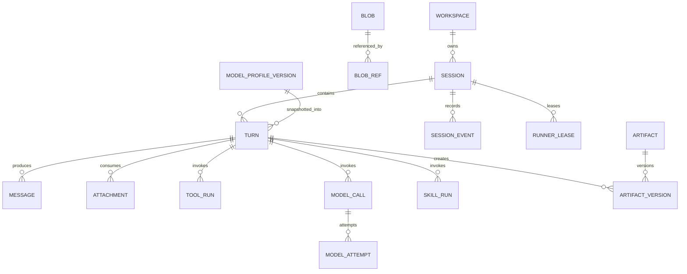
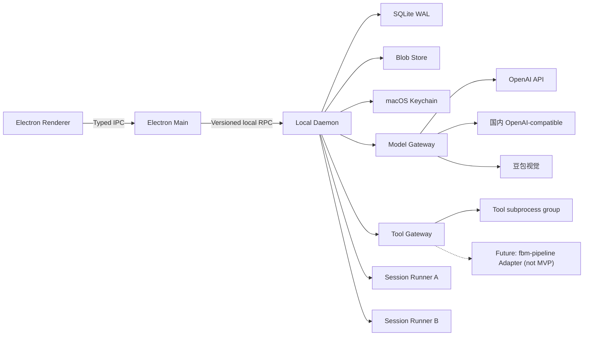
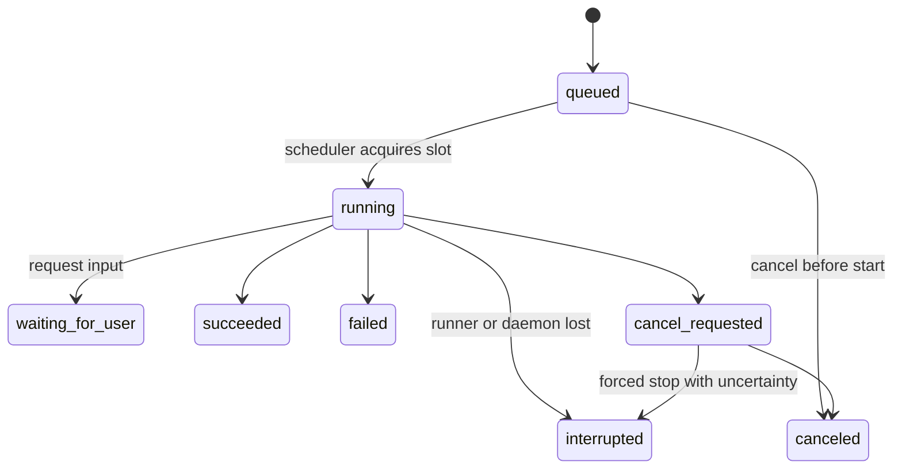

# Agent Workbench 基础框架 MVP 设计规格

- 状态：用户总评审通过，Magic 对标收敛完成，已批准进入开发
- 审查说明：产品范围审查已 APPROVE，运行时/安全专项已 PASS；主规格五轮独立审查发现项已逐项修订。2026-07-14 又基于 Magic 真实代码完成任务定义、规划、执行、恢复和交付链路对标，本次只吸收可验证的运行时闭环，不复制其云端控制面和遗留实现。
- 日期：2026-07-14
- 工程：Agent Workbench
- 首发平台：macOS
- 产品阶段：基础框架 MVP
- 设计依据：WorkBuddy 5.2.5 产品与运行时研究、Magic 真实运行时与 Skill 流程研究、fbm-pipeline 只读架构研究、已确认的产品决策

## 1. 摘要

Agent Workbench 是一个本地优先、任务驱动、可扩展的 AI 工作台。它不是单纯的聊天客户端，也不是把每个业务流程写成一段巨大 Prompt 的壳。它提供一套稳定的桌面交互、可恢复的 Session Runtime、统一模型网关、可审计 Tool Gateway、版本化 Artifact，以及 Skill、Tool、Connector、Scenario 四类扩展边界。

MVP 的核心闭环是：

> 选择工作区或场景 → 提交 Craft 任务 → Agent 调用模型与工具执行 → 实时查看过程 → 获得可预览、可追溯的正式产物 → 在同一 Session 中继续修改。

基础框架与业务场景严格分层：

- 基础框架负责 Session、Turn、事件、Runner、模型、工具、产物、扩展注册、恢复与桌面体验。
- 业务场景负责领域输入、SOP、规则、业务工具组合和产物契约。
- 现有 fbm-pipeline 将来通过 Connector/Tool Adapter 接入，继续作为独立电商执行引擎，不复制进平台内核，也不让 Agent 直接读写它的数据库。

Magic 对标后进一步明确：基础框架不建设独立 Planner Runtime 或通用 DAG。每个 Turn 都能从不可变输入事实派生轻量 TaskContractView，Runtime 提供清单、事件、工具、环境变化、等待用户、恢复和产物等可靠原语；具体任务该分几步、每一步何时通过、交付前验证什么，由 Skill/Scenario 的阶段门和 Validator 定义。简单 Craft 任务可以不创建清单直接执行。

MVP 保留 Ask、Plan、Craft 三种模式的产品概念和协议枚举，但只实现 Craft。Ask 与 Plan 在界面中显示为“即将支持”，不可启动。

MVP 默认且固定为 Full Access：不做逐工具审批弹窗，不做权限模式切换。Full Access 只取消人工授权步骤，不取消 Tool Gateway、输入校验、超时、取消、审计、幂等和副作用记录。

## 2. 已确认决策

| 主题 | 决策 |
|---|---|
| 产品形态 | WorkBuddy 类本地 AI 任务工作台 |
| 首发平台 | macOS |
| 用户模型 | 单人、本机使用 |
| 桌面架构 | Electron Renderer + Electron Main + Local Daemon + 每 Session 独立 Runner |
| 登录与云 | 不做登录、团队、组织、云同步 |
| 工作模式 | 保留 Ask / Plan / Craft，MVP 只实现 Craft |
| 权限 | 固定 Full Access，无逐工具审批 |
| 工作区 | 一个 Session 绑定一个主工作区，但工具可访问当前 macOS 用户有权访问的其他路径 |
| 并发 | 最多两个 Session 同时执行；同一 Session 内 Turn 串行 FIFO |
| 持久化 | SQLite WAL + 内容寻址 Blob Store，均位于应用数据目录 |
| 恢复 | 应用重启后恢复 Session、消息、事件、产物和队列 |
| 中断 | 已完成工具不重复执行；未完成工具标记 interrupted；继续时创建新 Turn |
| 密钥 | BYOK，明文只进入 macOS Keychain |
| 文本模型 | OpenAI API 与国内 OpenAI-compatible 模型 |
| 图片理解 | 统一自动路由至豆包视觉模型 |
| 业务实现 | 仅两个 Mock 场景，不连接真实 GIGA、TikTok Shop 或 Amazon |
| fbm-pipeline | 未来作为独立业务执行引擎，通过稳定 Adapter 接入 |

## 3. 产品目标

### 3.1 MVP 目标

1. 建立一个可靠的 Craft 任务闭环，而不是只完成一轮模型对话。
2. 支持模型流式输出、文件工具、Shell 工具、结构化 Tool Calling 和正式产物交付。
3. 支持两个 Session 并发、同 Session 消息排队、取消、崩溃恢复和继续执行。
4. 把所有执行事实持久化，使 UI 重连后可以准确复原，而不是依赖内存状态。
5. 建立 Skill、Tool、Connector、Scenario 的清晰协议边界；MVP 仅热加载声明式 Skill/Scenario，Tool/Connector Handler 由应用内置。
6. 用“数据报告”和“电商 Listing”两个 Mock 场景证明扩展体系可用。
7. 为将来将 fbm-pipeline 作为电商 Agent/Skill 的后端执行引擎预留清晰边界。
8. 让任务回复、执行终态和正式产物分别落为可验证事实，避免仅凭模型说“完成了”判定成功。

### 3.2 用户价值

用户应获得四种直接价值：

- 连续工作：任务中断、关闭窗口或客户端重启后，仍能找到原 Session 并继续。
- 真正交付：结果以 Artifact 呈现，可预览、打开、下载、版本化和追溯。
- 能力复用：同一个基础框架可以组合不同内置 Tool/Connector，并加载新的声明式 Skill/Scenario。
- 本机掌控：工作区、Session 数据和 API Key 均由本机管理，不依赖平台账号或云同步。

### 3.3 成功指标

#### 产品体验

- 首次配置模型后，用户在 5 分钟内可以完成一个 Mock 场景并打开正式 Artifact。
- 从点击发送到 UI 显示 queued/running 状态，P95 小于 200 毫秒。
- Renderer 重启后，最近 Session 列表和当前执行状态在 2 秒内恢复。
- 使用固定 Fake Provider、固定 Fixture 和固定重试策略时，发布验收场景必须 100% 通过。
- 真实 Provider 只做单独的兼容性 Smoke Test，不把外部模型的随机质量或可用性作为 Runtime 发布门槛。
- 任意失败都显示稳定错误码、用户可理解的原因和下一步动作。

#### 可靠性

- 全局同时运行的 Turn 永远不超过 2。
- 同一 Session 永远不同时运行两个 Turn。
- 同一 daemon-owned operation_id 或 idempotency_key 的已成功 ToolRun 实际执行次数为 1；不宣称识别任意 Shell 的语义等价操作。
- Daemon 或 Runner 崩溃不得把未完成操作错误标记为 succeeded。
- 状态变化与对应 Event 始终在同一数据库事务提交。

#### 产物质量

- 100% 标记为 final 的 Artifact 可打开或下载。
- 100% Artifact 可追溯到 Session、Turn、ToolRun、输入和扩展版本。
- 数据报告中的数字与确定性计算结果一致。
- Listing 中的规格和声明必须能追溯到商品事实或视觉证据。
- 所有要求结构化输出的模型调用均通过 JSON Schema 校验。

### 3.4 MVP 交付边界

本规格描述一个基础框架，但实施和发布分为两个明确门槛，避免把平台、SDK 和两个业务产品同时做成一个不可拆分的大爆炸版本。

#### Foundation Core：发布必需

- Electron、Main、Daemon、Runner 和本地 RPC。
- Session、Turn、Event、队列、取消、恢复和双 Session 并发。
- Model Gateway、Keychain、Craft Agent Loop。
- 每 Turn 的轻量 TaskContractView、可选执行清单、确定性 TurnOutcomeView。
- 模型可见但 UI 隐藏的环境变化通道，以及轻量文件读取基线与写前冲突检测。
- 内置文件/Shell Tool Gateway。
- Session 内 Artifact、版本、预览和来源链。
- 仅支持声明式、无可执行代码的内置扩展包。
- 数据报告 Mock 作为唯一发布阻断型端到端 Reference Scenario。

#### Validation Packs：随 MVP 仓库交付，但不阻断 Runtime Kernel 发布

- 电商 Listing Mock。
- 豆包视觉的真实网络 Smoke Test。
- 全局 Artifact 列表和相邻文本版本 Diff。
- 用户目录中的声明式 Skill/Scenario inspect→trust→enable 流程；Foundation Core 只要求同一加载器能读取应用内置声明式包。

Validation Pack 仍需在宣布“基础框架 MVP 完整交付”前完成，但它们失败时不能掩盖或改变 Foundation Core 的 Runtime 正确性结论。自动化测试中的视觉调用使用 Fake Doubao Adapter；真实豆包只做显式人工 Smoke Test。

### 3.5 开发切片 1：File-to-Artifact Craft Walking Skeleton

开发不按数据库、RPC、模型、Tool、UI 的横向层次分别做完，而是先交付一个最小但有产品意义的纵向闭环：

> 用户选择工作区并输入“读取 notes.md，生成三条要点到 summary.md” → Agent 调用 `fs.read_text`、`fs.write_text`、`artifact.register` → UI 实时显示回复与 Tool 卡片 → summary.md 写入磁盘并作为 Markdown Artifact 预览 → 重启应用后仍能查看完成态 Session、Message、ToolRun 和 Artifact。

Slice 1 必须包含：

- Electron Renderer/Main/preload、Local Daemon、每 Session 独立 Runner 的最小可启动骨架。
- 版本化 RPC/Event Schema、SQLite migration、单 Session/单 active Turn 状态机、一个持久 scheduler slot 和完成态 Snapshot 恢复；后续只扩容为两个 slot，不重写 claim 协议。
- OpenAI-compatible 流式 Tool Calling Adapter；自动化测试使用本地 Fake SSE Provider。
- Keychain CredentialStore、已认证 Main↔Daemon RPC、Turn-scoped Runner capability；API Key 只由 Daemon 读取，不进入 Runner、SQLite、Event 或日志。模型出站和 `fs.write_text` 的 Audit intent 写入失败时 fail closed。
- `fs.list`、`fs.read_text`、`fs.write_text`、`artifact.register`，以及文本/Markdown Artifact v1 Blob 快照与预览；Walking Skeleton 必须注册 `visibility=final`，并出现在 TurnOutcomeView.final_artifact_version_ids。
- 仅承载 `fs.write_text` 的最小短期 Tool Worker，以及 effectful 调用的 durable READY/GO；先不实现 Shell 进程树和 quarantine。
- Renderer sandbox、白名单 IPC、canonical path 校验、控制平面路径保护、原子文件写、read-hash CAS/FILE_CHANGED_SINCE_READ，以及“模型 Attempt 完整成功后才授权 Tool”的底线。
- 最小 fail-closed 启动恢复：prepared/worker_ready→not_applied，go_sent/acknowledged→unknown 且绝不自动重试；rename 后用 `fs.write_text` 绑定的确定性 hash Checker 判断 applied/not_applied。无法确认旧 worker 已退出时停止新调度并报告错误，但 Slice 1 不提供用户恢复 UI。

Slice 1 明确延后：Shell 与通用进程监督、quarantine/Reaper、双 Session 并发和第二个 scheduler slot、运行中取消与用户可操作恢复链、waiting_for_user/input_response、Attachment、视觉模型、扩展加载、Scenario Supervisor、Mock 场景、Artifact v2/Diff、HTML/CSV 预览和无丢事件 live 重连。上述能力仍属于 Foundation Core 或 Validation Pack 目标，按后续纵向切片逐步加入，不阻塞第一个可运行版本。

## 4. 非目标

以下内容不进入基础框架 MVP：

- 用户登录、账号中心、订阅、Credits、支付和计费。
- 团队、组织、RBAC、协同编辑、云同步和远程控制。
- Projects、知识库、长期记忆、跨 Session 自动学习。
- Automation、定时任务、Webhook 和长期后台监控。
- Ask 与 Plan 的真实执行逻辑。
- Agent Teams、多 Agent 编排和工作树管理。
- 独立 Planner Runtime、通用 DAG 工作流引擎，以及强制所有 Craft 任务先规划再执行。
- 全工作区 Checkpoint/Rollback、虚拟机 Playback 和任意 Shell 副作用的完整回放；MVP 只保护 Tool Gateway 已知写入和显式声明路径。
- 在线扩展市场、远程安装、不可信扩展沙箱。
- 任意本地可执行 Tool/Connector 扩展；MVP 本地扩展只允许声明式 Skill/Scenario 引用内置 Handler。
- 通用 HTTP Connector、带凭据 Connector、外部系统写入和长任务控制；相关枚举仅为协议预留。
- 浏览器自动化、Cookie、验证码和登录态复用。
- 真实 GIGA 拉品、TikTok Shop 发布、Amazon 发布或上传。
- 直接合并或重写 fbm-pipeline。
- 通用办公套件编辑器。
- 自动更新服务；正式分发前另行设计签名、发布和回滚机制。

## 5. 设计原则

### 5.1 Daemon 是唯一事实源

Renderer 只负责呈现，Runner 只负责推理和执行协调。Session、Turn、Event、ToolRun、Artifact、队列和 Runner Lease 的权威状态全部由 Daemon 管理并持久化。

### 5.2 一个运行时，不为每个场景复制状态机

自由 Craft 任务和 Scenario 启动的任务都落在同一套 Session/Turn/Event/ToolRun Runtime 上。Scenario 是任务入口和能力包，不在 MVP 内建立第二套通用 DAG 调度器。

现有垂直系统如果已经具备可靠工作流 Runtime，例如 fbm-pipeline，则通过 Connector 提交长任务并归一化其状态，不把它的内部步骤复制到平台数据库。

### 5.3 Agent 做判断，Tool 做动作

- Skill 提供领域知识、规则和结构化输出约束。
- Tool 执行确定性或有明确副作用的动作。
- Connector 适配外部或本地服务协议。
- Scenario 把用户入口、输入和需要的能力组合起来。
- Daemon 保存事实，模型输出本身不能直接成为执行状态。

### 5.4 Artifact 是一等对象

聊天文本不是唯一结果。正式交付物必须注册为 Artifact，带版本、来源、MIME、校验状态和不可变内容快照。

### 5.5 Full Access 仍然可控

不弹审批不等于无边界。所有工具仍经 Tool Gateway；所有调用仍可取消、超时、审计；不确定副作用仍禁止自动重试；密钥仍不能进入 Runner 或日志。

Full Access 的威胁模型以“用户主动允许内置 Agent 执行本机命令”为前提。架构保证产品组件不会通过正常协议把 SQLite、RPC bootstrap secret 或模型 Key 暴露给 Renderer/Runner，但不声称可以阻止同一 macOS 用户主动运行的恶意 Shell 命令读取其本来就能访问的本机资源。MVP 通过控制平面路径保护、最小环境继承、审计和不自动重试降低事故风险，不提供任意命令的 OS 沙箱保证。

### 5.6 默认本地和最小数据外发

Session 数据、文件快照、日志和密钥均保存在本机。对 Model Gateway 可执行的出站请求，只有本次调用 authorized object set 明确引用的文本和图片才可发送。Full Access shell.exec 可运行用户权限命令，其内部网络行为不受 Model Gateway 数据最小化保证覆盖，必须按 §15.2 的限制理解。

### 5.7 MVP 优先可验证

先实现可靠闭环、清晰协议和崩溃恢复。市场、团队、自动化、通用 DAG、复杂权限和真实业务发布全部后置。

### 5.8 Runtime 原语与业务阶段门分离

Magic 的真实实现表明，稳定规划主要来自具体 Skill 中的阶段门，而不是一个通用 Planner。Agent Workbench 因此遵循以下约束：

- Runtime 只提供 TaskContractView、执行清单、ToolRun、Event、Artifact、等待用户、取消和恢复原语，不规定所有任务的固定步骤。
- Skill 描述领域判断、SOP 和结构化子调用；Scenario 声明输入、能力集合、必需产物、Validator 与完成门。
- 简单 Craft 任务可以直接执行；复杂任务由 Agent 或 Scenario 创建清单。没有清单不等于没有执行事实。
- 一旦创建清单，仍有 pending 或 in_progress 条目时，Turn 不得静默 succeeded；这是“已创建清单的内部一致性门”，不是业务正确性判断。Agent 必须继续、标记 completed，或给出原因标记 skipped。
- 通用 Runner 不从聊天文本反推计划，不依赖“最后一条带 steps 的消息”恢复状态。

### 5.9 用户可见过程与模型环境上下文分层

用户需要看到任务、工具、错误和产物，但不需要看到每次文件 hash、工作区差异或上下文预算更新。系统将两类信息分开：

- UI Timeline 展示用户输入、Agent 回复、清单、ToolRun、等待用户、错误和 Artifact。
- Model Context Channel 保存文件变化、工作区变化、上下文压缩摘要等模型继续推理所需事实，默认不在 UI 展示。
- 环境 baseline 只有在对应上下文已成功进入一次模型请求后才能推进；构造失败、请求未发出或 Attempt 失败时不得假装模型已经看到更新。

### 5.10 回复、终态与产物分离

Agent 最终自然语言回复只负责向用户解释结果。是否完成由 Daemon 根据 Turn 状态、ToolRun、清单和 Scenario 完成门派生确定性的 TurnOutcomeView；正式交付由显式 Artifact 注册决定。三者互相引用，但任何一个都不能代替另外两个。

## 6. 用户体验设计

### 6.1 应用信息架构

左侧固定导航：

1. 新建任务
2. 最近 Session
3. 场景
4. 产物
5. 扩展
6. 设置

MVP 不设置 Projects、团队、市场和云盘入口。

主界面使用三栏工作区：

```text
┌────────────────┬──────────────────────────────────┬────────────────────┐
│ 导航 / Session  │ 对话与执行过程                    │ 过程 / Artifact     │
│                │                                  │                    │
│ + 新建任务      │ 用户消息                          │ 执行清单            │
│ 最近任务        │ Agent 流式回复                    │ Tool 状态           │
│ 场景            │ Tool 调用卡片                     │ 正式产物            │
│ 产物            │ 错误与继续提示                    │ 工作区变更          │
│ 扩展            │                                  │                    │
│ 设置            │ Composer                         │ Preview             │
└────────────────┴──────────────────────────────────┴────────────────────┘
```

右栏可折叠。窄窗口下右栏变为抽屉，不影响主对话。

### 6.2 新建任务

新建任务页面包含：

- 主工作区选择器。
- 模式选择器：Craft 可用；Ask、Plan 显示“即将支持”。
- 模型 Profile 选择器。
- Full Access 固定状态说明。
- 多行任务输入框。
- 文件和图片附件入口。
- 两个 Mock Scenario 快捷卡片。

启动 Session 时记录工作区、模式、模型 Profile、Scenario 和扩展版本快照。后续设置变化不应悄悄改变正在运行的 Turn。

附件选择由 Main 文件选择器完成。Main 返回一次性 opaque selection handle，Renderer 不能把任意本地路径伪装成已选择附件。Daemon 通过 attachment.importDraft(client_request_id, draft_owner_id, handle) 消费该 handle，将内容快照到 Blob Store，并返回 draft_attachment_id。session.create 或 scenario.start 在创建 Session/首 Turn 的同一事务中把 ready Draft 绑定为正式 Attachment；响应丢失重试返回同一绑定结果。

### 6.3 Session 工作区

Session 顶部显示：

- 标题。
- 主工作区。
- 当前模型。
- Craft / Full Access。
- idle、queued、running、waiting_for_user、canceling、recovering 或 error 状态。
- 取消、打开工作区、查看日志和归档操作。

消息流包含：

- 用户消息。
- Agent 文本与推理摘要。
- 模型调用状态。
- Tool 卡片：工具名、输入摘要、耗时、状态、输出摘要。
- Artifact 卡片。
- 结构化错误卡片。
- 等待用户输入卡片：展示问题、允许的回答 Schema、回答与取消动作；重启后仍可操作。
- 中断与恢复提示。

同一 Session 正在执行时再次发送消息，新消息进入 FIFO 队列。UI 显示队列位置，并允许取消尚未开始的消息。MVP 不支持队列重排。

### 6.4 执行过程面板

Craft Agent 可通过内置 Runtime Tool 发布一个“执行清单”。这不是 Plan 模式，也不是独立工作流引擎，只是当前 Turn 的可观察进度投影。

执行清单支持：

- 创建 1 至 20 个条目。
- pending、in_progress、completed、skipped 四种状态；skipped 必须带原因。
- 同时最多一个 in_progress。
- 每次变化产生 Event。
- Turn 结束后保留历史。
- 清单是 Daemon 持久化的一等数据，不从消息内容反推。
- 已创建清单时，存在 pending 或 in_progress 条目则普通 Craft Turn 不得 succeeded。

如果 Agent 未创建清单，UI 仍完整显示模型和 Tool 事件。

### 6.5 Artifact 面板

Artifact 面板分为：

- 正式产物：Agent 显式标记为 final。
- 工作区变更：文件工具或 Shell 检测到但未交付为 final 的文件。
- 执行证据：日志、校验结果和中间结构化数据。

这一区分解决“QA 脚本被误当成最终交付物”的问题。只有 final Artifact 默认出现在全局产物页。

MVP 内置预览：

- 文本与代码。
- Markdown。
- JSON。
- CSV 表格。
- 本地 HTML。
- PNG、JPEG 和 WebP。

其他类型允许下载、在 Finder 中显示或调用系统默认应用打开。

“工作区变更”只保证覆盖 Tool Gateway 已知的写入路径、artifact.register 的来源路径，以及 shell.exec 显式声明的 output_paths。MVP 不宣称能够穷举任意 Shell 脚本、子进程或后台进程修改的所有文件。观察到的路径只能标记为 working，不能自动升级为 final。

### 6.6 场景页

场景页展示已注册 Scenario。每张卡片显示：

- 场景名称和说明。
- 所需输入。
- 预期 Artifact。
- 使用的 Skill、Tool 和模型类型。
- 是否会访问模型网络。
- 是否包含外部系统写入。

启动 Scenario 时，Renderer 根据 JSON Schema 生成输入表单。提交后创建普通 Session 和首个 Craft Turn，并把结构化输入、Scenario 指令和能力约束作为不可见上下文快照交给 Runner。

Scenario Turn 有明确 contract_mode，但 Renderer 不能直接提交该枚举，模式由 Daemon 根据已授权方法推导：scenario.start→initial_delivery；普通 turn.enqueue→conversation；artifact.startRevision→deliverable_revision；scenario.retryDelivery→继承最近失败/取消的 initial_delivery 或 deliverable_revision；Recovery Turn→继承被恢复 Turn。非法转换返回 SCENARIO_CONTRACT_TRANSITION_INVALID。

初次交付或修订 failed/canceled 后，UI 显示“重试交付”并调用 scenario.retryDelivery，而不是让普通 Composer 绕过完成门。该动作可携带经原 Scenario Input Schema 校验的 input_patch；Daemon 合并后创建新的 scenario_input_version，并固定到重试 Turn。若 patch 引用新 ready_unbound Draft Attachment，Daemon 在同一事务校验 draft_owner/action token、CAS 绑定到当前 Session/重试 Turn、创建 Blob Ref，再创建 input version 和 Turn；任一步失败全部回滚，Draft 仍保持 unbound。conversation Turn 不修改正式 Scenario Input。conversation 只解释、分析或回答问题；其有效 Tool 集合排除 local_write、process、mixed 和所有 required delivery Tool。若为保存 evidence 暴露 artifact.register，Daemon 将其输入 Schema 收窄为 visibility=working/evidence；任何 final 注册返回 SCENARIO_REVISION_ACTION_REQUIRED，引导用户使用“修改并生成新版本”。

Scenario 不是只靠 Prompt 自觉完成。Daemon 内置 Scenario Supervisor，在启动前执行 preflight，并仅对 initial_delivery、deliverable_revision 及其 recovery Turn执行完成门；conversation Turn 使用普通 Craft 完成语义。交付型 Turn 请求完成时检查 required_artifacts、required_attestations、Skill 调用上限和输出 Schema。只有 Supervisor 通过才可 succeeded；否则把结构化缺口返回 Runner，最多允许清单声明的 correction_attempts 次纠正，仍不通过则以 SCENARIO_CONTRACT_FAILED 结束。

### 6.7 产物页

全局产物页支持：

- 按类型、Scenario、Session 和时间筛选。
- 预览、下载、在 Finder 显示。
- 查看来源链。
- 查看历史版本。
- 基于 Artifact 创建新 Session。

Foundation Core 只要求从 Session 打开 Artifact 及其来源链。全局产物页在 Validation Pack 阶段提供最小列表、类型筛选和来源跳转；相邻文本版本 Diff 不是 Runtime 发布门槛。二进制类型只显示元数据差异。

### 6.8 扩展页

扩展页是本地能力诊断页，不是市场。它展示：

- 扩展包 ID、名称、版本和路径。
- 组件类型。
- 清单校验结果。
- 声明的文件、进程、网络和外部写入能力。
- 启用状态。
- inspected_untrusted / trusted / disabled 状态，以及 staged digest。
- 加载错误。

MVP 只加载内置包，以及用户手动放入本地扩展目录的声明式 Skill/Scenario 包。声明式包不能携带可执行 Handler，只能引用当前应用已经内置的 Tool/Connector。扩展加载失败必须隔离，不能阻塞核心应用启动。

### 6.9 设置

设置页包含：

- 默认工作区。
- 模型 Profiles。
- 豆包视觉 Profile。
- 扩展目录。
- 数据与日志路径。
- 日志级别。
- Session 删除和本地数据清理。
- “Full Access 已启用”的明确说明。

不包含账号、团队、云同步、计费和远程渠道设置。

## 7. 核心领域模型

### 7.1 术语

| 对象 | 定义 |
|---|---|
| Workspace | Session 的主工作目录和默认相对路径基准 |
| Session | 持久对话与任务容器 |
| Turn | 一次用户提交及由此触发的完整 Agent 执行 |
| Message | 面向用户呈现的用户或 Agent 消息 |
| Session Event | append-only 执行事实和 UI 重建依据 |
| Attachment | 由用户选择并快照进 Blob Store 的 Turn 输入 |
| ToolRun | 一次具体工具执行尝试 |
| Runner Lease | Daemon 对某个 Session Runner 的进程租约 |
| ModelCall / ModelAttempt | 一次逻辑模型请求及其每次 Provider 尝试 |
| SkillRun | 一次受 Schema 约束的显式 Skill 子调用 |
| Artifact | 可预览、下载和追溯的逻辑产物 |
| Artifact Version | Artifact 的某个不可变内容版本 |
| Blob | 由 SHA-256 标识的不可变大内容 |
| Model Profile | Provider、Endpoint、模型、能力和 Keychain 引用 |
| Skill | 受约束的 AI 知识和判断单元 |
| Tool | 带 Schema、超时、副作用和错误契约的执行单元 |
| Connector | 对本地或远程系统的协议适配层 |
| Scenario | 用户可直接启动的任务入口与能力组合 |
| Audit Event | Session 之外也适用的持久安全审计记录 |

### 7.2 关系



### 7.3 Session

主要字段：

| 字段 | 说明 |
|---|---|
| id | UUIDv7 |
| title | Session 标题 |
| workspace_id | 主工作区 |
| lifecycle_status | active / archived |
| runtime_status | idle / queued / running / waiting_for_user / canceling / recovering / error |
| queue_block_reason | recovery_review / null |
| designated_recovery_turn_id | 当前唯一允许越过 recovery block 的 Turn，可空 |
| recovery_episode | 单调递增的恢复代次 |
| recovery_source_turn_id | 当前 block 的源 Terminal Turn，可空 |
| current_turn_id | 当前活动 Turn，可空 |
| mode | craft；协议保留 ask / plan |
| access_mode | MVP 固定 full_access |
| default_model_profile_id | 默认模型 Profile |
| scenario_id / scenario_version | 可空 |
| scenario_input_blob_id | 可空 |
| current_scenario_input_version_id | 可空 |
| next_turn_ordinal | 下一个 Turn 顺序号 |
| next_event_seq | 下一个 Event 序号 |
| revision | 乐观并发版本 |
| created_at / updated_at | 时间 |

### 7.4 Turn

一个 Turn 对应一次用户提交。恢复不修改原 Turn，而是创建新 Turn。

主要字段：

| 字段 | 说明 |
|---|---|
| id | UUIDv7 |
| session_id | 所属 Session |
| ordinal | Session 内严格递增 |
| client_request_id | Renderer 生成的幂等键 |
| resume_of_turn_id | 恢复来源，可空 |
| recovery_chain_id | 非空；根 Turn 等于自身 id，所有恢复后代继承 |
| queue_kind | normal / input_response / recovery |
| scenario_contract_mode | none / initial_delivery / deliverable_revision / conversation |
| scenario_input_version_id | 本 Turn 固定的结构化输入版本，可空 |
| parent_turn_id | 逻辑父 Turn，可空 |
| response_to_user_input_request_id | 回答等待用户请求时指向原 request，可空 |
| status | queued / running / waiting_for_user / cancel_requested / succeeded / failed / canceled / interrupted |
| input_message_id | 用户输入消息 |
| mode_snapshot | craft |
| model_snapshot_json | Provider、模型和参数快照 |
| model_profile_version_id | 不可变 Profile 版本 |
| extension_snapshot_json | Skill、Tool、Connector、Scenario 版本 |
| authorized_skill_ids | 本 Turn 可调用的固定 Skill 集合 |
| runner_instance_id | 当前 Runner |
| execution_fence | 递增 fencing token，所有 subexecution 回包必须匹配 |
| queued_at / started_at / finished_at | 时间 |
| cancel_requested_at | 可空 |
| error_code / error_message | 结构化错误 |
| result_message_id | 最终 Agent 消息，可空 |

唯一约束：

- session_id + ordinal。
- session_id + client_request_id。

TaskContractView 不新增第二份持久化事实，也不额外调用模型。Daemon 在同一 read transaction 中从 input_message_id、父/恢复关系、已绑定 Attachment、scenario_input_version、mode/model/extension/authorized skill snapshots 派生只读视图：normal Craft Turn 的 objective 为用户消息，默认 expected result 为“可解释的最终回复，可选正式 Artifact”；input_response Turn 继承 parent TaskContractView 的 objective/expected result，并把持久化的问题和回答作为补充约束；recovery Turn 继承 source TaskContractView 并加入中断事实与 Operation Ledger；Scenario Turn 再合并 required artifacts、Validator 和完成条件。Runner 可以创建清单推进任务，但不能改写这些原始事实。

根 Turn 在创建事务中先生成 id，并设置 recovery_chain_id=id、queue_kind=normal。恢复 Turn 继承 recovery_chain_id、设置 queue_kind=recovery，并继承原 Turn 的 scenario_contract_mode。input_response Turn 指向 waiting_for_user 父 Turn，继承其 recovery_chain_id、scenario contract/input version、模型与扩展快照，并把用户回答保存为新的 input_message_id。非 Scenario Turn 的 contract mode 为 none。

不可变终态为 succeeded、failed、canceled、interrupted、waiting_for_user。waiting_for_user 表示该 Turn 已结束执行但整个任务仍需要用户补充；用户回答时创建新的 input_response Turn，原 Turn 不再变化。

Session runtime_status 是数据库投影，不由 Renderer 或 Runner 自行设置，优先级为 canceling > recovering > running > waiting_for_user > queued > idle：

- current_turn_id 指向 cancel_requested Turn 时为 canceling。
- queue_block_reason=recovery_review 时为 recovering，即使 designated recovery Turn 正在 running。
- 未恢复阻塞且 current_turn_id 指向 running Turn 时为 running。
- 没有活动 Turn，且存在 open user_input_request 时为 waiting_for_user；该 request 阻塞本 Session 普通队列。
- 没有活动 Turn、未阻塞且存在 queued Turn 时为 queued。
- 没有活动 Turn、未阻塞且没有 queued Turn 时为 idle。

只有在 Turn terminalization 时，若 Turn=interrupted，或其关联的 Terminal ToolRun 仍存在未被 effect_resolutions 解决的有效 unknown，Daemon 才设置 queue_block_reason=recovery_review、递增 recovery_episode 并记录 recovery_source_turn_id。effectful Tool 在正常执行中的临时 unknown 不会提前阻塞 Session。该 Session 的后续普通 queued Turn 不得自动启动，直到当前 recovery episode 被解决。

### 7.5 Message

Message 是 UI 友好的对话投影，不代替 Event。

主要字段：

- id、session_id、turn_id。
- role：user、assistant、system_summary。
- status：streaming、completed、interrupted。
- content_blob_id。
- structured_content_blob_id，可空。
- created_at、completed_at。

模型流在执行过程中产生 coalesced Event，完成后写入不可变 Message 内容。每 50 毫秒或累计 4 KiB 合并一次 delta，避免逐 token 写库。

#### Attachment

主要字段：

- id、draft_owner_id、session_id 可空、bound_turn_id 可空；Draft 创建时后二者为空，session.create/scenario.start/retryDelivery 绑定后 session_id/bound_turn_id 不可变。
- blob_id、filename、mime_type、size、sha256。
- source_bookmark_ref 或 import_source_fingerprint；不把可复用的任意路径授权暴露给 Renderer。
- status：importing、ready_unbound、ready_bound、failed、deleted。
- client_request_id 与 normalized source fingerprint，用于导入幂等。
- created_at、deleted_at。

限制：单文件默认不超过 2 GiB，单张图片默认不超过 50 MiB，单 Turn 附件总量不超过 2 GiB。导入先完成 Blob 原子写入，再让 Draft 进入 ready_unbound。未绑定 Draft 24 小时后可 GC；已绑定 Attachment 在任何 queued/running/recovery Turn 或 Artifact provenance 引用期间不得删除其 Blob Ref。

### 7.6 Session Event

Event 是 append-only 审计事实，也是 Renderer 重连后的恢复依据。

主要字段：

- id。
- session_id、turn_id、tool_run_id，可空。
- seq：Session 内严格递增。
- type。
- actor：user、daemon、runner、model、tool。
- audience：ui、model、both；Security Audit 继续使用独立 audit_events/global_seq。订阅流按 seq 发送连续 Envelope：model-only Event 对 Renderer 只暴露 redacted 占位，不携带 payload、blob 或真实内部 subtype，Renderer 仍推进游标但不渲染；Daemon 内部模型通道读取完整内容。
- payload_json：小型结构化内容。
- blob_id：大型内容。
- producer_id、producer_seq：Runner 事件幂等。
- created_at。

唯一约束：

- session_id + seq。
- producer_id + producer_seq。

核心事件类型：

- session.created、session.updated。
- turn.queued、turn.started、turn.cancel_requested、turn.succeeded、turn.failed、turn.canceled、turn.interrupted。
- turn.waiting_for_user、turn.user_input_received。
- model.started、model.delta、model.completed、model.failed、model.canceled、model.interrupted。
- model.attempt_started、model.attempt_canceled、model.attempt_interrupted、model.attempt_failed。
- vision.started、vision.completed、vision.failed。
- tool.queued、tool.started、tool.output、tool.succeeded、tool.failed、tool.canceled、tool.interrupted。
- tool.reused。
- skill.started、skill.completed、skill.schema_failed、skill.failed、skill.canceled、skill.interrupted。
- checklist.updated。
- context.changed、context.injected、context.baseline_advanced。
- artifact.created、artifact.version_created。
- runner.started、runner.heartbeat、runner.exited、runner.crashed。
- recovery.detected、recovery.resumed。

Daemon 必须先提交状态与 Event，再向客户端广播。

### 7.7 ToolRun

主要字段：

| 字段 | 说明 |
|---|---|
| id | UUIDv7 |
| session_id / turn_id | 归属 |
| logical_call_id | 模型产生的调用 ID，只用于同一 Provider Response 内关联 |
| source_model_call_id / source_model_attempt_id | 授权该调用的成功模型响应 |
| initiator | model / daemon；daemon intrinsic 时 source_model_* 可空 |
| attempt | 尝试次数 |
| retry_of_tool_run_id | 重试来源 |
| operation_id | Daemon 为一次有意操作分配的 UUID |
| resume_operation_id | 恢复时显式引用的既有操作，可空 |
| normalized_input_hash | Tool 版本化规范化输入 hash |
| reused_from_tool_run_id | 恢复时复用的成功 ToolRun，可空 |
| tool_id / tool_version | 工具标识与版本 |
| side_effect_class | read / local_write / process / network_read / external_write / mixed |
| status | queued / running / cancel_requested / succeeded / failed / canceled / interrupted |
| dispatch_state | prepared / worker_ready / go_sent / acknowledged；read/daemon intrinsic 可空 |
| dispatch_nonce | 每次 Tool attempt 的随机握手值 |
| idempotency_key | 由 Runtime 或 Tool 生成；effectful Tool 必填 |
| idempotency_record_id | 指向全局幂等预留记录，可空 |
| input_json / input_blob_id | 输入 |
| result_json / result_blob_id | 输出 |
| stdout_blob_id / stderr_blob_id | 进程输出 |
| pid / pgid | 子进程信息 |
| exit_code | 可空 |
| effect_state | not_applied / applied / unknown |
| error_code / error_message | 结构化错误 |
| started_at / finished_at | 时间 |

effect_state 语义：

- not_applied：确认没有发生副作用。
- applied：确认副作用已完成。
- unknown：进程中断或远端响应不确定，无法判断是否已生效。

unknown 状态永远不自动重试。

唯一约束：

- source_model_attempt_id + logical_call_id + attempt。

独立 tool_idempotency_records 表以 tool_id + tool_version + idempotency_scope + idempotency_key 唯一，保存 normalized_input_hash、owner_tool_run_id、terminal_status 和 result reference。相同 key 但 normalized_input_hash 不同，返回 IDEMPOTENCY_CONFLICT。复用时新的展示 ToolRun 可以引用同一 idempotency_record_id 和 reused_from_tool_run_id，但不会重新占有或执行该幂等记录。

operation_id 是每次有意操作的稳定身份，不由输入 hash 代替，因此同一 Turn 可以有两次参数完全相同但确实有意执行两次的操作。恢复 Context 包含 Operation Ledger：operation_id、tool/version、normalized_input_hash、结果、effect 和 postcondition。恢复时 effectful Tool Call 必须声明 operation_intent=reuse:<operation_id> 或 operation_intent=new；reuse 必须严格匹配旧 fingerprint 并直接返回旧结果，new 才分配新 operation_id。若参数匹配既有成功操作但未给 intent，返回 AMBIGUOUS_RECOVERY_OPERATION，不执行。

本地 effectful Tool 默认以 operation_id 派生 idempotency_key；有真实远端幂等契约的未来 Tool 才可使用领域 key。两次 operation_intent=new 即使输入相同也得到不同 operation_id/key；resume reuse 使用原 idempotency_record。

#### ModelCall、ModelAttempt 与 SkillRun

ModelCall 表示一次逻辑模型用途，字段包括：

- id、session_id、turn_id、kind：craft、skill、vision、summary。
- model_profile_version_id。
- status：queued、running、succeeded、failed、canceled、interrupted。
- input_blob_id、result_blob_id、error_code。

每次 Provider 请求创建 ModelAttempt：

- id、model_call_id、attempt。
- provider_request_id。
- status、started_at、finished_at。
- partial_output_blob_id。
- input_tokens、output_tokens、cached_tokens、latency_ms。
- error_code、retryable。

失败 Attempt 的 partial output 保留为 evidence，但不得拼接进下一 Attempt 的用户可见 Assistant Message。只有 succeeded Attempt 可以完成对应 Message。

SkillRun 是显式结构化子调用，字段包括 skill_id、skill_version、input_blob_id、output_blob_id、status、schema_attempt、model_call_id 和 error_code。MVP Skill 是单次结构化模型调用，不在 Skill 内再次运行 Tool Loop。

### 7.8 Artifact 与 Blob

Artifact 是逻辑对象，Artifact Version 是不可变版本。

Artifact 主要字段：

- id、session_id。
- logical_name。
- artifact_type。
- current_version_id。
- created_at、updated_at。

唯一约束为 session_id + logical_name。

Artifact Version 主要字段：

- id、artifact_id、version。
- source_turn_id、source_tool_run_id。
- blob_id。
- original_path，可空。
- filename、mime_type、size、sha256。
- preview_kind。
- visibility：final、working、evidence；固化在 Version 上，不能被后续版本改写。
- validation_status：valid、warning、invalid、unchecked。
- validation_report_blob_id，可空。
- provenance_json：输入、模型、扩展和工具版本。
- registration_key：Turn 内注册幂等键。
- created_at。

唯一约束为 artifact_id + version，以及 source_turn_id + registration_key。版本号由 Daemon 在 BEGIN IMMEDIATE 事务中分配。只有相同 source_turn_id + registration_key 的响应丢失重试返回既有版本；不同交付/修订 Turn 即使内容 hash 相同，也创建新的 Artifact Version 并复用同一 Blob。v1 → v2 → 恢复到 v1 内容会创建 v3，而不是激活旧 v1 或静默 no-op。

provenance_json 和 artifact_attestations 由 Daemon 根据本次注册的 authorized inputs、ToolRun、SkillRun、ModelCall 和显式 reused relation 自动生成，Agent 不能提交任意来源 ID。若内容相同但需要新增当前 Turn provenance/attestation，必须创建引用同一 Blob 的新 Artifact Version。

同一 logical_name 可以从 working/evidence 演进为 final，但必须创建新的 Artifact Version；历史 Version 的 visibility 不变。Artifact 面板使用 current_version 的 visibility，TurnOutcomeView 始终按 source Turn 实际创建或显式复用的 Version visibility 分类，因此后续注册不会重分类历史结果。

跨 Session 派生关系记录在 artifact_inputs(source_artifact_version_id, target_artifact_version_id, relation)。

Blob 采用 SHA-256 内容寻址。相同内容只保存一次，通过 blob_refs 记录所有者关系。

### 7.9 其他表

MVP 数据库还包含：

- workspaces。
- scheduler_slots：固定两行，字段为 slot_no、state=free/owned/quarantined、owner_turn_id、quarantine_id、updated_at。
- executor_quarantines：id、slot_no、session_id、turn_id、pid/pgid、process_start_identity、reason、status=open/cleared、created_at、cleared_at、clear_evidence。
- runner_leases：id、daemon_epoch、lease_epoch、session_id、current_turn_id、pid、process_start_identity、status、heartbeat_at、lease_expires_at。
- model_profiles 与不可变 model_profile_versions。
- credential_records：Keychain 引用的 pending / active / deleting 状态。
- model_calls、model_attempts、skill_runs。
- tool_idempotency_records。
- effect_resolutions：append-only，引用 Terminal ToolRun，记录 confirmed_applied / confirmed_not_applied / accepted_unknown、actor、evidence 和 Audit Event。
- attachments。
- turn_checklist_items：按 Turn 保存清单条目、状态、顺序、skip reason 和 revision。
- tracked_files：按 Session 保存 canonical path、最近成功读取 fingerprint、最近注入模型的 fingerprint 与更新时间。
- user_input_requests：保存 request schema、提示、状态、创建时间、回答 Blob 和响应幂等键；同一 Turn 同时最多一个 open request。
- scenario_input_versions：Session 内递增版本、input_blob_id、source_turn_id、created_at。
- usage_records。
- extension_packages。
- extension_components。
- audit_events。
- blobs。
- blob_refs。
- artifact_inputs。
- artifact_attestations。
- schema_migrations。

Runner 每 5 秒 heartbeat，Lease 默认 20 秒过期。每次 Daemon 启动生成新的 daemon_epoch；每次 Runner 绑定生成递增 lease_epoch。所有 Runner 请求必须携带二者并与当前 Lease 匹配。

## 8. 进程架构



### 8.1 Electron Renderer

职责：

- 页面、输入、流式展示、队列展示、Artifact 预览。
- 维护最后收到的 Session Event seq。
- 断线后请求 Snapshot 并按游标补事件。

限制：

- nodeIntegration 关闭。
- contextIsolation 开启。
- Renderer sandbox 开启。
- 不直接访问文件系统、Shell、SQLite、Keychain、模型或 Connector。
- 不加载拥有本机权限的远程页面。

### 8.2 Electron Main

职责：

- 窗口、菜单、文件选择器、Finder 打开和单实例锁。
- 启动、发现、健康检查和重连 Daemon。
- 通过 preload 暴露严格白名单 IPC。
- 将 Renderer RPC 转发给 Daemon。
- 转发模型凭据的新增、替换和删除请求；已保存密钥的读取由 Daemon 的 Credential Store 直接访问 Keychain，Main 和 Renderer 都不能取回明文。
- 对所有 IPC 校验 top-level webContents、frame、origin 和方法 Schema；来自预览 WebContents 或非可信子 frame 的调用一律拒绝。用户手势只用于授权矩阵中列出的敏感方法，不能要求自动重连/订阅具备瞬时手势。

Main 不执行长任务，也不保存 Runtime 权威状态。

### 8.3 Local Daemon

Daemon 是本机控制平面：

- 在 AgentWorkbench 组件和协议内，Daemon 是 SQLite 唯一持有连接和执行读写的进程；任意同 UID 恶意 Shell 不在该架构保证内。
- Session/Turn 状态机和持久队列。
- Event 分配 seq、事务提交和广播。
- Runner Supervisor 和全局并发控制。
- Model Gateway。
- Tool Gateway。
- Artifact 与 Blob 管理。
- Extension Registry。
- 通过 Credential Store 按需读取 macOS Keychain；即使 Main 崩溃，已运行 Turn 也不依赖 Main 才能取得模型凭据。

Daemon 使用文件锁确保单实例。每次启动创建 daemon_epoch，并在权限 0700 的 runtime 目录创建 socket；socket 权限为 0600，启动前只删除经 owner、类型、路径和存活 PID 验证后的 stale socket。

Main 与 Daemon 使用 Keychain 中的应用级 RPC bootstrap secret 做 challenge-response。bootstrap secret 不进入 argv、环境变量、日志或 runtime 明文文件。Daemon 同时校验 peer UID；握手成功后签发只绑定该连接、能力集合和 daemon_epoch 的短期 Token。替换 Main 可以通过同一 Keychain bootstrap secret 重新握手。MVP 威胁模型不防御已经获得当前 macOS 用户完整代码执行权限的恶意进程，但防止未认证连接、陈旧连接和协议误用。

首次启动时，Main 在启动 Daemon 之前创建随机 256-bit bootstrap secret 并写入 Keychain；Daemon 只从 Keychain 读取。若创建成功但 Daemon 启动失败，secret 保留供重试。用户在无活动/queued/recovery/quarantine 状态下可执行“重置本地 RPC 身份”，生成新 secret 并使全部连接 Token 失效。app.getRuntimeBootstrap 只返回 UI 启动数据，和该 Keychain secret 无关。

### 8.4 Session Runner

每个活动 Session 拥有一个独立 Runner 进程：

- 一个 Runner 同时只处理该 Session 的一个 Turn。
- Runner 不跨 Session 复用上下文。
- Runner 不直接读取 Keychain 或 SQLite。
- Runner 不直接修改 Runtime 状态，只上报结构化请求和事件。
- 模型调用通过 Daemon Model Gateway。
- 工具调用通过 Daemon Tool Gateway。
- Runner 崩溃只影响当前 Session 的当前 Turn。
- Runner 通过继承的已认证文件描述符或一次性凭据连接；凭据绑定 daemon_epoch、session_id、turn_id 和 lease_epoch，不能声明其他 Session 身份。

Turn 完成后必须在同一终止事务释放 scheduler_slot。Runner 可在不占用活动槽位的独立 idle pool 中保温 30 秒；pool 全局最多 2 个进程、总 RSS 上限 512 MiB，超限按 LRU 退出。保温 Runner 不得自行领取 Turn，下一次执行仍须经过 Daemon 的原子 claim。

### 8.5 Tool subprocess

Shell 和进程型 Tool 在独立进程组中执行：

- 记录 pid 和 pgid。
- 在 exec 前建立新进程组，并记录 pid、pgid、可验证的 process_start_identity。
- 支持 stdout/stderr 流式读取与脱敏。
- 取消时先发送 SIGTERM。
- 最多等待 3 秒，再发送 SIGKILL。
- 每个进程型调用由短期 tool-worker 监督。tool-worker 监听经过认证的控制管道；Daemon/Runner 控制通道 EOF、Lease 失效或 supervisor 退出时，worker 必须终止并 reap 整个进程组。
- shell.exec 禁止声明 detached/background 模式。对故意 double-fork、setsid 或逃离进程组的程序，MVP 不承诺 OS 级绝对包含；此限制在 Tool 卡片中公开，测试只覆盖未主动逃逸的子进程树。
- 恢复时不得仅凭持久化 PID/PGID 发信号；必须同时验证进程 owner 和 process_start_identity。

### 8.6 Main、Daemon 与 Runner 生命周期

规范行为：

| 事件 | 行为 |
|---|---|
| 关闭最后一个窗口 | Electron Main 保持运行；已有 Turn 和队列继续，可从 Dock 重新打开 |
| 显式 Quit / Cmd+Q | Main 发出 stop_all；Daemon 取消 running、取消 queued并等待所有受监督 Runner/worker 退出。存在 open quarantine 时普通 Quit 保持阻塞并展示原因；用户可选择继续等待或 Force Quit，Force Quit 明确超出“无后台受监督进程”保证 |
| Renderer 崩溃 | Main、Daemon、Runner 继续，不影响执行 |
| Main 崩溃 | Daemon 进入 orphaned_client；当前 Turn 最多继续 60 秒，暂停启动新的 queued Turn；新 Main 可重新认证接管 |
| Main 60 秒内未接管 | Daemon 取消/中断 running/cancel_requested Turn；waiting_for_user request 和 queued Turn 保持持久化但不调度。无 open quarantine 时清理后退出；存在 quarantine 时进入 headless_reaper_only，不接收新任务、不调模型，仅运行 Reaper，全部清除后退出 |
| Daemon 崩溃 | 所有旧 Lease 被新 daemon_epoch fencing；旧 Runner/worker 通过控制通道 EOF 自清理；旧 running/cancel_requested Turn 进入 interrupted，waiting_for_user request 保持持久化 |
| Daemon 重启且 Main 已连接 | 恢复持久 queued Turn；recovery_review Session 的普通队列保持阻塞，但已持久化 designated recovery Turn 可按 §11.2 越过 |
| 无 active 但有 queued 或 open user_input_request | Daemon 不是 idle，不得自动退出 |

queued Turn 只在有已认证 Main 连接时调度。普通 Turn 要求 Session 未被 recovery_review 阻塞；唯一例外是与 designated_recovery_turn_id 精确匹配的 recovery Turn。MVP 不支持旧 Runner 在 Daemon 重启后继续原 Turn。

## 9. 本地 RPC

### 9.1 协议

MVP 使用版本化、长度前缀 JSON RPC：

- Main 与 Daemon：Unix Domain Socket。
- Daemon 与 Runner：独立本地 IPC 通道，复用同一 Schema 包。
- 每帧为 4 字节大端长度加 UTF-8 JSON。
- 支持 request、response、notification、cancel 和 heartbeat。

协议限制在分配和 JSON 解析前执行：单帧最大 16 MiB、JSON 最大深度 64、单连接最多 128 个 in-flight request、方法级 payload 另设更小上限。大文件只通过 Blob/Attachment handle 传递，不嵌入 RPC。

每个 RPC Envelope 至少包含：

- protocol_version。
- request_id。
- trace_id。
- session_id 和 turn_id，可空。
- method。
- payload。
- idempotency_key：只读方法可空；授权矩阵中的所有 mutation 必填并持久去重。

所有输入和输出由共享协议包中的 Zod Schema 运行时校验，并由同一 Schema 导出 TypeScript 类型。

连接身份由已认证 capability 决定，Envelope 中的 session_id/turn_id 只能与 capability 一致，不能自行声明扩大范围。Daemon 为每个 Turn 计算 authorized object set：

- session_id/bound_turn_id 已绑定到该 Turn，或被该 Turn 的 Scenario Input Version 显式引用的 Attachment。
- 同 Session 可访问的 Artifact Version、Evidence、ToolRun 和 SkillRun。
- 通过显式 artifact.importToSession 用户动作建立的跨 Session Artifact import relation。
- 当前恢复链允许复用的 operation/idempotency record。

Runner 读取 Blob/Attachment/Artifact 时使用 Daemon 签发、绑定 object_id + turn_id + operation + expiry 的 opaque capability handle；raw UUID、SHA-256、blob_id 或路径从不作为授权。每个 Tool 输入和 Artifact provenance 中的嵌套引用都必须在执行前重新校验 authorized object set。跨 Session 使用必须先由用户手势调用 artifact.importToSession，不能仅把另一个 Session 的 ID 放进 Prompt。

### 9.2 Renderer API

核心方法：

- app.getRuntimeBootstrap。
- workspace.list、workspace.choose、workspace.register。
- session.create、session.list、session.getSnapshot、session.archive、session.delete。
- turn.enqueue、turn.cancel、turn.resolveRecovery。
- userInput.respond、userInput.cancel。
- event.listAfter、event.subscribe。
- attachment.importDraft、attachment.get、attachment.delete。
- artifact.list、artifact.get、artifact.open、artifact.reveal、artifact.export。
- artifact.importToSession、artifact.startRevision。
- scenario.list、scenario.getSchema、scenario.preflight、scenario.start、scenario.retryDelivery。
- modelProfile.list、create、update、test、delete。
- extension.list、inspect、trust、untrust、reload、enable、disable。
- diagnostics.getHealth、openLogs。

Renderer 不获得通用 invokeShell、readFile 或 keychainRead 方法。

#### 方法授权与幂等矩阵

| 方法类别 | top-level origin | 用户手势 | client_request_id / idempotency |
|---|---|---|---|
| app.getRuntimeBootstrap；所有 *.list/*.get；session.getSnapshot；event.listAfter/subscribe；scenario.getSchema/preflight；diagnostics.getHealth | 必须 | 不需要 | 只读，不需要 |
| turn.enqueue；turn.cancel；userInput.respond/cancel；session.create；scenario.start/retryDelivery；artifact.startRevision | 必须 | 必须；响应丢失重试复用原 action token | 必填、持久去重 |
| turn.resolveRecovery（continue/skip/cancel 均包括） | 必须 | 必须；accepted_unknown 只能来自该用户动作 | 必填、Audit、持久去重 |
| workspace.choose/register；attachment.importDraft/delete；artifact.open/reveal/export/importToSession；diagnostics.openLogs | 必须 | 必须 | mutation/cross-session import 必填；open/reveal 使用短期 action token |
| modelProfile.create/update/test/delete；extension.inspect/trust/untrust/reload/enable/disable；session.archive/delete；data cleanup；RPC identity reset | 必须 | 必须 | 必填、Audit、持久去重 |
| event/delta acknowledgement | 必须 | 不需要 | sequence/cursor 去重 |

矩阵是 exhaustive allowlist；任何未列方法默认拒绝，不允许按名称相似性继承授权。Renderer 首次用户动作可获得短期 action token；因响应丢失而重试同一 mutation 时使用原 client_request_id 和 action token，不要求用户再次点击。Daemon 对同一 key、不同 normalized payload 返回 IDEMPOTENCY_CONFLICT。

### 9.3 无丢事件重连

`event.listAfter` 与 `event.subscribe` 使用同一连续 Session seq 投影和同一 audience/redaction 规则。Renderer 对 model-only Event 只能收到无 payload/blob/真实 subtype 的 redacted Envelope；两个 API 都不得因过滤事件产生 seq 缺口。

重连流程：

1. session.getSnapshot 在同一个 SQLite read transaction 中读取全部物化状态和 high_water_seq。
2. Renderer 调用 event.subscribe(after_seq)。
3. Daemon 在 Event Hub 中原子注册订阅者并捕获 cutoff_seq；从这一刻开始先缓冲所有 seq 大于 cutoff_seq 的新提交。
4. Daemon 从 SQLite 补发 (after_seq, cutoff_seq]。
5. Daemon 按严格 seq 排空缓冲，再切换到 live。
6. Renderer 按 seq 去重和排序。

如果 seq 出现缺口，Renderer 停止增量应用并重新请求 Snapshot。resync_required 必须作为该订阅的最后一条有序控制消息，随后 Daemon 关闭流；Renderer 不得继续应用该流后续数据。

### 9.4 背压

- 模型 delta 合并后再持久化和广播。
- 每个订阅客户端有有界缓冲区。
- 慢客户端超出缓冲后收到 resync_required，而不是无限占用内存。
- Tool stdout/stderr 大内容进入 Blob，Event 只携带摘要和引用。

## 10. Craft 执行模型

### 10.1 Turn 生命周期



interrupted 是不可变终态。用户点击继续时创建新 Turn，并设置 resume_of_turn_id；原 Turn 保持不可变。

waiting_for_user 也是不可变终态，但不代表整个任务完成。Daemon 在一个终止事务内持久化 open `user_input_request`、Turn=waiting_for_user、Event，清 current_turn_id 并释放 Runner Lease 与 scheduler slot；同 Session 普通队列保持阻塞。用户回答通过幂等 RPC 绑定到该 request，Daemon 在同一事务写回答、关闭 request、创建 `queue_kind=input_response` 的新 Turn，并设置 parent_turn_id/response_to_user_input_request_id。新 Turn 优先于既有 normal FIFO，原 Turn 不再变化。

MVP 禁止 recovery Turn 调用 `runtime.request_user_input`；任何 Turn 存在 unresolved unknown effect 时也不得进入 waiting_for_user，而应先按恢复协议收口。恢复链中的不确定副作用只能通过 `runtime.verify_effect` 或用户显式 `turn.resolveRecovery` 处理，避免 recovery block 与 input_response 两套优先级发生死锁。

### 10.2 Agent Loop

Runner 执行以下循环：

1. 从 Daemon 获取本 Turn 的不可变 Context Snapshot，其中包含派生的 TaskContractView、授权对象和扩展版本。
2. 组装 Craft 系统指令、最近对话、摘要、Skill 指令、Tool Schemas、附件引用和待注入的 model-only 环境变化。
3. 请求文本模型流式响应。Tool Call delta 只作为当前 ModelAttempt 的候选内容缓存，不得边流边执行。
4. 只有 Provider 明确结束响应、完整 Tool Call 参数通过 Schema、ModelAttempt 成功事务已提交后，才可为每个调用创建持久 ToolRun。所有 ToolRun 与 tool.queued Event 必须先提交；仅 `execution.mode=worker` 的 effectful Tool 继续执行 durable READY/GO，`read_inline` 不使用 GO。interrupted/failed Attempt 的 Tool Call 永远不授权执行。
5. 如果模型调用 skill.invoke，Daemon 创建 SkillRun，用 Skill 的独立输入/输出 Schema 和 Model Profile Role 执行一次结构化模型子调用；Skill 内不再启动 Tool Loop。
6. ToolResult 或 SkillResult 独立持久化，再加入当前 Turn 上下文；不得只嵌在 Assistant Message 中。
7. 继续模型调用，直到输出最终回答、产生可恢复错误或达到上限。
8. 注册 Agent 明确交付的 final Artifact；工作区变化只能自动成为 working/evidence。
9. Runner 请求完成 Turn；Daemon 检查清单一致性、未解决副作用和 Scenario 完成门，并在一个事务内写 Terminal 状态、result_message_id 与对应 Events。提交后 UI/Runner 从权威记录派生 TurnOutcomeView。

MVP 同一 Session 内一次只执行一个 ToolRun。模型同时返回多个 Tool Call 时按返回顺序执行。只读工具并行化留待后续。

默认安全上限：

- 每 Turn 最多 64 次模型/工具循环。
- 默认最长 60 分钟，可在开发设置调整。
- 单次模型调用默认 5 分钟。
- Tool 使用各自清单超时。
- 模型和工具输出均有大小上限，超出部分进入 Blob 并返回截断摘要。

### 10.3 Context 管理

不实现跨 Session 长期记忆。Session 内保留完整原始历史，但发给模型的上下文受预算控制：

- 优先当前用户请求、最近 Turn、未完成任务和已成功 Tool 结果。
- 大 Tool 输出使用摘要和 Blob 引用，不反复注入全文。
- 当估算上下文超过模型窗口的 70% 时，创建 system_summary Message。
- 摘要生成是显式模型调用，有 usage 记录和 Event。
- 原始消息和工具结果不删除，用户仍可审计。
- Prompt 中不注入不存在或无价值的空记忆模板。

MVP 实现 Horizon Lite，而不是完整工作区快照系统：

- `fs.read_text` / `fs.read_binary` 成功后记录 canonical path、内容 SHA-256、size 和 mtime，作为该 Session 的最近成功读取 fingerprint；hash 是权威，size/mtime 只用于快速筛选是否需要重新计算。
- 目标不存在时允许创建；目标已存在但本 Session 从未成功读取时，覆盖型 fs Tool 返回 `FILE_READ_REQUIRED_BEFORE_OVERWRITE`，要求先读取。
- `fs.write_text`、`fs.copy`、`fs.move` 和其他已知覆盖工具在最终 rename/replace 前必须重新计算目标内容 hash；若与最近读取值不一致，返回 `FILE_CHANGED_SINCE_READ`，要求模型重新读取后再编辑。Shell 写入不受此保证覆盖。
- 每次模型调用前，仅检查已跟踪文件和 Tool Gateway 已知变化路径，生成简短 model-only 变化摘要；不扫描整台电脑，也不把完整文件内容重复注入。
- 当前环境变化先进入 staging。只有携带该变化的主 Craft ModelAttempt 以 succeeded 终止后，Daemon 才推进 context baseline；failed/interrupted/canceled Attempt 以及 skill/vision/summary 调用都不推进主 baseline。
- Context 压缩后保留 TaskContractView、未完成清单、成功 ToolRun 摘要、Artifact 引用、未解决副作用和最近环境变化。

### 10.4 执行清单

内置 runtime.checklist_update Tool 只更新本 Turn 的展示清单：

- 不执行外部动作。
- 由 Daemon 校验状态约束。
- 每次更新产生 checklist.updated Event。
- Turn 失败或中断后保留最后状态。
- 状态转换由 Daemon 校验：pending→in_progress/completed/skipped，in_progress→completed/skipped；Terminal 条目不可回退。
- 同时最多一个 in_progress；skipped 必须包含非空原因。
- 未创建清单时不增加额外模型调用；已创建清单时，完成请求必须先通过一致性门。未通过时 complete RPC 返回结构化缺口且 Turn 保持 running，不消耗 Scenario correction_attempts，也不能替代 Skill/Scenario Validator。

### 10.5 模式

协议和数据库枚举保留：

- ask：未来只读分析。
- plan：未来调查、形成计划并等待执行转换。
- craft：当前可用，直接使用工具执行。

MVP Renderer 不能创建 ask 或 plan Turn。Daemon 收到这两种模式请求时返回 MODE_NOT_IMPLEMENTED。

### 10.6 TaskContractView 与 TurnOutcomeView

TaskContractView 和 TurnOutcomeView 都是 Daemon 在单个 SQLite read transaction 中确定性派生的只读视图，可以缓存但不能成为第二事实源。

TurnOutcomeView 至少包含：

- terminal_status、error_code。
- result_message_id。
- final_artifact_version_ids、working_artifact_version_ids、evidence_artifact_version_ids。
- checklist 汇总。
- ToolRun / SkillRun / ModelCall usage 汇总。
- unresolved_effects；非空时不得 succeeded。

TurnOutcomeView 不触发额外“总结模型”调用。它由 Turn.status/error/result_message_id、关联的 Artifact Version、ToolRun、SkillRun、ModelCall 和 usage_records 计算；UI 可以据此稳定恢复任务卡片、正式产物和失败后的下一步动作。

## 11. 调度、并发与队列

### 11.1 不变量

- 全局 active Turn 小于等于 2。
- 同一 Session active Turn 小于等于 1。
- 同一 Session 的普通 Turn 严格 FIFO；recovery Turn 优先级最高，回答 open user_input_request 创建的 input_response Turn 次之，二者都优先于该 Session 已存在的 normal Turn。
- Terminal Turn 不得改变状态。
- Session current_turn_id 只能指向活动 Turn。

### 11.2 调度规则

1. queued Turn 持久化在 SQLite，不只存在内存。
2. scheduler_slots 固定两行，是活动容量的持久权威；内存信号量只用于唤醒，不作为正确性依据。
3. Scheduler 使用 BEGIN IMMEDIATE claim 事务。queue_block_reason=recovery_review 时只允许选择与 designated_recovery_turn_id 精确匹配的 queued recovery Turn；存在 open user_input_request 时不选择该 Session 的任何普通 Turn；request 被回答并原子创建 input_response Turn 后，先选择该 Turn；其余情况下选择最小 ordinal normal Turn。
4. 同一事务以 compare-and-set 占用一个空 scheduler_slot，依靠 Turn 活动状态的 partial unique index 保证每 Session 只有一个 active Turn。
5. 同一事务把 Turn 置为 running、设置 Session.current_turn_id、创建带 daemon_epoch/lease_epoch 的 Runner Lease，并插入 turn.started Event。
6. 任一前置状态或 slot 条件不再满足时，整个 claim 回滚并重新调度。
7. 不同 Session 按候选 Turn 的 queued_at、session_id、ordinal 依次排序，保证确定性 tie-break；已运行 Turn 不抢占；第三个 Session 稳定保持 queued。
8. 正常终止时，在一个 compare-and-set 事务中写 Terminal 状态和 Event、清 current_turn_id、释放 slot 和 Lease，再广播。无法确认 executor 停止时走 quarantine 事务：Turn=interrupted、清 current_turn_id、Lease=fenced、slot 从 owned 变为 quarantined 并创建 executor_quarantine；不得直接变 free。

Warm Runner 不拥有 scheduler_slot，也不能自行 dispatch。数据库建立一个仅覆盖 running/cancel_requested 的每 Session active partial unique index；queued 不在唯一索引内，因此可保留任意多个并按 ordinal FIFO。scheduler_slots.owner_turn_id 在 owned 状态下唯一。Scheduler 只 claim state=free 的 slot；quarantined slot 不计为可用容量。

### 11.3 重复提交

Renderer 为每次发送生成 client_request_id。网络重试或双击造成的重复 enqueue 返回原 Turn，不创建新 Turn。

## 12. 取消、恢复与幂等

### 12.1 取消

取消流程：

1. Daemon 以 compare-and-set 将 queued 直接变为 canceled，或将 running 变为 cancel_requested；重复取消幂等返回当前状态。
2. cancel_requested_at 和 turn.cancel_requested Event 在同一事务提交。该提交是取消线性化点；之后 Turn 不允许进入 succeeded。
3. 向 Runner 发送 cancellation token。
4. Model Gateway 中止 HTTP 流。
5. Tool Gateway 向进程组发送 SIGTERM。
6. 3 秒后未退出则 SIGKILL，并最多再等待 2 秒验证 process_start_identity 已消失。
7. executor 已确认退出时，才事务性终止 ToolRun/Turn并释放 slot。
8. 如果 5 秒内仍无法确认本地执行器停止，执行 quarantine 事务：Turn=interrupted、Session=error/recovery_review、清 current_turn_id、Lease=fenced、slot=quarantined、创建 executor_quarantine，并显示 ORPHAN_EXECUTOR_SUSPECTED。

Daemon Reaper 每 2 秒检查 open quarantine，只能在 owner、process_start_identity 和进程不存在证据成立后，把 quarantine 标为 cleared 并把 slot 变 free。用户的 recovery resolution、Session 删除、数据清理和普通调度都无权清除 quarantine。

waiting_for_user Turn 已经不可变且没有执行器，不能再调用 turn.cancel 改写它。用户选择“不回答/取消提问”时调用 userInput.cancel：Daemon 关闭 open request、写 Event 并解除 Session 的 waiting_for_user 投影；随后既有 normal FIFO 可以继续。

queued Turn 可直接变为 canceled，不启动 Runner。

完成与取消竞争时，先成功提交 compare-and-set Terminal 事务的一方获胜：如果 succeeded 已提交，后续 cancel 返回 already_terminal；如果 cancel_requested 已提交，后续模型或工具完成结果只作为迟到诊断保存，不能完成 Turn。

effect_state 转移：

- read 始终为 not_applied。
- effectful Tool 在真正 dispatch 前先持久化为 unknown。
- 原子本地写在 rename 前取消可变为 not_applied，rename 成功后为 applied。
- shell.exec/mixed 成功退出为 applied；失败、取消、强杀或失联保持 unknown。
- unknown 只能由执行器的积极完成证据转为 applied 或 not_applied，不能靠超时推断。

取消、Turn timeout、Runner pipe EOF、heartbeat expiry 和单 Runner crash 统一调用 terminalize_turn_execution：

1. 先递增/撤销该 Turn 的 execution_fence，使 Runner 和 Model Gateway 的迟到回包失去授权。
2. 中止 Daemon 持有的模型 HTTP 流和 Tool worker 控制通道。
3. 保存每个 active ModelAttempt 的 partial output 和已知 usage；按原因标记 canceled 或 interrupted。
4. 同时终止对应 ModelCall、SkillRun 和 ToolRun，并插入各自 Terminal Event。
5. 迟到 Provider Response 只能写脱敏 diagnostic，不得改变 Terminal 行、完成 Message、授权 Tool Call 或满足 Scenario gate。
6. 只有全部 subexecution 已 Terminal 或被 execution_fence 不可逆隔离，并且本地 executor 已退出/进入 quarantine 后，才终止 Turn 并释放或 quarantine slot。

上述状态、结果引用、usage_incomplete、Events、Turn 投影和 slot/lease 变化在一个终止事务提交；外部 abort/kill 在事务前后按 fencing 协议协调。

### 12.2 Daemon 启动恢复

Daemon 启动时扫描：

- running 或 cancel_requested Turn。
- waiting_for_user Turn 与 open user_input_request 的一一对应关系。
- 所有非 Terminal ToolRun，包括 status=queued 且 dispatch_state=prepared/worker_ready。
- running ModelCall / ModelAttempt / SkillRun。
- runner_leases。
- scheduler_slots.state=quarantined 和 executor_quarantines.status=open。
- queued Turn。

处理：

- queued Turn 保留；只有已认证 Main 连接后才重新调度。
- 合法 open user_input_request 保持等待，不创建 Runner、不占 slot；request 与 source Turn 状态不匹配时 fail closed，记录 `USER_INPUT_STATE_INVALID` 并解除自动调度，等待用户处理。
- 每次启动生成新 daemon_epoch，所有旧 Runner Lease 无条件失效；MVP 不重新握手继续旧 Turn。
- 与被中断 Turn 关联的 ToolRun 按 execution.mode、status 和 durable dispatch_state 终止：worker 的 queued+prepared/worker_ready 在确认控制通道关闭后变为 canceled/not_applied，running/cancel_requested+go_sent/acknowledged 变为 interrupted/unknown；read_inline 或 transactional_intrinsic 的 null dispatch 若 status=queued 则 canceled/not_applied，若 status=running/cancel_requested 则 interrupted/not_applied；transactional_intrinsic 非 Terminal 说明同事务业务效果未提交；非法 null/effectful 组合变为 interrupted/unknown 并报 TOOL_DISPATCH_STATE_INVALID；已 Terminal 不变。每项的 Tool Event、结果引用和 Audit outcome 同事务提交。
- 活动 ModelAttempt 标记 interrupted，已收到的 delta 写入 partial_output_blob_id；对应 ModelCall 和 SkillRun 标记 interrupted，并产生 model.attempt_interrupted、model.interrupted、skill.interrupted Event。它们不得永久停留 running。
- usage_records 以已收到的 Provider usage 为准；Provider 未返回最终 usage 时标记 usage_incomplete=true，不自行猜测 token 数。
- 已成功 ToolRun 和 Artifact 不变。
- effect_state=unknown 的工具不自动重试。
- 旧 runner/tool-worker 必须先因控制通道 EOF 退出，或由新 Daemon 根据 owner + process_start_identity 确认已不存在；无法确认的 slot 转为 quarantined，由 Reaper 独占清理权。
- 已持久化的 open quarantine 在任何调度前恢复到 Reaper；对应 slot 保持不可 claim。即使没有 Main 客户端，Daemon 也以 headless_reaper_only 运行到 quarantine cleared。
- Session 设置 recovery_review，后续普通 queued Turn 保持阻塞；UI 显示“上次执行被中断，可以继续或跳过”。

### 12.3 用户继续

ToolRun Terminal 行保持不可变。用户或后续确定性检查对 unknown effect 的判断写入独立 effect_resolutions；“有效副作用状态”由原 ToolRun.effect_state 加最新有效 Resolution 计算，不能回写历史 ToolRun。

Resolution 只有两条受控入口：

- runtime.verify_effect：Daemon intrinsic，只能调用 Tool Manifest 声明的 builtin postcondition checker；checker 读取 authorized object、输出结构化证据，Daemon 验证后可写 confirmed_applied/confirmed_not_applied。模型不能自行提交 Resolution 值。
- turn.resolveRecovery：用户手势 + 短期 action token，可对仍无法验证的 ToolRun 写 accepted_unknown。continue 本身不等于接受风险。

turn.resolveRecovery 使用必填 client_request_id、expected_recovery_episode 和 recovery_source_turn_id，并在 BEGIN IMMEDIATE 事务中先 compare-and-set 校验 queue_block_reason=recovery_review、episode/source 完全匹配，再执行以下三种动作之一。延迟请求遇到已清除或更新的 episode 返回 RECOVERY_EPISODE_STALE，不能影响新状态：

- continue：要求不存在 open executor_quarantine，并在同一 episode CAS designated_recovery_turn_id IS NULL 且不存在该 Session 的非 Terminal recovery Turn；创建唯一 recovery Turn并设置 pointer，但保持 queue_block_reason=recovery_review。不同 client_request_id 的并发 continue 只有一个成功，其他返回 RECOVERY_ALREADY_IN_PROGRESS 和现有 Turn ID。continue 不创建 accepted_unknown。
- skip_and_continue：要求当前没有 queued/running/cancel_requested designated recovery Turn。用户只能为尚未被 checker 确认的 unknown ToolRun 写 accepted_unknown；confirmed_applied/confirmed_not_applied 必须已经由 runtime.verify_effect 产生。全部 effect 有有效 Resolution 后清空 block，让原普通 FIFO 继续。
- cancel_remaining：要求当前没有非 Terminal designated recovery Turn，或先通过 turn.cancel 将其完整 terminalize。随后取消该 Session 全部普通 queued Turn；用户只能为未确认 effect 写 accepted_unknown，清空 block但不删除证据。

请求重复时按 client_request_id 返回同一结果。任何 open quarantine 都使三个动作返回 EXECUTOR_QUARANTINED，只有 Reaper 可以先清除 quarantine。

数据库增加 partial unique index：同一 session_id 在 queue_kind=recovery 且 status IN (queued,running,cancel_requested) 时最多一行。skip/cancel 不得覆盖 designated pointer 或与活动 recovery 竞争。

continue 创建的新 Turn：

- resume_of_turn_id 指向 recovery_source_turn_id；源可以是 interrupted，也可以是因 unresolved unknown 而触发 block 的 failed/canceled Terminal Turn。
- recovery_chain_id 继承原 Turn 的非空链 ID；Turn 标记 queue_kind=recovery，并在该 Session 的普通 queued Turn 之前执行。
- Context 包含原请求、已完成 Agent 内容、成功 Tool 结果和未完成摘要。
- effect_state=unknown 的项目以高优先级警告注入上下文并展示给用户。
- Tool Gateway 根据 Operation Ledger 和模型显式 operation_intent 处理恢复：reuse:<operation_id> 且 fingerprint/postcondition 匹配时创建 reused ToolRun 和 tool.reused Event，不启动执行器；new 则分配新 operation_id 并执行。
- 如果成功本地写的目标 fingerprint 已改变，返回 RESUME_STATE_CONFLICT；不覆盖、不自动重跑。
- 对任意 Shell 只保证显式复用同一 operation_id/idempotency_key 时不重复执行，不承诺识别语义等价但文本不同的命令。

每个 resolution 动作涉及的 queue block/designated Turn 变化、Recovery Turn 创建或队列取消、effect_resolutions、Session Event 和 Audit Event 必须在一个事务中提交。

Recovery Turn 终止规则：

- 只有 Turn 本身满足完成条件，并且 recovery_chain_id 下所有 unknown effect 均已有 confirmed_applied、confirmed_not_applied 或用户显式 accepted_unknown Resolution，Daemon 才以 WHERE recovery_episode=<expected> AND designated_recovery_turn_id=<this turn> 的 CAS 清 queue_block_reason、source 和 pointer，然后允许普通 FIFO。
- failed、canceled、interrupted、超时或仍有 unresolved unknown 时，queue_block_reason 保持 recovery_review；只能在 pointer 仍等于本 Turn 且 episode 匹配时清 designated_recovery_turn_id，普通队列继续阻塞。未解决副作用使用 RECOVERY_EFFECT_UNRESOLVED，用户可再次 continue/skip/cancel。
- free Craft 和 Scenario 使用同一规则；不能只检查“与交付契约相关”的 unknown。

### 12.4 Tool 自动重试

| 类型 | 自动重试规则 |
|---|---|
| read | 可按策略创建新 attempt |
| local_write | 仅支持临时文件加原子 rename，或有明确幂等键时 |
| process | 默认不自动重试 |
| network_read | 协议预留，MVP 无此 Connector Tool |
| external_write | 协议预留，MVP 不执行 |
| unknown effect | 永不自动重试 |

已 succeeded 的 ToolRun 永不再次执行。

## 13. SQLite 与本地存储

### 13.1 路径

默认应用数据目录：

    ~/Library/Application Support/AgentWorkbench/
      workbench.sqlite3
      workbench.sqlite3-wal
      workbench.sqlite3-shm
      blobs/sha256/
      runtime/
      logs/
      extensions/
      extension-cache/sha256/
      temp/

目录权限默认为 0700，数据库、Token、日志和临时文件默认为 0600。

Session 元数据、计划、事件和内部临时文件不得写入用户工作区。用户明确要求创建的业务文件可以写入工作区，并在注册 Artifact 时快照到 Blob Store。

### 13.2 SQLite 配置

- journal_mode=WAL。
- foreign_keys=ON。
- busy_timeout=5000。
- synchronous=NORMAL。
- AgentWorkbench 自身仅 Daemon 持有读写连接；Runner、Renderer、Main 和内置 worker 不继承数据库 fd。
- 所有 Schema 变更使用递增迁移。
- 启动迁移前使用 SQLite Online Backup API 创建包含已提交 WAL 内容的一致备份；迁移失败不启动新 Runtime。

### 13.3 事务要求

以下操作必须单事务完成：

- 状态变化与对应 Event。
- 分配 Session Event seq 与插入 Event。
- 创建 Turn 与入队 Event。
- claim scheduler_slot、启动 Turn、创建 Runner Lease 与 turn.started Event。
- 完成 effectful ToolRun 时，把 Terminal 状态、effect_state、结果引用、Session Event 和 Audit outcome 在同一事务提交。
- 创建 Artifact Version、Blob Ref、来源关系、current_version 和 Event。
- 释放 Runner Lease 与 Session 状态投影。
- effectful Tool 执行前的 Audit intent 与 ToolRun dispatch 状态。

### 13.4 Blob Store

- SHA-256 内容寻址。复制源文件时只打开一次，对实际复制的同一字节流计算 hash。
- 写 temp、fsync 文件、以不覆盖已有 hash 文件的原子方式安装，并 fsync 目标目录。
- 大于 64 KiB 的文本和所有二进制内容进入 Blob。
- SQLite 保存 MIME、大小、hash 和引用。
- Blob 文件安装完成后，才在单个 SQLite 事务中提交 Blob、Ref、Artifact Version 和 Event，之后才能对 UI 可见。
- 复用已存在 hash 路径前必须校验文件类型、size 和重新计算 hash；不能仅凭路径存在信任内容。
- GC 先把零引用 Blob 标记为 tombstoned；删除文件前在 BEGIN IMMEDIATE 事务中再次确认仍为零引用，删除后再清理元数据。新增引用会取消 tombstone。
- 定期清理确认无引用 Blob 和超过 24 小时的 temp。
- 相同内容只存一份。
- 工作区源文件默认记录 canonical path 和 stat fingerprint；只有作为附件、证据或 Artifact 时才快照。

### 13.5 删除

生命周期规则：

- archive：只改变展示状态，不删除数据；active、queued 或 recovery_review Session 可以归档但执行不受影响，归档页必须继续显示运行状态。
- session.delete：存在 active、queued、queue_block_reason、未解决 unknown effect 或 open executor_quarantine 时拒绝；真正空闲后先 soft-delete 和移除引用，再异步 GC。永不删除用户工作区文件。
- data cleanup：存在任何 active、queued、recovery-blocked、未解决 unknown effect 或 open quarantine 时拒绝；清理操作本身写 Audit Event。
- Model Profile disable：立即禁止新 Turn 选择，但 queued/running Turn 继续使用已固定版本。
- Model Profile delete：先进入 deleting，只有没有 queued/running/recovery Turn 引用对应 credential_ref 后才删除 Keychain 项；否则要求完成、取消或明确放弃对应恢复链。
- extension disable：禁止新 Scenario Session 和现有 Session 的新 normal/conversation/revision Turn；已 queued/running/recovery Turn 从 immutable extension-cache 继续。重新启用后才能在旧 Session 新建普通 Turn。
- extension reload：产生新 digest，只供新 Session 使用；现有 Session 全生命周期继续固定旧 digest。迁移到新 digest 必须创建新 Session，并用显式 Artifact import 传递输入。
- Blob GC 独立执行，可失败重试，并遵守 tombstone recheck。

## 14. Model Gateway

### 14.1 统一职责

Model Gateway 负责：

- OpenAI-compatible 请求适配。
- 流式响应归一化。
- Tool Calling 归一化。
- 超时、重试和错误码。
- 模型能力检查。
- 用量记录。
- 密钥读取和注入。
- 豆包视觉子调用。

Runner 永远不接触 API Key 明文。

### 14.2 Model Profile

model_profiles 是逻辑配置；每次创建或修改都产生不可变 model_profile_version。Turn 固化 version_id，而不是只保存会变化的逻辑 Profile ID。

逻辑 model_profile 保存 display_name、enabled 和 current_version_id；enabled 只控制新 Turn 选择，不改变不可变版本。

Profile Version 包含：

- id、display_name。
- provider_kind：openai、openai_compatible、doubao_vision。
- base_url。
- model_id。
- capability：streaming、tool_calling、json_schema、vision。
- timeout 和 retry_policy。
- immutable credential_ref。

Craft 默认文本模型必须支持 streaming 和 tool_calling；Scenario/Skill 如要求 json_schema，也必须在 preflight 中验证该能力。无法满足能力要求的 Profile 可保存，但不能用于对应 Turn。

“ChatGPT”在本产品中指 OpenAI API 模型。MVP 不支持使用 ChatGPT 消费者订阅登录替代 API Key。

### 14.3 Keychain

- API Key 使用 macOS Keychain Generic Password。
- Daemon Credential Store 是唯一 Keychain 写入者；Main 只通过已认证 IPC 转发用户正在提交的新密钥。
- 数据库只保存 immutable credential_ref、状态和脱敏尾号。
- Renderer 可以短暂持有用户正在输入的新明文，但提交后立即清空，不落 localStorage、日志或崩溃状态；Renderer 不能取回已保存明文。
- Daemon 调用模型前按需读取。
- 明文不进入 Runner 环境、Event、ToolRun、Blob 或日志。
- “明文只进入 Keychain”准确含义是：明文只在输入控件、已认证 IPC、Daemon 临时内存和 Keychain 写入调用中短暂存在，唯一持久化位置是 Keychain。

凭据状态机：

1. 创建新 credential_ref 和 pending 数据库记录。
2. 写入新的 Keychain Item。
3. 数据库把 credential_ref 置为 active，并创建新的 Profile Version。
4. 任一步失败执行补偿；启动时清理无 Profile Version 引用的 pending/orphan Keychain Item。
5. 更新永不覆盖旧 Keychain Item，而是创建新 ref 和新 Profile Version。
6. 删除先禁止新 Turn 使用；引用计数覆盖 queued、running、recovery Turn，以及 queue_block_reason=recovery_review 且其恢复链固定该 credential_ref 的 Session。只有这些执行或恢复链全部完成、取消、显式放弃，或通过用户授权迁移到另一 Profile Version 后，旧 ref 才进入 deleting 并从 Keychain 删除。

### 14.4 文本路由

- 海外 Profile 使用 OpenAI 官方 API。
- 国内文本模型使用用户配置的 OpenAI-compatible Endpoint。
- MVP 不做自动价格路由或多模型投票。
- 每个 Turn 使用创建时的 Profile Snapshot，除非用户在新 Turn 明确切换。
- completed Session 的新 normal/conversation/revision Turn 重新解析当前 enabled Profile Version；只有 queued/running/recovery Turn 保留旧 credential_ref。因而历史只读 Session 不会无限阻止旧凭据删除，但未解决恢复链会阻止。
- OpenAI-compatible 只表示协议适配，不承诺所有 Provider 行为一致。发布包维护一份精确到 base_url API 版本、model_id 和能力的兼容性矩阵；矩阵外 Profile 属于 best effort。

### 14.5 豆包视觉自动路由

通过 Attachment/Artifact 进入平台模型上下文的图片理解统一走豆包视觉，不把原图直接发送给文本模型。该保证覆盖 Model Gateway 管理的模型调用，不覆盖用户明确允许的 shell.exec 内部程序、OCR 或 curl 行为。

流程：

1. Context Builder 检测本 Turn 引用的图片附件或图片 Artifact。
2. Daemon 创建显式 vision.started Event 和 usage attempt。
3. 只把被本 Turn 明确引用的图片发送给豆包视觉。
4. 豆包返回结构化 VisualEvidence。
5. Daemon 校验 Schema，持久化为 evidence Artifact。
6. 文本模型只接收 VisualEvidence 和用户目标，不接收原始图片。

VisualEvidence 至少包含：

- source_image_sha256。
- summary。
- detected_text。
- objects。
- product_attributes。
- uncertainty。
- safety_notes。

视觉失败时：

- 明确产生 vision.failed。
- 不生成虚假描述。
- 如果图片是必要输入，Turn 失败并给出配置或重试建议。
- 如果图片是可选输入，Agent 可在明确说明缺失视觉证据后继续。

电商 Listing Reference Scenario 的 Fixture 明确包含图片，因此 vision Profile 和 visual-evidence.json 对该路径均为必需；无图片的自由 Craft Turn 才可选择不触发视觉调用。

### 14.6 重试

- 认证、权限和无效请求错误不自动重试。
- 429、连接失败和 5xx 使用带抖动指数退避，默认最多 3 次。
- Retry-After 优先。
- 流中断后把当前 ModelAttempt 标记 interrupted，partial output 只作为 evidence 保存，再创建新 Attempt；不得把两次 Attempt 的 delta 拼接成一个 Assistant Message。
- 不无限降级到另一个 Provider。

### 14.7 用量

usage_records 以 model_attempt_id 为最小归属保存：

- session_id、turn_id。
- provider、model。
- call_kind：text、vision、summary。
- input_tokens、output_tokens、cached_tokens。
- latency。
- provider_request_id。
- attempt status、error_code、retryable。
- 可选估算成本。

MVP 不实现 Credits 或平台计费。

## 15. Tool Gateway

### 15.1 统一边界

Runner、Skill 和 Scenario 不直接调用底层文件系统、Shell、凭据或 Connector Client。所有动作通过 Tool Gateway：

- 校验 Tool 和版本。
- 使用 JSON Schema 校验输入。
- 在 effectful Tool dispatch 前原子创建 ToolRun 和 durable Audit intent；审计提交失败则拒绝执行。
- 注入取消与超时。
- 执行并流式收集输出。
- 脱敏。
- 校验输出。
- 记录副作用和 Artifact。
- 返回结构化结果。

所有 Tool Call 都遵循“先记账、后执行”：Handler 开始前先提交规范化输入、`ToolRun.status=queued` 和 `tool.queued` Event；ToolResult 独立写入 ToolRun result，不从 Assistant Message 反推。`read_inline` 不使用 GO 且 dispatch_state=null；`transactional_intrinsic` 的调用事实、业务效果、Terminal ToolRun 和 Event 在同一 SQLite 事务；只有 `execution.mode=worker` 的 effectful Handler 使用下述 durable READY/GO。

所有 `execution.mode=worker` 的 effectful builtin Handler 使用 durable GO handshake：

1. 在事务中写 Audit intent、ToolRun.status=queued、dispatch_state=prepared、effect_state=unknown。
2. 启动 tool-worker；worker 完成隔离和输入加载后回传带 dispatch_nonce 的 READY，但绝不执行。
3. Daemon 验证 READY 后持久化 dispatch_state=worker_ready。
4. Daemon 在同一事务把 status=running、dispatch_state=go_sent 持久化后发送 GO(dispatch_nonce)。只允许收到正确 GO 的 worker 执行。
5. worker 收到 GO 先回 ACK；Daemon 持久化 dispatch_state=acknowledged，再接收输出。

恢复判定：prepared/worker_ready 且控制通道关闭时可由协议证明未执行，记 not_applied；go_sent/acknowledged 但无 Terminal 证据时必须 unknown。go_sent 可能在真正发送前崩溃而产生保守 false positive，但绝不能错误判为 not_applied。

worker 对 dispatch_nonce 的 GO 使用 atomic consume-once；重复 GO 返回 DUPLICATE_GO 且不再次执行。Daemon 一旦 durable dispatch_state=go_sent，崩溃恢复后绝不重发 GO，只按 unknown/interrupted 处理。

### 15.2 Full Access 语义

MVP Full Access 表示：

- 内置文件工具可访问当前 macOS 用户有权访问的路径。
- Shell 可在用户权限下运行命令。
- Model Gateway 可访问已配置模型 Endpoint；MVP 不提供通用网络 Connector Tool。
- 不出现逐次允许/拒绝弹窗。

它不表示：

- Renderer 可直接访问系统能力。
- Tool 可以绕过 Schema 和 Gateway。
- 密钥可以传给模型或 Runner。
- 未安装或未信任的 Tool 可以运行。
- 失败或中断的外部写入可以盲目重试。
- Gateway 可以省略 Tool Call 本身的审计记录。

威胁模型和可兑现边界：

- Renderer 与 Runner 的产品 API 没有 SQLite/Keychain 直连能力，Daemon 也不会主动把数据库句柄或密钥注入给它们。
- AgentWorkbench 应用数据目录是控制平面保护路径；内置 fs Tool 同时拒绝读取和写入数据库、runtime token、audit store、extension-cache、Credential 元数据和 Keychain 导出路径，并使用 no-follow canonical 检查。
- shell.exec 是用户权限下的可信任高能力操作，技术上可以执行 sqlite3、security、curl 或用户脚本。MVP 不声称能用 0600 权限隔离同一 macOS 用户主动运行的恶意命令，也不把“任意同 UID 进程无法修改数据库”列为验收保证。
- Gateway 保证记录 shell.exec 的命令、cwd、声明输出和进程结果，但不宣称能观察命令内部发起的每一次文件/网络动作；用户要求或 Skill 指令也不得把这种不可观测性描述成完整审计。
- 因此 shell.exec 固定归类为 mixed/effectful，默认不重试；命令、cwd、声明输出、开始和结果必须审计。审计不可用时拒绝所有 local_write、process、mixed 和预留 external_write。
- Full Access 的目标是消除逐次审批摩擦，不是为恶意本地代码提供 OS 沙箱。任意可执行第三方扩展不在 MVP 范围。

### 15.3 Tool Manifest

Tool 至少声明：

    api_version: agent-workbench/v1alpha1
    kind: Tool
    metadata:
      id: core.fs.read
      version: 0.1.0
    schemas:
      input: schemas/input.json
      output: schemas/output.json
    execution:
      mode: read_inline
      handler: builtin:fs.read
      timeout_seconds: 60
    effects:
      class: read
      idempotency: safe

约束：

- ID 使用命名空间且全局唯一。
- 版本遵循 SemVer。
- 输入输出必须有 JSON Schema。
- 错误使用稳定 Error Envelope。
- 文件结果不能只返回临时路径，正式结果必须注册 Artifact。
- local_write、process、mixed 和未来 external_write 必须定义 idempotency scope、输入规范化规则和 resume_policy；不能把 idempotency_key 留空后自动重试。

execution.mode 仅允许：

- read_inline：只读、dispatch_state=null、effect_state=not_applied；崩溃时非 Terminal 行转 canceled/not_applied。
- transactional_intrinsic：Daemon 内部状态操作，业务效果、ToolRun Terminal、Event 和 Audit outcome 必须在同一 SQLite 事务；若重启看到非 Terminal 行，证明效果事务未提交，转 canceled/not_applied。
- worker：使用 §15.1 durable READY/GO；所有 effectful 文件/Shell Handler 必须使用该模式。

任何 side_effect_class 非 read 且 execution.mode/dispatch_state 不符合上述契约的 Tool 在 Registry 加载时拒绝；启动恢复遇到非法组合时转 interrupted/unknown 并报告 TOOL_DISPATCH_STATE_INVALID。

可验证副作用的 effectful Tool 可声明：

    postcondition_checker:
      handler: builtin:fs.verify-write
      input_schema: schemas/checker-input.json
      output_schema: schemas/checker-output.json

checker output 固定包含 resolution=confirmed_applied|confirmed_not_applied、evidence、checked_at。Checker 必须是应用内置、确定性、read-only、无模型、无网络、无副作用 Handler；用户扩展不能提供 Checker。Daemon 只接受与原 Tool Manifest 绑定的 checker 输出，且检查对象必须在 recovery Turn authorized object set 内。

### 15.4 MVP 内置 Tool

文件类：

- fs.list。
- fs.stat。
- fs.read_text。
- fs.read_binary。
- fs.write_text。
- fs.copy。
- fs.move。
- fs.mkdir。
- fs.search。

进程类：

- shell.exec。
- shell.which。

Artifact 类：

- artifact.register。
- artifact.validate。

Runtime 类：

- runtime.checklist_update。
- runtime.request_user_input。
- runtime.verify_effect。
- skill.invoke。

runtime.request_user_input 只在 normal/input_response Turn 可用；recovery Turn 调用返回 `RECOVERY_USER_INPUT_UNSUPPORTED`。runtime.verify_effect 是 Recovery Supervisor intrinsic：只在 queue_kind=recovery 时自动加入有效能力，不受业务 Scenario.allowed_tools 排除，也不能在 normal/conversation Turn 调用。它只选择并运行原 Tool Manifest 的 postcondition_checker；若 Manifest 没有 Checker，则只能由用户通过 turn.resolveRecovery 写 accepted_unknown，不能伪造 confirmed 状态。

内置只读 Connector Tool：

- connector.mock.read。
- connector.local_file.read_attachment。

Mock 场景确定性 Tool：

- table.validate。
- table.profile。
- report.render。
- report.validate。
- listing.validate_facts。
- listing.validate_copy。
- listing.package。

MVP 不提供通用删除 Tool。确有业务需要时使用 shell.exec，仍留下完整审计；专用安全删除协议后续设计。

network_read、external_write 和 Connector credential capability 只保留为协议枚举，MVP Registry 不注册对应可执行 Handler。模型 API 网络由 Model Gateway 单独管理，不属于 Connector Tool。

### 15.5 文件写入

- 写入新文件采用临时文件加原子 rename。
- 写前对现有父目录和目标做 no-follow/canonical 检查；控制平面保护不得被 symlink、硬链接或路径遍历绕过。
- `fs.read_text` / `fs.read_binary` 保存 canonical path 与内容 hash；目标不存在时允许创建，目标已存在但当前 Session 无读取 baseline 时返回 FILE_READ_REQUIRED_BEFORE_OVERWRITE；覆盖型 fs Tool 在最终 rename/replace 前以内容 hash 做 compare-and-swap。hash 不匹配时返回 FILE_CHANGED_SINCE_READ 且不覆盖，size/mtime 只作快速筛选。shell.exec 不受该 CAS 保证覆盖。
- Tool 结果返回用户请求路径和实际 canonical path。
- 不擅自重写目录分隔、标点或文件名。
- 注册 Artifact 时快照内容，后续工作区修改创建新 Artifact Version。

### 15.6 Shell

- 使用用户默认 shell 的非交互模式。
- cwd 默认 Session Workspace，可由调用显式指定其他路径。
- 输入必须包含 output_paths，可为空；它只用于展示和 postcondition，不宣称覆盖命令所有副作用。
- 环境变量使用白名单继承，并移除常见密钥变量。
- 不把模型 API Key 注入进程环境。
- stdout/stderr 在持久化前脱敏。
- 输出超限时截断展示，完整脱敏结果进入 Blob。
- shell.exec 不允许 detached/background 选项，side_effect_class 固定 mixed；非零退出、取消或失联的 effect_state 固定 unknown。

## 16. Artifact 与预览协议

### 16.1 注册

Agent 必须显式调用 artifact.register 才能将文件标为正式产物。参数包括：

- Tool Gateway 已知 path，或 Daemon 签发的 source_capability_handle；Runner 不能提交 raw blob_id/hash。
- logical_name。
- visibility。
- artifact_type。
- validation_report，可空。
- source_inputs。
- registration_key。

Tool Gateway 对已知写入路径和 shell.exec.output_paths 做有界观察，只能标记为 working，不能自动升级为 final；不宣称发现任意 Shell 的全部副作用。

### 16.2 版本

- 同一 logical_name 再次注册不同内容时创建 v2、v3。
- 同一 Turn 使用相同 registration_key 重试时不创建重复版本。
- 不同交付/修订 Turn 即使 hash 相同也创建新版本并复用 Blob，以保留新的 provenance；内容从 v2 回到 v1 时形成 v3。
- 旧版本不可覆盖。
- Artifact provenance 保存输入 Artifact、Tool、Skill、Scenario、模型和 Turn。

### 16.3 HTML 预览

HTML 在独立、无 preload、无 IPC 的 sandboxed WebContents 中预览，不与主 Renderer 共享特权 origin：

- 禁止 Node。
- 内容由只读自定义 protocol 提供，使用 opaque origin，不使用 file: URL。
- 禁止 top navigation、popup、form、download、same-origin 和任意自定义协议跳转。
- 禁止任意本地文件访问。
- 响应头 CSP 与 Electron session.webRequest 双重阻止 script、connect、object、frame、local file 和默认网络；不依赖 Artifact 自带 meta CSP。
- 链接点击必须有用户手势，交给 Main allowlist 校验后使用系统浏览器打开；只允许 https: 和 mailto:，拒绝 file:、javascript:、data: 和任意 custom scheme。
- Preview WebContents 崩溃只销毁预览容器，不影响主 Renderer。

模型文本、Markdown、CSV、JSON、错误和扩展元数据在主 Renderer 中一律转义或经固定 sanitizer 渲染，不能把原始 HTML 注入特权 DOM。

### 16.4 表格预览

CSV：

- 自动检测 UTF-8/UTF-8 BOM。
- 首屏虚拟化。
- 显示行列数和解析警告。
- 不在 Renderer 一次载入超大文件；由 Daemon 分页读取。

artifact.open、artifact.export 和 attachment.importDraft 使用 Main/Daemon 签发的 opaque handle；Renderer 不能直接提交任意路径。可执行、脚本或应用类型在交给系统默认程序前必须显示一次明确的“打开外部文件”用户动作，绝不自动执行。

JSON：

- Schema 校验结果可展开。
- 大对象按路径惰性加载。

### 16.5 来源链

Artifact 详情页至少显示：

- 创建它的 Session 和 Turn。
- ToolRun 或 Agent 注册事件。
- 输入 Artifact。
- 文件 hash。
- 组件版本。
- 校验状态和警告。

## 17. 扩展体系

### 17.1 四类组件

| 类型 | 责任 | 不应承担 |
|---|---|---|
| Skill | 指令、领域规则、结构化判断 | 直接持有凭据或隐式执行外部写入 |
| Tool | 原子动作和确定性转换 | 业务流程编排 |
| Connector | 本地/远程系统协议和认证适配 | 领域 SOP 和对话体验 |
| Scenario | 用户入口、输入表单、能力组合和产物契约 | 复制 Runtime 或数据库 |

### 17.2 扩展包结构

    extensions/
      mock-commerce-listing/
        extension.yaml
        skills/
        tools/
        connectors/
        scenarios/
        schemas/
        fixtures/
        prompts/

extension.yaml 声明：

- 包 ID、名称、版本。
- Runtime 兼容范围。
- 提供的组件。
- 能力说明。
- 入口文件和 Schema。
- 可选发布者校验和；只作诊断，信任以 Daemon 对 staging 内容计算的 digest 为准。

MVP 包是纯声明式数据包：YAML、JSON Schema、Prompt、Fixture 和静态资源。它不能包含 JavaScript、Python、原生二进制、安装脚本或任意 executable entry。应用内置包可以声明 Tool/Connector，并且 handler 必须是当前应用构建中已注册的 builtin handler；用户放入扩展目录的本地包只允许 kind=Skill 或 kind=Scenario，不能定义、别名或覆盖 Tool/Connector。新增可执行 Handler 需要发布新应用版本，不属于本地扩展热加载。

加载采用 copy-then-hash，避免 TOCTOU：

1. extension-inspector 通过 no-follow descriptor 把允许的普通文件复制到权限 0700 的私有 staging；拒绝 symlink、硬链接、设备文件和路径逃逸。
2. 只对 staging 中的字节做解析、Schema 校验和规范路径排序 SHA-256。
3. 校验通过后将 staging 原子安装到 extension-cache/sha256/<computed-digest>，并 fsync 目录。
4. 用户 trust 动作绑定 canonical source path + staged digest + capability set，并写 Audit Event；inspect 不等于 trust。
5. 任意字节、能力或路径变化产生新 digest，旧 trust 不继承。

资源上限：每包最多 512 个文件、总计 64 MiB、单文件 8 MiB、Prompt/Schema 单文件 2 MiB、路径长度 240、目录深度 16；YAML 禁止自定义 tag，alias 数最多 32，解析节点最多 100,000；JSON Schema 最大深度 64、包内 $ref 展开最多 1,024 次。extension-inspector 单包解析超时 2 秒、内存上限 128 MiB，失败即隔离该包。

Session/Turn 只从已安装的 immutable cache 读取固定 digest，因此原始扩展目录被修改或删除后，queued/running/recovery Turn 仍能恢复。

### 17.3 Skill

Skill 是可版本化的 AI 行为单元：

    api_version: agent-workbench/v1alpha1
    kind: Skill
    metadata:
      id: mock.listing.writer
      version: 0.1.0
    spec:
      instructions: prompts/listing-writer.md
      model_profile_role: default_text
      input_schema: schemas/listing-skill-input.json
      output_schema: schemas/listing-skill-output.json
      schema_retry_attempts: 2

规则：

- Skill 指令与用户 Prompt 分离并可审计。
- Skill 由 skill.invoke 显式调用，不只是把 Prompt 片段注入 Craft 上下文。
- Scenario Turn 的 authorized Skill 来自 required_skills；自由 Craft 只有用户在 Composer “添加 Skill”明确选择的 enabled/trusted Skill 才进入 authorized_skill_ids。Agent 不能枚举或调用未授权的全部本地 Skill。
- MVP Skill 是单次结构化模型子调用，不拥有 Tool；需要的事实和 Evidence 必须由 Craft Agent 在 input 中传入。
- 结构化输出必须 Schema 校验。
- Schema 失败按 schema_retry_attempts 新建 ModelAttempt；重试只重做 Skill，不重做已成功 Tool。
- 事实型结论必须引用 Evidence ID。
- 不确定时输出缺失信息和风险，不能编造。

### 17.4 Connector

Connector 负责能力发现和稳定操作：

- mock：读取扩展包固定样例。
- local_file：读取用户指定文件。
- local_service、HTTP、带凭据和外部写入 Connector 为协议预留，MVP 不注册 Handler。

MVP 的 mock/local_file Connector 均由内置 Handler 实现，在 Agent 看来仍表现为只读 Tool，并具有输入输出 Schema 和稳定错误契约。

### 17.5 Scenario

MVP Scenario 采用“Scenario-as-Craft Package”：

    api_version: agent-workbench/v1alpha1
    kind: Scenario
    metadata:
      id: mock.data-report
      version: 0.1.0
    spec:
      execution:
        kind: craft
      input_schema: schemas/scenario-input.json
      entry_instructions: prompts/entry.md
      required_skills:
        - id: mock.report.insight-writer
          min_invocations: 1
          max_invocations: 1
      required_model_roles:
        - default_text
      allowed_tools:
        - connector.mock.read
        - connector.local_file.read_attachment
        - skill.invoke
        - table.validate
        - table.profile
        - report.render
        - report.validate
        - artifact.register
      required_tools:
        - table.validate
        - table.profile
        - report.render
        - report.validate
      completion:
        correction_attempts: 2
        required_artifacts:
          - type: report/html
            visibility: final
            validation: valid
          - type: report/markdown
            visibility: final
            validation: valid
        required_attestations:
          - validator: table.validate
          - validator: report.validate

启动时：

1. 校验 Scenario 清单和依赖版本。
2. 根据 input_schema 生成表单。
3. 创建 Session。
4. 固化组件版本和结构化输入。
5. 创建首个 Craft Turn。
6. 计算有效 Tool 集合：应用当前启用的内置 Tool ∩ Scenario allowed_tools；Runner 看不到交集之外的 Tool。skill.invoke 和 Connector Tool 不是隐式特权，必须列入 allowed_tools。Full Access 表示交集内 Tool 无审批，不表示 Scenario 必须暴露全部 Tool。
7. Runner 按 Scenario 约束使用 Skill 和 Tool。
8. Scenario Supervisor 在请求完成时检查 required_artifacts、Schema、validation、attestations、Skill 次数和 provenance。

Turn contract_mode 规则：

- initial_delivery：所有 required final Artifact Version 和交付 attestation 必须由当前 Turn 创建。
- deliverable_revision：必须为每个 required final Artifact 创建当前 Turn 的新 Artifact Version；旧 v1 不能单独满足。确定性只读 Evidence/attestation 可通过显式 provenance relation 复用，但必须记录 reused_from 和当前 Turn 的验证决定。
- conversation：不运行 completion gate，不要求新 Artifact；Daemon 使用只读 conversation Tool subset，并拒绝 final Artifact 注册。正式修改必须通过 artifact.startRevision。
- failed/canceled initial/revision：只有 scenario.retryDelivery 可创建相同 contract mode 的重试 Turn；普通 Composer 始终是 conversation。
- recovery：继承原 mode；交付/修订恢复可显式复用同 recovery_chain_id 中已成功的 Artifact Version、ToolRun 和 SkillRun。

Supervisor 只检查前置条件和完成条件，不调度步骤，不规定唯一执行顺序。required_tools 表示本交付 Turn 或同恢复链显式复用时必须出现的成功 ToolRun；required_skills 的 min/max_invocations 按 SkillRun 计数。required_attestations 必须能从 Artifact provenance 追溯到指定 validator 的成功 ToolRun；模型不能通过口头声明绕过。完成门失败时向同一 Runner 返回结构化缺口，最多 correction_attempts 次；仍失败则 Turn=failed，error_code=SCENARIO_CONTRACT_FAILED。

MVP 不实现由 Scenario 清单驱动的通用 DAG。将来如果确有多个无独立后端的复杂固定工作流，再新增 execution.kind=workflow；该扩展必须复用同一 Event、ToolRun 和 Artifact 基础设施。

### 17.6 加载与兼容

- 不支持的 api_version 拒绝加载。
- 重复 ID、循环依赖、缺失 Schema、hash 不匹配时禁用扩展。
- 表单 Schema 采用 JSON Schema 2020-12 的受控子集：object、properties、required、string、number、integer、boolean、primitive array、enum、oneOf、min/max、pattern、format 和包内 $ref；拒绝递归、远程 $ref、$dynamicRef 和可执行 format。
- 可选 x-ui 只支持 widget、order、help、file、image、multiline；未知 x-ui 字段忽略但记录诊断。
- 单个扩展失败不影响其他扩展和核心应用。
- 内置包随签名应用预信任。用户包先处于 inspected_untrusted，只有 extension.trust 的用户手势 + durable idempotency + Audit 成功后才能 enable；extension.untrust 立即阻止新 Turn，但不删除 queued/running/recovery 所需 cache。
- Session/Turn 固化扩展 digest 和组件版本；运行中升级不改变 queued/running/recovery Turn。
- disable/reload 只影响新任务。历史只读查看保留元数据；需要继续执行的 Turn 必须能从 immutable extension-cache 加载完整包。
- MVP 可在不修改核心 UI 的情况下新增声明式 Skill 或 Scenario；新增 Tool/Connector 实现仍需应用构建更新，因此不把“任意 Tool/Connector 热插拔”作为验收项。

## 18. Mock 场景一：数据报告

### 18.1 目的

验证：

- Scenario 表单。
- 本地文件读取。
- 确定性数据 Tool。
- 文本模型 Skill。
- 多格式 Artifact。
- Shell/Tool QA。
- Artifact 版本与继续修改。
- Session 恢复。

### 18.2 输入

- 内置销售 CSV 或用户选择的本地 CSV。
- 日期字段。
- 指标字段。
- 分组字段。
- 输出语言。

Scenario Input Schema 的必填字段为 source、date_column、metric_column、group_column、language。source 必须是内置 fixture ID 或 ready attachment_id；language 枚举为 zh-CN、en-US。

发布验收 Fixture 固定为：

| date | channel | revenue | orders |
|---|---:|---:|---:|
| 2026-07-01 | TikTok | 1200 | 12 |
| 2026-07-01 | Amazon | 1800 | 15 |
| 2026-07-02 | TikTok | 1500 | 14 |
| 2026-07-02 | Amazon | 1700 | 16 |
| 2026-07-03 | TikTok | 900 | 9 |
| 2026-07-03 | Amazon | 2100 | 18 |

规范计算：

- total_revenue = 9200。
- total_orders = 84。
- average_order_value = total_revenue / total_orders = 109.5238095，展示四舍五入为 109.52。
- daily_revenue = 3000、3200、3000。
- channel_revenue：Amazon=5600、TikTok=3600；Top channel=Amazon。
- 数据质量：6 行有效，必填数值空值 0，解析错误 0。

table.profile 输出必须包含稳定 metric_id；报告中的每个数字从 metric_id 渲染，不允许 Skill 自行计算。

### 18.3 执行

建议执行序列如下；顺序本身不由 Supervisor 调度，但最终 provenance 和 attestation 必须证明必需操作已经成功：

1. local_file 或 mock Connector 读取输入。
2. table.validate 校验编码、表头、空值和类型。
3. table.profile 计算 KPI、趋势、Top 分组、异常和质量指标。
4. report insight Skill 仅基于 profile Evidence 生成洞察。
5. report.render 生成 Markdown 和离线 HTML。
6. 确定性校验器核对数字和 HTML 外部依赖。
7. 注册 final Artifact。

这是 Craft Agent 执行的受约束任务，不是独立 DAG Runtime。执行清单可向用户展示上述阶段。Scenario Supervisor 要求 table.validate 和 report.validate 的成功 attestation，并要求 report.md、report.html 的内容 hash 与所引用 profile.json 一致；缺少任一项不能 succeeded。

Insight Skill 输入只允许 metric_id、label、value、unit、period 和 data_quality；输出固定为 insights 数组，每项含 text、evidence_metric_ids、confidence。Fake Provider 的 Golden 输出固定生成 3 条洞察，并且每条至少引用一个已存在 metric_id。

### 18.4 产物

- source_snapshot.csv，evidence。
- profile.json，evidence。
- report.md，final。
- report.html，final。
- validation.json，evidence。

### 18.5 失败

- 缺失字段：Agent 返回结构化缺失信息，并结束当前 Turn；用户下一 Turn 补充字段映射。
- 空数据或类型不可解析：不调用洞察 Skill。
- Skill Schema 无效：按 manifest 最多重试 2 次，只重试 Skill，不重复 table.profile。
- 渲染失败：保留 profile 和已生成 Markdown。

### 18.6 验收

- 报告数字与 CSV 一致。
- 固定 Fixture 的 total_revenue、total_orders、AOV、daily 和 channel 指标与上述 Golden 值完全一致。
- 每条洞察引用至少一个 Evidence ID。
- HTML 无外部脚本、样式或网络资源。
- 用户从 Artifact 使用“修改并生成新版本”创建 deliverable_revision Turn 后产生当前 Turn 的 v2，v1 保留；普通 conversation Turn 不被旧 v1 误判为新交付。
- 重启客户端后可继续修改同一 Session。

## 19. Mock 场景二：电商 Listing

### 19.1 目的

验证：

- 商品事实 Schema。
- Skill、Tool、Scenario 边界。
- 图片到豆包视觉的显式子调用。
- Evidence 驱动生成。
- 平台规则校验。
- Listing Artifact 与模拟上传 CSV。
- 将来替换为 fbm-pipeline Connector 时无需改变基础 Runtime。

### 19.2 输入

- 内置虚拟供应商商品 JSON。
- 一张或多张本地样例商品图。
- 目标平台：TikTok Shop US 或 Amazon US。
- 英文风格和长度偏好。

Mock 数据不包含真实供应商、账号或平台凭据。

固定 ProductFacts Fixture：

- sku：MOCK-CART-001。
- product_name：3-Tier Rolling Utility Cart。
- brand：Northstar Home（虚构品牌）。
- material：carbon steel。
- color：matte black。
- assembled_dimensions_in：16.5 × 13.0 × 31.5。
- max_load_total_lb：66。
- features：3 baskets、4 casters、2 lockable casters、integrated handle。
- 每个字段都有稳定 evidence_id，例如 fact.material、fact.dimensions、fact.load。

发布 Fixture 必须包含一张本地图片。自动化测试使用固定 Fake Doubao Adapter 返回：source_image_sha256、summary、detected_text=[]、objects=[rolling_cart, three_baskets, four_casters]、product_attributes[color=black]、uncertainty=[]。真实豆包 Smoke Test 使用同一图片但不要求文案逐字一致，只要求 Schema、source hash 和必需对象字段通过。

Mock 规则 Profile 为本规格自定义测试契约，不代表平台官方规则：

| 规则 | TikTok Shop US Mock | Amazon US Mock |
|---|---:|---:|
| title | 40–150 字符 | 50–200 字符 |
| bullets | 3–5 条，每条不超过 200 字符 | 恰好 5 条，每条不超过 250 字符 |
| description | 100–2000 字符 | 100–2000 字符 |
| search_terms | 不超过 250 UTF-8 bytes | 不超过 249 UTF-8 bytes |

共同禁用无证据词：best、#1、guaranteed、FDA approved、eco-friendly。所有尺寸、承重、材质、颜色和功能声明必须引用 ProductFacts 或 VisualEvidence ID。

mock-upload.csv 使用 UTF-8、RFC 4180 quoting、LF，并固定一行商品。列和映射：

- TikTok Shop US Mock：seller_sku←sku、title←listing.title、bullet_1..bullet_5←listing.bullets（不足 5 条留空）、description←listing.description、search_terms←listing.search_terms 以空格连接、color←fact.color、material←fact.material、length_in/width_in/height_in←fact.dimensions、max_load_lb←fact.max_load_total_lb。
- Amazon US Mock：item_sku←sku、item_name←listing.title、bullet_point1..bullet_point5←恰好 5 条 bullets、product_description←listing.description、generic_keywords←listing.search_terms 以空格连接、color_name←fact.color、material_type←fact.material、item_length/item_width/item_height←fact.dimensions、max_load←fact.max_load_total_lb。

Fake Provider 的 Golden Snapshot 必须逐列匹配上述 header 和事实字段；测试不能由当前实现动态生成 header 作为自己的通过标准。

### 19.3 执行

Listing Scenario 的规范能力集合：

- required_model_roles：default_text、vision。
- allowed_tools：connector.mock.read、skill.invoke、listing.validate_facts、listing.validate_copy、listing.package、artifact.register。
- required_tools：listing.validate_facts、listing.validate_copy、listing.package。
- required_skill：mock.listing.writer，min_invocations=1、max_invocations=2。
- required_artifacts：listing.json、listing.md、mock-upload.csv 均 final/valid；compliance-report.json 为 evidence 且无 blocking issue。

建议执行序列如下；Scenario Supervisor 通过 provenance 和 attestation 强制结果契约，不调度固定步骤：

1. mock Connector 返回标准 ProductFacts。
2. Model Gateway 调用豆包视觉并生成必需的 VisualEvidence。
3. listing.validate_facts 校验名称、材质、尺寸、规格和证据完整度。
4. Listing Skill 生成标题、卖点、描述和搜索词。
5. listing.validate_copy 校验长度、重复词、禁用词和无证据声明。
6. 如有可修复问题，Skill 在初始生成后最多再执行一次受控修订；因此该 Scenario 对 listing Skill 声明 min_invocations=1、max_invocations=2。
7. listing.package 输出 JSON、Markdown 和模拟上传 CSV。
8. 注册 final Artifact 和 compliance evidence。

完成门要求 listing.validate_facts、listing.validate_copy 和 listing.package 的成功 attestation；listing.json、listing.md、mock-upload.csv 必须为 valid，compliance-report.json 必须零 blocking issue。受控修订通过 listing SkillRun 总数最多 2（一次初始生成加一次修订）强制，而不是依赖 Prompt 自律。

### 19.4 平台差异

TikTok Shop US 和 Amazon US 使用不同规则 Profile：

- 标题和字段长度。
- Bullet/description 结构。
- 搜索词规则。
- 禁用声明和格式。
- 模拟上传 CSV 列结构。

MVP 规则仅用于演示框架，不能宣称是平台最新正式模板，也不能用于真实上传。

### 19.5 产物

- product-facts.json，evidence。
- visual-evidence.json，evidence，固定图片路径下必需。
- listing.json，final。
- listing.md，final。
- mock-upload.csv，final。
- compliance-report.json，evidence。

### 19.6 业务复核

生成后 UI 并排展示商品事实、视觉证据、Listing 和风险。用户的“批准”只表示接受本地产物，不触发平台发布，也不是 Full Access 工具审批。

用户从 Artifact 使用“修改并生成新版本”后，以 deliverable_revision Turn 生成 Artifact v2；普通解释性对话使用 conversation 模式，不触发完成门。

### 19.7 验收

- 图片调用在事件流和用量中可见。
- 文本模型上下文中只有 VisualEvidence，没有原始图片。
- 每个规格声明可追溯到 ProductFacts 或 VisualEvidence。
- 无证据声明被标记或移除。
- 两个平台输出不同且符合各自 Mock Schema。
- Fake Provider Golden 输出的事实字段、Evidence 引用和模拟 CSV 列必须逐值匹配固定 Fixture；自然语言允许使用 Golden Snapshot 或 Schema+规则断言，但不得自定义通过标准。
- 整个场景无 GIGA、TikTok 或 Amazon 外部写入。

## 20. fbm-pipeline 后续集成边界

本章是下一阶段的非规范性集成方向，不是 Foundation Core 或 Validation Pack 的可执行验收要求。MVP 不实现 local_service Connector、网络 Connector、Connector Credential、external_write、长任务轮询、远端 retry/cancel，也不启动或修改 fbm-pipeline。相关枚举和方法名仅用于避免未来协议命名冲突。

### 20.1 定位

fbm-pipeline 已经具备 GIGA 拉取、商品聚合、Amazon Listing、任务 Runtime 和 Excel/ZIP 导出能力。它应继续作为独立电商领域服务：

    Agent Workbench Session
      → Commerce Scenario / Skill
      → fbm Connector Tools
      → 本机 fbm-pipeline Adapter API
      → 既有 Task Runtime 与领域服务
      → 归一化事件、审核链接和 Artifact

基础框架不应：

- 直连 fbm-pipeline MySQL。
- 执行它的维护脚本。
- 复制价格、库存、模板和工作流状态机。
- 把整个系统包装成一个没有结构的巨大 Skill。

### 20.2 未来 Adapter 契约

后续独立规格可考虑提供 /agent/v1 或 MCP Adapter：

- capabilities：发现版本、平台和操作。
- submit_task：使用幂等键提交领域任务。
- get_task：读取归一化状态和进度。
- list_events：按游标读取增量事件。
- control_task：retry、wake、cancel。
- list_artifacts：读取安全 Artifact 元数据和下载句柄。
- get_review_link：深链到现有领域 UI。

返回给 Agent 的数据不得包含：

- 原始数据库 payload。
- lock owner。
- 绝对服务端路径。
- Cookie、Header 或凭据。
- 内部堆栈和敏感响应。

### 20.3 组件映射

- Commerce Listing Agent：理解目标、补齐业务输入、解释进度和风险。
- Platform Skill：TikTok US 或 Amazon US 的 SOP、规则和人工复核点。
- Connector Tool：提交、查询、取消任务，获取 Artifact。
- fbm-pipeline：真正的数据拉取、领域计算、任务执行和导出。

### 20.4 进入真实集成前的条件

后续业务阶段至少需要解决：

- 长任务 Lease 和 heartbeat 延长。
- 可持久运行的 Worker。
- 启动恢复默认开启。
- 强取消。
- 全局唯一幂等键。
- 统一 Artifact API。
- 密钥迁移到更安全的存储。
- TikTok 独立 Listing/Workflow 模型和正式模板校验。

这些不属于本基础框架 MVP 的实现范围。

## 21. 安全与隐私

### 21.1 Renderer 安全

- nodeIntegration=false。
- contextIsolation=true。
- sandbox=true。
- preload 只暴露类型化白名单。
- 禁止 remote module。
- 禁止在特权窗口加载远程内容。
- 外链由 Main 校验并交给系统浏览器。
- 主 Renderer 只渲染转义/净化后的非特权内容；HTML Artifact 使用独立无 preload WebContents。
- 所有 IPC 校验 top-level webContents、frame、origin 和方法 Schema；只有 §9.2 授权矩阵中的敏感动作要求用户手势/短期 action token。对象访问同时校验 opaque capability handle，不只校验 TypeScript 类型。

### 21.2 本地数据

- 应用目录 0700、文件 0600。
- Keychain 保存密钥。
- SQLite 可保存本地路径，但日志默认不打印完整用户文件正文。
- 崩溃报告默认不包含 Prompt、Response、附件或工作区文件。
- 用户可在设置中打开数据目录并删除 Session。

### 21.3 日志脱敏

持久化前自动脱敏：

- Authorization。
- Cookie。
- API Key、Token、Secret 常见格式。
- 模型和 Connector 请求头。
- Keychain 明文。

默认日志记录组件、状态、耗时、错误码、trace_id、session_id、turn_id 和 tool_run_id，不记录完整模型正文和文件正文。

### 21.4 扩展信任

MVP 没有不可信扩展沙箱，因此：

- 默认只启用内置扩展。
- 本地扩展只允许声明式 Skill/Scenario，不允许运行包内代码。
- 信任绑定 Daemon 计算的 canonical path + 全包 digest + capability set；任意变化失效。
- 完整包缓存到 immutable extension-cache，防止恢复时加载到已变化内容。
- 进程型 Tool 仅限应用内置 Handler，并在 tool-worker 中运行。
- 扩展不能从 Renderer 获取任意 IPC。

“标记可信”是安装级配置，不是每次 Tool 的审批弹窗。

### 21.5 网络

模型调用必须产生 Audit Event。MVP 没有可执行网络 Connector；Renderer HTML Preview 默认不得联网。Full Access 不改变数据最小化规则。用户配置模型 Endpoint 默认必须为 HTTPS；localhost/plain HTTP 例外需显式标记。Authorization 不得跨重定向或 Origin 转发。

## 22. 错误模型与可观测性

### 22.1 Error Envelope

跨进程错误统一为：

    {
      "code": "MODEL_AUTH_FAILED",
      "category": "configuration",
      "message": "OpenAI API Key 无效",
      "retryable": false,
      "user_action": "在设置中更新该模型 Profile",
      "details_ref": null,
      "trace_id": "..."
    }

类别：

- validation。
- configuration。
- model。
- tool。
- connector。
- runtime。
- storage。
- canceled。
- interrupted。
- internal。

UI 依据 code 和 category 呈现，不解析日志文本判断状态。

### 22.2 日志层次

- Runtime Log：组件状态、耗时、重试和错误。
- Session Event：用户可见执行事实。
- Security Audit：模型网络、Tool 副作用、配置和扩展变化。

Security Audit 使用独立 append-only audit_events 表，不依赖 Session 存在。字段至少包含 global_seq、event_type、actor、session_id/turn_id/tool_run_id 可空、target、effect_class、input_hash、trace_id、outcome、created_at；不保存密钥或完整正文。

必须在敏感动作前成功提交 Audit intent：local_write、shell.exec/mixed、模型出站请求、凭据变化、扩展 trust/enable/disable、Session 删除、数据清理和 recovery resolution。动作结束后追加 outcome。Intent 写入失败时，effectful Tool、模型出站和配置变化全部 fail closed。默认保留 90 天；用户执行“清理审计”时本身也写一条不可在同事务删除的 Audit Event，并延迟到下一次清理周期删除旧记录。

### 22.3 诊断

设置页可导出脱敏诊断包：

- 应用和协议版本。
- 组件健康状态。
- 最近错误码。
- 数据库迁移版本。
- 脱敏日志。

不默认包含消息正文、文件、Artifact 内容或 Key。

### 22.4 健康检查

Daemon 提供：

- 数据库可写。
- Blob Store 可写。
- Runner Supervisor 状态。
- Tool Registry 状态。
- Model Profile 配置状态。
- Event 广播状态。

模型网络连通性只在用户点击“测试连接”或真实调用时检查。

## 23. 故障边界

| 故障 | 预期行为 |
|---|---|
| Renderer 崩溃 | Daemon 与 Runner 继续；重启后按 Event 游标恢复 |
| Electron Main 崩溃 | Daemon 暂停启动新 queued Turn；当前 Turn 最多继续 60 秒；新 Main 以 Keychain bootstrap secret 重新握手 |
| Daemon 崩溃 | 新 boot epoch fencing 所有旧 Lease；worker 经控制通道 EOF 自清理；running/cancel_requested Turn 标记 interrupted，waiting_for_user request 保持持久化 |
| 单个 Runner 崩溃 | terminalize_turn_execution 终止/隔离该 Turn 的全部 Model/Skill/Tool 子执行，只影响该 Session 当前 Turn |
| Tool subprocess 崩溃 | 当前 ToolRun 失败或 interrupted，其他 Session 继续 |
| 模型服务失败 | 限次重试，给出明确错误，不无限循环 |
| 豆包视觉失败 | 明确标记视觉失败，不伪造视觉结论 |
| SQLite 写入失败 | 不广播未提交状态；停止启动新 Turn |
| Blob 写入失败 | Artifact Version 不提交，不暴露半文件 |
| 普通日志写入失败 | Runtime 可继续并报告降级 |
| Audit 写入失败 | 拒绝模型出站和所有 effectful Tool；只读本地操作可继续 |

正常关闭以 §8.6 为唯一规范：关闭窗口不等于 Quit；显式普通 Quit 必须 stop_all 并等待受监督 executor 清理；存在 quarantine 时不能宣称已安全退出，只能继续等待或由用户选择带警告的 Force Quit；存在 queued Turn 时 Daemon 不视为 idle。

## 24. 推荐 Monorepo 结构

    agent-workbench/
      apps/
        desktop/
          src/main/              Electron Main
          src/preload/           白名单 IPC bridge
          src/renderer/          React UI
      services/
        daemon/
          src/db/                Schema、migration、repository
          src/rpc/               本地 RPC 与 Event stream
          src/runtime/           Session/Turn/Agent 协调
          src/model/             Provider Adapter
          src/tools/             内置 Tool Gateway
          src/artifacts/         Blob 与 Artifact
          src/credentials/       Keychain 接口
      runtimes/
        session-runner/          Craft Agent Loop
        tool-worker/             Slice 1 先承载 fs.write_text，后续扩展进程型 Tool
      packages/
        protocol/                RPC/Event/Zod 契约
        testkit/                 Fake Provider 与进程测试辅助
      tests/
        integration/
        e2e/
      docs/
        superpowers/specs/

Slice 1 只把真正被多个进程消费的协议与测试辅助抽成 package；数据库、模型、工具、Artifact 和配置先作为 Daemon 内部模块，不因概念不同提前拆包。`extension-sdk`、Mock 扩展、通用 crash harness 与对应 Fixture 在相关纵向切片开始时再增加。

建议使用 TypeScript monorepo 和 pnpm workspace，不引入 Turborepo/Nx。具体依赖、构建工具和任务拆分在实施计划中确定。

## 25. 测试策略

### 25.1 单元测试

- Turn、ToolRun、Session 状态机。
- Terminal 状态不可变。
- cancel/completion compare-and-set 竞争。
- 调度公平性和全局并发上限。
- scheduler_slots 原子 claim、partial unique index 和 recovery queue block。
- Event seq 分配。
- Tool retry/effect_state 决策。
- Blob 去重和引用计数。
- Schema 和 Extension Manifest 校验。
- Model 路由与视觉路由。
- Artifact 版本规则。
- TaskContractView 与 TurnOutcomeView 在同一权威数据上确定性派生，缓存不会成为第二事实源。
- 清单状态转换、单 in_progress 约束和未完成清单阻止 succeeded。
- Horizon Lite 的 read-before-write、外部修改检测和 baseline 只在成功注入后推进。
- credential pending/active/deleting 补偿和引用保留。
- Scenario Supervisor completion contract。

### 25.2 契约测试

- Renderer/Main/Daemon RPC Schema。
- Daemon/Runner 协议版本握手。
- Main/Daemon challenge-response、peer UID、Runner capability binding、frame/depth/in-flight limits。
- Tool Manifest 输入输出。
- Provider Adapter 的统一流式事件。
- Mock/local_file Connector 错误归一化；网络 Connector 不在 MVP。
- Extension 兼容范围。

### 25.3 集成测试

使用 Fake Model Provider 和 Fake Tool：

- 模型 → Tool Call → Tool 结果 → 最终回复。
- 两个 Session 并发，第三个排队。
- 同 Session 三 Turn FIFO。
- running Turn 请求用户输入后以 waiting_for_user 不可变终态释放 slot；回答幂等创建 input_response 子 Turn，优先于既有 normal FIFO，重启后 open request 不丢失。
- 模型 429/5xx 重试。
- ModelAttempt 在 Tool Call 参数完整但流最终 interrupted 时不得 dispatch Tool；只有 succeeded Attempt 可授权。
- 外部进程在 `fs.read_text` 与 `fs.write_text` 之间修改目标文件时返回 FILE_CHANGED_SINCE_READ，原内容不被覆盖。
- 已存在目标在当前 Session 从未读取时返回 FILE_READ_REQUIRED_BEFORE_OVERWRITE；不存在的目标可直接原子创建。
- Tool 超时和进程组取消。
- Turn 取消、Runner EOF、heartbeat expiry 和 timeout 均终止/隔离全部 ModelAttempt、ModelCall、SkillRun 和 ToolRun；迟到响应不能授权 Tool。
- Renderer 断线和游标恢复。
- 在 Snapshot read、订阅注册、cutoff、backfill、buffer drain 每个边界并发提交 Event，验证无丢失或重复。
- Daemon 重启后 queued Turn 继续。
- interrupted Turn 继续时，显式 reuse 同一 operation_id/idempotency_key 的成功 Tool 只产生 tool.reused，不启动执行器。
- 两次有意相同参数调用使用不同 operation_id 并可执行两次；恢复时未声明 reuse/new 的歧义调用被拒绝。
- 数据库、Event、Blob 和日志中不存在凭据明文；SQLite 只允许 opaque credential_ref 和脱敏尾号。
- Profile 更新/删除时，已排队 Turn 仍使用固定 credential_ref。
- Scenario 缺少 Artifact/attestation 时不能 succeeded，并按 correction_attempts 纠正后失败。
- Scenario initial/revision/conversation 三种 Turn 模式分别执行正确完成门，旧 v1 不能满足普通 revision。
- failed/canceled delivery 只能经 scenario.retryDelivery 重试；conversation 注册 final Artifact 返回 SCENARIO_REVISION_ACTION_REQUIRED。
- turn.resolveRecovery 的 continue/skip/cancel、effect_resolutions 和 quarantine 阻断均原子且可幂等重试。
- recovery Turn 调用 runtime.request_user_input 返回 RECOVERY_USER_INPUT_UNSUPPORTED，designated recovery 和 queue block 不发生变化。
- continue 期间 recovery_review 保持，只有 designated recovery Turn 可运行；任一 unresolved effect 或失败/取消恢复都继续阻塞普通 FIFO。
- 使用不同 idempotency key 并发提交两个 continue，以及在 designated recovery queued/running 时提交 skip/cancel；验证 single-flight CAS 和 RECOVERY_ALREADY_IN_PROGRESS。
- 在 episode 清除或递增后重放旧 continue/skip/cancel，验证 RECOVERY_EPISODE_STALE 且新队列不受影响。

### 25.4 崩溃注入

- 模型流中杀 Runner。
- Shell 写文件前、写入中、rename 后杀进程。
- 分别在 ToolRun prepared、worker_ready、go_sent、acknowledged 四个边界杀 Daemon，验证 not_applied/unknown 映射、GO 不重发和 Audit outcome。
- 在 ToolCall 已持久化但执行器尚未收到 GO 时杀进程，验证恢复后不会把调用误判为已执行。
- 在环境变化已 staging 但模型 Attempt 失败时杀进程，验证 baseline 未推进、下次调用仍会收到变化摘要。
- shell.exec 运行中杀 Daemon，验证 control EOF、boot epoch fencing 和 recovery_review。
- 注入无法确认退出的 executor，验证 slot=quarantined、Reaper 独占释放、删除/cleanup/Quit 阻断。
- Blob temp 写入中杀 Daemon。
- 状态提交后、Event 广播前断开 Renderer。
- 连续 20 次 Runner crash 后检查数据库。

### 25.5 Electron E2E

- 首次启动和模型设置。
- 新建 Session。
- 流式消息和 Tool 卡片。
- 取消 queued/running Turn。
- 客户端重启恢复。
- Artifact 预览、下载和 Finder。
- Scenario 表单自动生成。
- Attachment opaque handle 导入、大小限制和删除。
- Draft Attachment 响应丢失重试、Scenario start 原子绑定、被 queued/recovery 引用时拒绝删除。
- 扩展错误隔离。
- 扩展源目录在 copy/hash 间被修改时，cache digest 必须匹配 staging 实际字节；超文件数/大小/YAML alias/Schema 深度/超时均隔离。

### 25.6 Mock 场景测试

数据报告：

- KPI 与 Fixture 一致。
- 洞察 Evidence 引用完整。
- HTML 离线。
- 修改后 v2 且保留 v1。

电商 Listing：

- 豆包视觉使用 Fake Adapter 时输出固定 Evidence。
- 固定图片路径必须产生 visual-evidence.json；缺少 vision Profile 时 preflight 失败。
- 两个平台 Schema 均通过。
- 无证据声明被检测。
- 不发生真实外部业务请求。

### 25.7 安全测试

- Renderer 无法获得 Keychain 明文。
- 数据库、Blob 和日志扫描不到测试 API Key。
- HTML Preview 无 Node、无本地任意文件访问、无默认网络。
- 预览 WebContents 无 preload/IPC，外链 scheme 和用户手势校验生效。
- stdout/stderr 中密钥格式在持久化前被脱敏。
- Renderer/Runner 协议没有数据库或 Keychain 读取方法，Daemon 不向子进程继承数据库 fd、bootstrap secret 或模型 Key。
- 内置 fs Tool 拒绝 AgentWorkbench 控制平面写路径；shell.exec 的同 UID 高权限限制按威胁模型公开，不做不可兑现的 OS 隔离断言。
- Audit intent 写入失败时模型出站和 effectful Tool 均 fail closed。
- Runner 使用跨 Session raw Blob/Attachment/Artifact ID 时被拒绝；只有 opaque capability 或显式 import relation 可访问。

## 26. MVP 验收清单

### 26.1 桌面与 Session

- [ ] macOS 应用可启动、退出和重连 Daemon。
- [ ] 新建 Session 默认 Craft + Full Access。
- [ ] Ask 和 Plan 可见但不可运行。
- [ ] 一个 Session 绑定一个主工作区。
- [ ] 最近 Session 和归档状态可持久化。
- [ ] Renderer 重启后消息、状态和 Artifact 可恢复。

### 26.2 模型

- [ ] 可配置 OpenAI Profile。
- [ ] 可配置国内 OpenAI-compatible Profile。
- [ ] API Key 只存 Keychain。
- [ ] Craft 拒绝缺少 Tool Calling 能力的模型。
- [ ] 图片自动产生豆包视觉子调用。
- [ ] 模型调用和用量可追溯。

### 26.3 Runtime

- [ ] 两个不同 Session 可同时执行。
- [ ] 第三个 Session 保持 queued。
- [ ] 同一 Session 普通 Turn 严格 FIFO；显式 recovery Turn 按规范优先。
- [ ] active partial unique index 不覆盖 queued；同一 Session 可稳定保存三个以上 queued Turn。
- [ ] 重复 client_request_id 不重复创建 Turn。
- [ ] Event seq 严格递增。
- [ ] 状态变化和 Event 同事务。
- [ ] Runner 不直接写数据库。
- [ ] 每个 Turn 都能从不可变输入快照派生 TaskContractView；Terminal Turn 都能派生 TurnOutcomeView。
- [ ] 已创建清单时，存在未完成条目不能 succeeded。
- [ ] 最终回复、TurnOutcomeView 和 Artifact 可以独立恢复并互相追溯。
- [ ] waiting_for_user Turn 保持不可变并释放运行槽；用户回答创建关联的 input_response Turn，重启后请求仍可回答或取消。

### 26.4 Tool

- [ ] 文件、Shell 和 Runtime Tool 均通过 Gateway。
- [ ] 不出现逐工具审批弹窗。
- [ ] ToolRun 有输入摘要、结果、状态、耗时和副作用。
- [ ] Shell 子进程取消后 5 秒内确认退出，或进入 quarantined slot + Reaper 路径；不得静默释放容量。
- [ ] 显式 reuse 同一 operation_id/idempotency_key 的已成功 ToolRun 不重复执行；语义不同的任意 Shell 不宣称 exactly-once。
- [ ] unknown effect 不自动重试。
- [ ] 实际路径和用户请求路径都被正确记录。
- [ ] 已读取文件被外部修改后，覆盖工具返回 FILE_CHANGED_SINCE_READ，不会静默覆盖。
- [ ] 已存在但当前 Session 未读取的目标拒绝覆盖；新文件可以直接创建。

### 26.5 恢复

- [ ] queued Turn 在 Daemon 重启后不丢失。
- [ ] running Turn 不被错误恢复为 succeeded。
- [ ] Runner 丢失后 Turn 标记 interrupted。
- [ ] 继续操作创建新 Turn 并链接 resume_of_turn_id。
- [ ] 已成功 Tool 结果被复用。
- [ ] 不确定副作用显示明显警告。
- [ ] recovery_review 阻塞后续普通队列，直到用户显式选择继续、跳过或取消。
- [ ] suspected orphan 转入 quarantined slot，只有 Reaper 可释放，期间删除/cleanup/普通 Quit 均受阻。

### 26.6 Artifact

- [ ] final、working、evidence 三类可区分。
- [ ] final Artifact 可预览或下载。
- [ ] 相同逻辑产物修改后创建新版本。
- [ ] Artifact 可追溯到输入、Turn、Tool 和扩展。
- [ ] 工作区无隐藏 Session 元数据目录。
- [ ] HTML Preview 默认离线和 sandbox。

### 26.7 扩展

- [ ] 内置两个 Mock Scenario 自动注册；数据报告是 Foundation Core 发布门槛，Listing 是 Validation Pack。
- [ ] 新 Scenario 不修改核心页面即可出现。
- [ ] 不支持 api_version 的扩展被禁用。
- [ ] 重复 ID、缺失 Schema 和 hash 错误被隔离。
- [ ] Session 固化扩展版本。
- [ ] 本地包只能新增声明式 Skill/Scenario 并引用内置 Handler；可执行 Tool/Connector 热加载被拒绝。

### 26.8 Mock 场景

- [ ] 数据报告完整生成 Markdown 与 HTML。
- [ ] Listing 可分别生成 TikTok Shop US 和 Amazon US Mock 输出。
- [ ] Listing 图片走豆包视觉。
- [ ] 两个场景均可继续修改并形成 v2。
- [ ] conversation Turn 不被强制重做 Artifact；deliverable_revision 必须创建当前 Turn 的新版本。
- [ ] 两个场景均无真实电商系统写入。

## 27. 性能与质量门槛

性能基线统一在 Apple M2、16 GB RAM、本地 SSD、受支持 macOS、release build、关闭调试工具的机器上测量。每项先预热 5 次，再测 30 次并取 P95；Fixture、数据库大小和脚本固定进仓库。更快机器可以补充结果，但不能替代基线。

- 100,000 条 Event 时，读取最近 200 条 P95 小于 100 毫秒。
- Session 列表 1,000 条时首屏 P95 小于 300 毫秒。
- Event 从 Daemon 提交到本机 Renderer 显示 P95 小于 200 毫秒。
- 相同 Blob 只保存一份。
- Blob 写入崩溃不产生可见半文件。
- SQLite foreign_key_check 无错误。
- 连续崩溃注入后数据库无损坏。
- 标准代码检查、单元测试、集成测试和 Electron E2E 全部通过后才可发布 MVP。

确定性发布门槛使用 Fake Text Provider、Fake Doubao Adapter、固定响应、固定重试和 100 次场景循环，要求 100 次全部满足 Schema、Artifact 和 Runtime 不变量。真实 OpenAI、国内兼容模型和豆包各执行 5 次人工 Smoke Test，精确 model_id、API 版本、日期和结果记录在发布兼容性矩阵；真实模型文案质量不是自动化 Runtime 的通过条件。

## 28. 主要风险与应对

### 28.1 基础框架范围膨胀

风险：为了“像 WorkBuddy”一次加入项目、市场、团队、自动化和知识库。

应对：Foundation Core 与 Validation Packs 分门验收；数据报告阻断 Core，Listing/真实视觉 Smoke 不掩盖 Runtime 结论。

### 28.2 Scenario 与 Runtime 重复

风险：每个业务场景建立自己的通用队列、步骤和产物系统。

应对：Scenario-as-Craft；有独立业务 Runtime 的系统通过 Connector 接入。通用 DAG 只有在出现多个真实需求后再设计。

### 28.3 Full Access 导致不可恢复副作用

风险：无审批状态下，取消或崩溃后盲目重试写操作。

应对：effect_state、幂等键、进程组取消、unknown 禁止重试和完整审计。

### 28.4 模型兼容性

风险：不同 OpenAI-compatible Provider 对 Tool Calling、流式和 JSON Schema 支持不一致。

应对：Profile capability 探测、Provider Adapter 契约测试、不满足 Craft 能力时拒绝选择。

### 28.5 图片隐私与路由不透明

风险：图片被静默发送给错误 Provider。

应对：所有视觉调用单独记录，MVP 只路由豆包，只发送当前 Turn 明确引用的图片。

### 28.6 本地扩展安全

风险：即使扩展是声明式的，Prompt、Schema 或能力声明被替换也可能诱导 Full Access Agent 做出不同动作。

应对：MVP 本地包纯声明式、digest-bound trust、immutable cache；只有应用内置 Handler 可执行，不宣称支持第三方可执行扩展。

## 29. 后续阶段

设计批准后，按可运行的纵向切片实施，而不是把桌面、数据库、模型、工具等横向层分别做完，更不立即接入真实电商链路。

实施顺序：

1. Slice 1：完成 §3.5 File-to-Artifact Craft Walking Skeleton。
2. Slice 2：在同一闭环上加入运行中取消、第二个 scheduler slot、双 Session 并发、持久 FIFO 和无丢事件 live 重连。
3. Slice 3：加入 Shell/通用 Tool Worker、quarantine/Reaper、waiting_for_user/input_response、恢复链和崩溃注入，达到 Foundation Runtime 可靠性门槛。
4. Slice 4：加入 Attachment、声明式 Extension Loader、HTML/CSV 预览和数据报告 Reference Scenario，完成 Foundation Core 发布门。
5. Slice 5：加入豆包视觉、电商 Listing Validation Pack、Artifact v2/Diff 和全局产物页，完成基础框架 MVP。
6. 基础框架稳定后，再为 fbm-pipeline 编写独立集成规格并接入真实业务执行引擎。

## 30. 最终定义

本 MVP 完成时，用户应能在一台 Mac 上：

1. 配置自己的 OpenAI 或国内兼容模型，以及豆包视觉模型。
2. 选择任意主工作区并创建 Craft Session。
3. 让 Agent 使用文件和 Shell 工具完成真实本地任务。
4. 同时运行两个 Session，并看到第三个任务可靠排队。
5. 随时取消；崩溃或重启后恢复执行历史并安全继续。
6. 获得清晰区分的正式产物、中间证据和工作区变更。
7. 从两个 Mock Scenario 启动受约束任务。
8. 在不修改核心 UI 的前提下加载新的声明式本地 Skill 或 Scenario；新的可执行 Tool/Connector Handler 需要新应用版本。

做到以上内容，才算基础框架 MVP 成立。真实 TikTok Shop、Amazon 和 fbm-pipeline 接入属于下一轮业务场景设计与实施。

## 31. 规范性附录

本附录用于消除实施计划中的自由解释。与前文冲突时，以本附录和更具体的前文章节为准。

### 31.1 状态转移表

Turn：

| From | Allowed To | 事务前置条件 |
|---|---|---|
| queued | running | queue_block_reason=null 且该 Turn 是合法 input_response 或 normal 队首；或该 Turn 是 blocked Session 的 designated recovery；slot CAS 成功 |
| queued | canceled | 当前仍为 queued |
| running | succeeded | 未提交 cancel_requested；已创建清单时无 pending/in_progress；无 unresolved effect；Scenario completion gate 通过；状态、结果消息与 Event 同事务提交 |
| running | failed | 当前仍为 running |
| running | waiting_for_user | queue_kind!=recovery 且无 unresolved unknown effect；open user_input_request、Turn 终态、清 current_turn_id、释放 slot/lease 与 Event 同事务提交 |
| running | cancel_requested | 当前仍为 running |
| running | interrupted | executor 丢失或 daemon epoch 变化 |
| cancel_requested | canceled | executor 已确认停止且 effect outcome 已记录 |
| cancel_requested | interrupted | 无法确认停止或 effect_state=unknown 需恢复复核 |
| Terminal | 无 | 任何更新必须拒绝 |

ToolRun：

| From | Allowed To | effect_state 要求 |
|---|---|---|
| queued | running | read_inline：dispatch_state=null，effect_state=not_applied |
| queued | running | worker/effectful：已提交 Audit intent，worker READY，事务写 go_sent；effect_state=unknown |
| queued | succeeded / failed | transactional_intrinsic：业务效果、Terminal ToolRun 与 Event 同一 SQLite 事务；effect_state=not_applied |
| queued | canceled | 仅 prepared/worker_ready；not_applied |
| running | succeeded | read=not_applied；effectful 有积极证据后 applied/not_applied |
| running | failed | read=not_applied；effectful 按执行器证据，否则 unknown |
| running | cancel_requested | 保留当前 effect_state |
| running | interrupted | effectful 默认 unknown |
| cancel_requested | canceled | 执行器停止；effect_state 已按类型决议 |
| cancel_requested | interrupted | 无法确认执行器或副作用 |
| Terminal | 无 | 任何更新必须拒绝 |

所有转移使用 UPDATE ... WHERE status=<expected> 的 compare-and-set，并检查 affected row count=1。状态与 Event、必要的 slot/lease/audit 投影同事务提交。

Terminal ToolRun 的 status/effect_state 不回写；后续人工或确定性证据写 effect_resolutions。Session 的“有效副作用状态”是投影，不能违反 Terminal 不可变性。

dispatch_state=null 只允许 read_inline 或 transactional_intrinsic。重启看到二者 status=queued 时转 canceled/not_applied，status=running/cancel_requested 时转 interrupted/not_applied；transactional_intrinsic 的业务效果如果已经提交，按契约必然和 ToolRun Terminal 同事务存在，因此不会出现“效果已提交但 ToolRun 非 Terminal”。

### 31.2 崩溃点结果矩阵

| 崩溃点 | 恢复结果 |
|---|---|
| Audit intent 提交前 | 不 dispatch，无副作用 |
| dispatch_state=prepared/worker_ready，尚未 go_sent | worker 协议保证未执行；控制通道关闭后可判定 not_applied |
| dispatch_state=go_sent/acknowledged，无 Terminal 证据 | 一律 unknown，即使 GO 可能尚未真正送达 |
| 原子文件 temp 写入中 | temp 清理，目标未变化，not_applied |
| 原子 rename 后、完成事务前 | 通过目标 fingerprint/worker completion evidence 判定 applied；不得盲重试 |
| shell.exec 运行中 | worker EOF 清理；ToolRun interrupted/unknown；Session recovery_review |
| ModelAttempt 流式中 | partial output 单独保存，Attempt interrupted，新 Attempt 不拼接 |
| context staging 已生成、模型输入未成功记录 | baseline 不推进；下次 Attempt 重新注入同一变化 |
| Blob 安装前 | 无可见 Artifact，temp 清理 |
| Blob 文件安装后、DB 事务前 | 无引用 Blob 后续 GC；无可见 Artifact |
| Artifact DB 事务后、Event 广播前 | Snapshot/Event catch-up 恢复，不能重复注册 |
| Turn terminal 事务后、Runner 回包前 | Terminal 状态权威，迟到回包丢弃或仅记诊断 |
| Daemon 崩溃 | 新 daemon_epoch fencing；旧 running/cancel_requested Turn interrupted，不续跑旧 Runner；waiting_for_user request 保持持久化 |

### 31.3 必需稳定错误码

- MODE_NOT_IMPLEMENTED。
- RPC_AUTH_FAILED。
- RPC_PROTOCOL_INCOMPATIBLE。
- RPC_FRAME_TOO_LARGE。
- SESSION_RECOVERY_BLOCKED。
- RECOVERY_EFFECT_UNRESOLVED。
- RECOVERY_ALREADY_IN_PROGRESS。
- RECOVERY_EPISODE_STALE。
- RECOVERY_USER_INPUT_UNSUPPORTED。
- TURN_ALREADY_TERMINAL。
- ORPHAN_EXECUTOR_SUSPECTED。
- EXECUTOR_QUARANTINED。
- IDEMPOTENCY_CONFLICT。
- AMBIGUOUS_RECOVERY_OPERATION。
- RESUME_STATE_CONFLICT。
- TOOL_INPUT_INVALID。
- TOOL_DISPATCH_STATE_INVALID。
- TOOL_TIMEOUT。
- TOOL_EFFECT_UNKNOWN。
- FILE_READ_REQUIRED_BEFORE_OVERWRITE。
- FILE_CHANGED_SINCE_READ。
- USER_INPUT_STATE_INVALID。
- MODEL_PROFILE_INCOMPATIBLE。
- MODEL_AUTH_FAILED。
- MODEL_STREAM_INTERRUPTED。
- VISION_PROFILE_REQUIRED。
- SKILL_OUTPUT_SCHEMA_INVALID。
- SCENARIO_PREFLIGHT_FAILED。
- SCENARIO_CONTRACT_TRANSITION_INVALID。
- SCENARIO_REVISION_ACTION_REQUIRED。
- SCENARIO_CONTRACT_INCOMPLETE。
- SCENARIO_CONTRACT_FAILED。
- ARTIFACT_REGISTRATION_CONFLICT。
- ATTACHMENT_TOO_LARGE。
- EXTENSION_UNSUPPORTED_API。
- EXTENSION_DIGEST_CHANGED。
- AUDIT_UNAVAILABLE。

错误文案可以本地化，但 code 及其状态语义不得依赖字符串解析。

### 31.4 Scenario Supervisor 算法

Daemon-authoritative contract transition：

| RPC/动作 | 允许前置 | 派生 contract_mode |
|---|---|---|
| scenario.start | 新 Session | initial_delivery |
| turn.enqueue | Scenario Session 已存在 | conversation |
| artifact.startRevision | 有用户选择的当前 final Artifact | deliverable_revision |
| scenario.retryDelivery | 最近交付/修订 Turn 为 failed/canceled | 继承该 Turn mode |
| turn.resolveRecovery/continue | recovery_source_turn_id 指向 interrupted，或带 unresolved unknown 的 failed/canceled Terminal Turn | 继承源 Turn mode |

Renderer 传入 contract_mode 字段时 Daemon 必须拒绝请求并返回验证错误；模式只能从上表动作派生。conversation Tool subset 不含 artifact.register(final) 或 effectful delivery Tool。

scenario.retryDelivery 若创建新的 scenario_input_version，必须在同一事务绑定 input_patch 引用的 ready_unbound Draft Attachment、建立 Blob Ref、创建重试 Turn 和 Event；draft_owner、action token 或 CAS 任一失败则全部回滚。

Preflight 必须按顺序检查：

1. Scenario digest、api_version 和依赖组件存在。
2. Input 通过受控 JSON Schema 子集。
3. required_model_roles 有 enabled 且能力匹配的不可变 Profile Version。
4. effective Tool set 非空且覆盖 allowed_tools 中的 required Tool。
5. 所有输入 Draft Attachment 为 ready_unbound 且满足大小/MIME；scenario.start 在创建 Session/首 Turn 的同一事务绑定它们，之后完成门只接受 ready_bound Attachment。

Completion 必须在 Turn succeeded CAS 前检查：

1. required_artifacts 按 type、visibility、Schema 和 validation_status 匹配；initial_delivery/revision 必须使用当前 Turn 创建的 Artifact Version，recovery 只可复用同 recovery_chain_id 的显式 reused relation。
2. required_attestations 可从当前 Artifact Version 的 Daemon-generated provenance 追溯到指定 builtin Tool 的成功 ToolRun 和版本；旧版本 attestation 不能单独满足普通 revision。
3. 所有 Evidence 引用存在且属于当前 Session 可访问来源。
4. SkillRun 次数、schema retry 和 correction_attempts 未超限。
5. 不存在 blocking validation issue；作为当前交付 provenance 的 ToolRun 不得有 unresolved effective effect_state=unknown，accepted_unknown 不能作为 attestation。

失败时返回机器可读缺口数组。correction_attempts 尚有余额时回到同一 Runner；耗尽后 Turn=failed。Supervisor 不创建、排序或调度业务步骤，因此不是第二套 DAG Runtime。

### 31.5 Mock Fixture 版本规则

- Fixture、JSON Schema、Prompt、Fake Provider Response、规则 Profile 和 Golden Snapshot 与扩展包一起进入 digest。
- 自动化测试不得在首次运行时根据当前实现重新生成 Golden 并直接接受。
- 修改 Golden 必须显式代码评审，并导致扩展版本和 digest 变化。
- 数据报告 Golden 数值以 §18.2 为准。
- Listing Golden 必须包含两个平台各一份固定 listing.json、listing.md、mock-upload.csv 和 compliance-report.json；自然语言 Snapshot 可以更新，但所有 ProductFacts、VisualEvidence、Evidence 引用和 Mock 规则断言必须保持通过。
