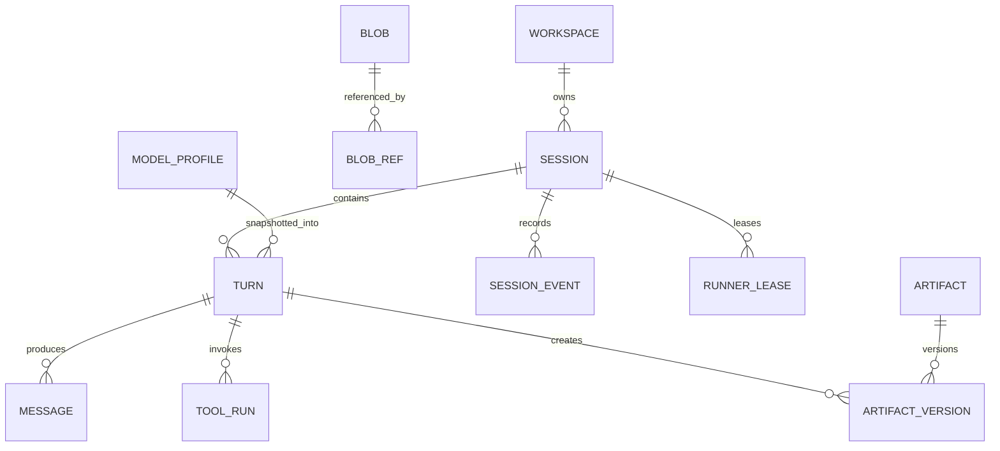
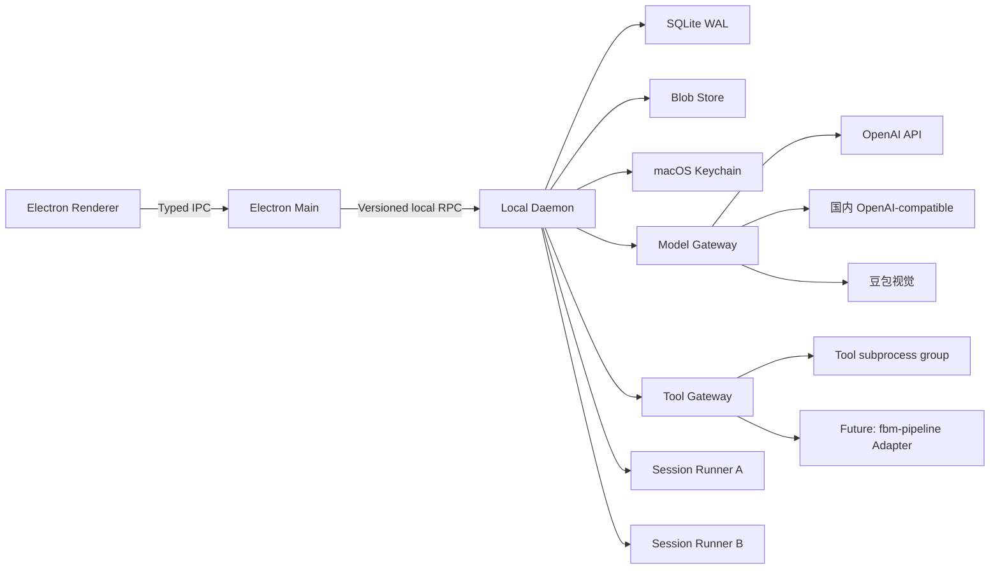
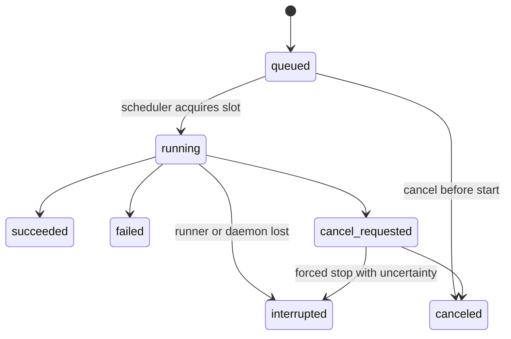

# Agent Workbench 基础框架 MVP 设计规格

- 状态：待用户总评审
- 日期：2026-07-13
- 工程：Agent Workbench
- 首发平台：macOS
- 产品阶段：基础框架 MVP
- 设计依据：WorkBuddy 5.2.5 产品与运行时研究、fbm-pipeline 只读架构研究、已确认的产品决策

## 1. 摘要

Agent Workbench 是一个本地优先、任务驱动、可扩展的 AI 工作台。它不是单纯的聊天客户端，也不是把每个业务流程写成一段巨大 Prompt 的壳。它提供一套稳定的桌面交互、可恢复的 Session Runtime、统一模型网关、可审计 Tool Gateway、版本化 Artifact，以及 Skill、Tool、Connector、Scenario 四类扩展边界。

MVP 的核心闭环是：

> 选择工作区或场景 → 提交 Craft 任务 → Agent 调用模型与工具执行 → 实时查看过程 → 获得可预览、可追溯的正式产物 → 在同一 Session 中继续修改。

基础框架与业务场景严格分层：

- 基础框架负责 Session、Turn、事件、Runner、模型、工具、产物、扩展注册、恢复与桌面体验。
- 业务场景负责领域输入、SOP、规则、业务工具组合和产物契约。
- 现有 fbm-pipeline 将来通过 Connector/Tool Adapter 接入，继续作为独立电商执行引擎，不复制进平台内核，也不让 Agent 直接读写它的数据库。

MVP 保留 Ask、Plan、Craft 三种模式的产品概念和协议枚举，但只实现 Craft。Ask 与 Plan 在界面中显示为“即将支持”，不可启动。

MVP 默认且固定为 Full Access：不做逐工具审批弹窗，不做权限模式切换。Full Access 只取消人工授权步骤，不取消 Tool Gateway、输入校验、超时、取消、审计、幂等和副作用记录。

## 2. 已确认决策

| 主题 | 决策 |
|---|---|
| 产品形态 | WorkBuddy 类本地 AI 任务工作台 |
| 首发平台 | macOS |
| 用户模型 | 单人、本机使用 |
| 桌面架构 | Electron Renderer + Electron Main + Local Daemon + 每 Session 独立 Runner |
| 登录与云 | 不做登录、团队、组织、云同步 |
| 工作模式 | 保留 Ask / Plan / Craft，MVP 只实现 Craft |
| 权限 | 固定 Full Access，无逐工具审批 |
| 工作区 | 一个 Session 绑定一个主工作区，但工具可访问当前 macOS 用户有权访问的其他路径 |
| 并发 | 最多两个 Session 同时执行；同一 Session 内 Turn 串行 FIFO |
| 持久化 | SQLite WAL + 内容寻址 Blob Store，均位于应用数据目录 |
| 恢复 | 应用重启后恢复 Session、消息、事件、产物和队列 |
| 中断 | 已完成工具不重复执行；未完成工具标记 interrupted；继续时创建新 Turn |
| 密钥 | BYOK，明文只进入 macOS Keychain |
| 文本模型 | OpenAI API 与国内 OpenAI-compatible 模型 |
| 图片理解 | 统一自动路由至豆包视觉模型 |
| 业务实现 | 仅两个 Mock 场景，不连接真实 GIGA、TikTok Shop 或 Amazon |
| fbm-pipeline | 未来作为独立业务执行引擎，通过稳定 Adapter 接入 |

## 3. 产品目标

### 3.1 MVP 目标

1. 建立一个可靠的 Craft 任务闭环，而不是只完成一轮模型对话。
2. 支持模型流式输出、文件工具、Shell 工具、结构化 Tool Calling 和正式产物交付。
3. 支持两个 Session 并发、同 Session 消息排队、取消、崩溃恢复和继续执行。
4. 把所有执行事实持久化，使 UI 重连后可以准确复原，而不是依赖内存状态。
5. 建立可扩展但不过度设计的 Skill、Tool、Connector、Scenario 协议。
6. 用“数据报告”和“电商 Listing”两个 Mock 场景证明扩展体系可用。
7. 为将来将 fbm-pipeline 作为电商 Agent/Skill 的后端执行引擎预留清晰边界。

### 3.2 用户价值

用户应获得四种直接价值：

- 连续工作：任务中断、关闭窗口或客户端重启后，仍能找到原 Session 并继续。
- 真正交付：结果以 Artifact 呈现，可预览、打开、下载、版本化和追溯。
- 能力复用：同一个基础框架可以加载不同 Skill、Tool、Connector 和 Scenario。
- 本机掌控：工作区、Session 数据和 API Key 均由本机管理，不依赖平台账号或云同步。

### 3.3 成功指标

#### 产品体验

- 首次配置模型后，用户在 5 分钟内可以完成一个 Mock 场景并打开正式 Artifact。
- 从点击发送到 UI 显示 queued/running 状态，P95 小于 200 毫秒。
- Renderer 重启后，最近 Session 列表和当前执行状态在 2 秒内恢复。
- 标准 Mock 场景在有效模型配置下完成率不低于 95%。
- 任意失败都显示稳定错误码、用户可理解的原因和下一步动作。

#### 可靠性

- 全局同时运行的 Turn 永远不超过 2。
- 同一 Session 永远不同时运行两个 Turn。
- 已成功 ToolRun 在恢复或继续时重复执行率为 0。
- Daemon 或 Runner 崩溃不得把未完成操作错误标记为 succeeded。
- 状态变化与对应 Event 始终在同一数据库事务提交。

#### 产物质量

- 100% 标记为 final 的 Artifact 可打开或下载。
- 100% Artifact 可追溯到 Session、Turn、ToolRun、输入和扩展版本。
- 数据报告中的数字与确定性计算结果一致。
- Listing 中的规格和声明必须能追溯到商品事实或视觉证据。
- 所有要求结构化输出的模型调用均通过 JSON Schema 校验。

## 4. 非目标

以下内容不进入基础框架 MVP：

- 用户登录、账号中心、订阅、Credits、支付和计费。
- 团队、组织、RBAC、协同编辑、云同步和远程控制。
- Projects、知识库、长期记忆、跨 Session 自动学习。
- Automation、定时任务、Webhook 和长期后台监控。
- Ask 与 Plan 的真实执行逻辑。
- Agent Teams、多 Agent 编排和工作树管理。
- 在线扩展市场、远程安装、不可信扩展沙箱。
- 浏览器自动化、Cookie、验证码和登录态复用。
- 真实 GIGA 拉品、TikTok Shop 发布、Amazon 发布或上传。
- 直接合并或重写 fbm-pipeline。
- 通用办公套件编辑器。
- 自动更新服务；正式分发前另行设计签名、发布和回滚机制。

## 5. 设计原则

### 5.1 Daemon 是唯一事实源

Renderer 只负责呈现，Runner 只负责推理和执行协调。Session、Turn、Event、ToolRun、Artifact、队列和 Runner Lease 的权威状态全部由 Daemon 管理并持久化。

### 5.2 一个运行时，不为每个场景复制状态机

自由 Craft 任务和 Scenario 启动的任务都落在同一套 Session/Turn/Event/ToolRun Runtime 上。Scenario 是任务入口和能力包，不在 MVP 内建立第二套通用 DAG 调度器。

现有垂直系统如果已经具备可靠工作流 Runtime，例如 fbm-pipeline，则通过 Connector 提交长任务并归一化其状态，不把它的内部步骤复制到平台数据库。

### 5.3 Agent 做判断，Tool 做动作

- Skill 提供领域知识、规则和结构化输出约束。
- Tool 执行确定性或有明确副作用的动作。
- Connector 适配外部或本地服务协议。
- Scenario 把用户入口、输入和需要的能力组合起来。
- Daemon 保存事实，模型输出本身不能直接成为执行状态。

### 5.4 Artifact 是一等对象

聊天文本不是唯一结果。正式交付物必须注册为 Artifact，带版本、来源、MIME、校验状态和不可变内容快照。

### 5.5 Full Access 仍然可控

不弹审批不等于无边界。所有工具仍经 Tool Gateway；所有调用仍可取消、超时、审计；不确定副作用仍禁止自动重试；密钥仍不能进入 Runner 或日志。

### 5.6 默认本地和最小数据外发

Session 数据、文件快照、日志和密钥均保存在本机。只有本次模型请求明确引用的文本和图片才可发送给对应模型服务。

### 5.7 MVP 优先可验证

先实现可靠闭环、清晰协议和崩溃恢复。市场、团队、自动化、通用 DAG、复杂权限和真实业务发布全部后置。

## 6. 用户体验设计

### 6.1 应用信息架构

左侧固定导航：

1. 新建任务
2. 最近 Session
3. 场景
4. 产物
5. 扩展
6. 设置

MVP 不设置 Projects、团队、市场和云盘入口。

主界面使用三栏工作区：

```text
┌────────────────┬──────────────────────────────────┬────────────────────┐
│ 导航 / Session  │ 对话与执行过程                    │ 过程 / Artifact     │
│                │                                  │                    │
│ + 新建任务      │ 用户消息                          │ 执行清单            │
│ 最近任务        │ Agent 流式回复                    │ Tool 状态           │
│ 场景            │ Tool 调用卡片                     │ 正式产物            │
│ 产物            │ 错误与继续提示                    │ 工作区变更          │
│ 扩展            │                                  │                    │
│ 设置            │ Composer                         │ Preview             │
└────────────────┴──────────────────────────────────┴────────────────────┘
```

右栏可折叠。窄窗口下右栏变为抽屉，不影响主对话。

### 6.2 新建任务

新建任务页面包含：

- 主工作区选择器。
- 模式选择器：Craft 可用；Ask、Plan 显示“即将支持”。
- 模型 Profile 选择器。
- Full Access 固定状态说明。
- 多行任务输入框。
- 文件和图片附件入口。
- 两个 Mock Scenario 快捷卡片。

启动 Session 时记录工作区、模式、模型 Profile、Scenario 和扩展版本快照。后续设置变化不应悄悄改变正在运行的 Turn。

### 6.3 Session 工作区

Session 顶部显示：

- 标题。
- 主工作区。
- 当前模型。
- Craft / Full Access。
- idle、queued、running、canceling、recovering 或 error 状态。
- 取消、打开工作区、查看日志和归档操作。

消息流包含：

- 用户消息。
- Agent 文本与推理摘要。
- 模型调用状态。
- Tool 卡片：工具名、输入摘要、耗时、状态、输出摘要。
- Artifact 卡片。
- 结构化错误卡片。
- 中断与恢复提示。

同一 Session 正在执行时再次发送消息，新消息进入 FIFO 队列。UI 显示队列位置，并允许取消尚未开始的消息。MVP 不支持队列重排。

### 6.4 执行过程面板

Craft Agent 可通过内置 Runtime Tool 发布一个“执行清单”。这不是 Plan 模式，也不是独立工作流引擎，只是当前 Turn 的可观察进度投影。

执行清单支持：

- 创建 1 至 20 个条目。
- pending、in_progress、completed 三种状态。
- 同时最多一个 in_progress。
- 每次变化产生 Event。
- Turn 结束后保留历史。

如果 Agent 未创建清单，UI 仍完整显示模型和 Tool 事件。

### 6.5 Artifact 面板

Artifact 面板分为：

- 正式产物：Agent 显式标记为 final。
- 工作区变更：文件工具或 Shell 检测到但未交付为 final 的文件。
- 执行证据：日志、校验结果和中间结构化数据。

这一区分解决“QA 脚本被误当成最终交付物”的问题。只有 final Artifact 默认出现在全局产物页。

MVP 内置预览：

- 文本与代码。
- Markdown。
- JSON。
- CSV 表格。
- 本地 HTML。
- PNG、JPEG 和 WebP。

其他类型允许下载、在 Finder 中显示或调用系统默认应用打开。

### 6.6 场景页

场景页展示已注册 Scenario。每张卡片显示：

- 场景名称和说明。
- 所需输入。
- 预期 Artifact。
- 使用的 Skill、Tool 和模型类型。
- 是否会访问模型网络。
- 是否包含外部系统写入。

启动 Scenario 时，Renderer 根据 JSON Schema 生成输入表单。提交后创建普通 Session 和首个 Craft Turn，并把结构化输入、Scenario 指令和能力约束作为不可见上下文快照交给 Runner。

### 6.7 产物页

全局产物页支持：

- 按类型、Scenario、Session 和时间筛选。
- 预览、下载、在 Finder 显示。
- 查看来源链。
- 查看历史版本。
- 基于 Artifact 创建新 Session。

MVP 不实现复杂 Diff 编辑器。文本类 Artifact 可显示相邻版本的行级 Diff；二进制类型仅显示元数据差异。

### 6.8 扩展页

扩展页是本地能力诊断页，不是市场。它展示：

- 扩展包 ID、名称、版本和路径。
- 组件类型。
- 清单校验结果。
- 声明的文件、进程、网络和外部写入能力。
- 启用状态。
- 加载错误。

MVP 只加载内置扩展和用户手动放入本地扩展目录且标记为可信的扩展。扩展加载失败必须隔离，不能阻塞核心应用启动。

### 6.9 设置

设置页包含：

- 默认工作区。
- 模型 Profiles。
- 豆包视觉 Profile。
- 扩展目录。
- 数据与日志路径。
- 日志级别。
- Session 删除和本地数据清理。
- “Full Access 已启用”的明确说明。

不包含账号、团队、云同步、计费和远程渠道设置。

## 7. 核心领域模型

### 7.1 术语

| 对象 | 定义 |
|---|---|
| Workspace | Session 的主工作目录和默认相对路径基准 |
| Session | 持久对话与任务容器 |
| Turn | 一次用户提交及由此触发的完整 Agent 执行 |
| Message | 面向用户呈现的用户或 Agent 消息 |
| Session Event | append-only 执行事实和 UI 重建依据 |
| ToolRun | 一次具体工具执行尝试 |
| Runner Lease | Daemon 对某个 Session Runner 的进程租约 |
| Artifact | 可预览、下载和追溯的逻辑产物 |
| Artifact Version | Artifact 的某个不可变内容版本 |
| Blob | 由 SHA-256 标识的不可变大内容 |
| Model Profile | Provider、Endpoint、模型、能力和 Keychain 引用 |
| Skill | 受约束的 AI 知识和判断单元 |
| Tool | 带 Schema、超时、副作用和错误契约的执行单元 |
| Connector | 对本地或远程系统的协议适配层 |
| Scenario | 用户可直接启动的任务入口与能力组合 |

### 7.2 关系



### 7.3 Session

主要字段：

| 字段 | 说明 |
|---|---|
| id | UUIDv7 |
| title | Session 标题 |
| workspace_id | 主工作区 |
| lifecycle_status | active / archived |
| runtime_status | idle / queued / running / canceling / recovering / error |
| current_turn_id | 当前活动 Turn，可空 |
| mode | craft；协议保留 ask / plan |
| access_mode | MVP 固定 full_access |
| default_model_profile_id | 默认模型 Profile |
| scenario_id / scenario_version | 可空 |
| scenario_input_blob_id | 可空 |
| next_turn_ordinal | 下一个 Turn 顺序号 |
| next_event_seq | 下一个 Event 序号 |
| revision | 乐观并发版本 |
| created_at / updated_at | 时间 |

### 7.4 Turn

一个 Turn 对应一次用户提交。恢复不修改原 Turn，而是创建新 Turn。

主要字段：

| 字段 | 说明 |
|---|---|
| id | UUIDv7 |
| session_id | 所属 Session |
| ordinal | Session 内严格递增 |
| client_request_id | Renderer 生成的幂等键 |
| resume_of_turn_id | 恢复来源，可空 |
| parent_turn_id | 逻辑父 Turn，可空 |
| status | queued / running / cancel_requested / succeeded / failed / canceled / interrupted |
| input_message_id | 用户输入消息 |
| mode_snapshot | craft |
| model_snapshot_json | Provider、模型和参数快照 |
| extension_snapshot_json | Skill、Tool、Connector、Scenario 版本 |
| runner_instance_id | 当前 Runner |
| queued_at / started_at / finished_at | 时间 |
| cancel_requested_at | 可空 |
| error_code / error_message | 结构化错误 |
| result_message_id | 最终 Agent 消息，可空 |

唯一约束：

- session_id + ordinal。
- session_id + client_request_id。

Terminal 状态为 succeeded、failed、canceled、interrupted。Terminal Turn 不得再次变化。

### 7.5 Message

Message 是 UI 友好的对话投影，不代替 Event。

主要字段：

- id、session_id、turn_id。
- role：user、assistant、system_summary。
- status：streaming、completed、interrupted。
- content_blob_id。
- structured_content_blob_id，可空。
- created_at、completed_at。

模型流在执行过程中产生 coalesced Event，完成后写入不可变 Message 内容。每 50 毫秒或累计 4 KiB 合并一次 delta，避免逐 token 写库。

### 7.6 Session Event

Event 是 append-only 审计事实，也是 Renderer 重连后的恢复依据。

主要字段：

- id。
- session_id、turn_id、tool_run_id，可空。
- seq：Session 内严格递增。
- type。
- actor：user、daemon、runner、model、tool。
- payload_json：小型结构化内容。
- blob_id：大型内容。
- producer_id、producer_seq：Runner 事件幂等。
- created_at。

唯一约束：

- session_id + seq。
- producer_id + producer_seq。

核心事件类型：

- session.created、session.updated。
- turn.queued、turn.started、turn.cancel_requested、turn.succeeded、turn.failed、turn.canceled、turn.interrupted。
- model.started、model.delta、model.completed、model.failed。
- vision.started、vision.completed、vision.failed。
- tool.queued、tool.started、tool.output、tool.succeeded、tool.failed、tool.canceled、tool.interrupted。
- checklist.updated。
- artifact.created、artifact.version_created。
- runner.started、runner.heartbeat、runner.exited、runner.crashed。
- recovery.detected、recovery.resumed。

Daemon 必须先提交状态与 Event，再向客户端广播。

### 7.7 ToolRun

主要字段：

| 字段 | 说明 |
|---|---|
| id | UUIDv7 |
| session_id / turn_id | 归属 |
| logical_call_id | 模型产生的稳定调用 ID |
| attempt | 尝试次数 |
| retry_of_tool_run_id | 重试来源 |
| tool_id / tool_version | 工具标识与版本 |
| side_effect_class | read / local_write / process / network_read / external_write / mixed |
| status | queued / running / cancel_requested / succeeded / failed / canceled / interrupted |
| idempotency_key | 工具幂等键，可空 |
| input_json / input_blob_id | 输入 |
| result_json / result_blob_id | 输出 |
| stdout_blob_id / stderr_blob_id | 进程输出 |
| pid / pgid | 子进程信息 |
| exit_code | 可空 |
| effect_state | not_applied / applied / unknown |
| error_code / error_message | 结构化错误 |
| started_at / finished_at | 时间 |

effect_state 语义：

- not_applied：确认没有发生副作用。
- applied：确认副作用已完成。
- unknown：进程中断或远端响应不确定，无法判断是否已生效。

unknown 状态永远不自动重试。

### 7.8 Artifact 与 Blob

Artifact 是逻辑对象，Artifact Version 是不可变版本。

Artifact 主要字段：

- id、session_id。
- logical_name。
- artifact_type。
- visibility：final、working、evidence。
- current_version_id。
- created_at、updated_at。

Artifact Version 主要字段：

- id、artifact_id、version。
- source_turn_id、source_tool_run_id。
- blob_id。
- original_path，可空。
- filename、mime_type、size、sha256。
- preview_kind。
- validation_status：valid、warning、invalid、unchecked。
- validation_report_blob_id，可空。
- provenance_json：输入、模型、扩展和工具版本。
- created_at。

Blob 采用 SHA-256 内容寻址。相同内容只保存一次，通过 blob_refs 记录所有者关系。

### 7.9 其他表

MVP 数据库还包含：

- workspaces。
- runner_leases。
- model_profiles。
- usage_records。
- extension_packages。
- extension_components。
- blobs。
- blob_refs。
- schema_migrations。

## 8. 进程架构



### 8.1 Electron Renderer

职责：

- 页面、输入、流式展示、队列展示、Artifact 预览。
- 维护最后收到的 Session Event seq。
- 断线后请求 Snapshot 并按游标补事件。

限制：

- nodeIntegration 关闭。
- contextIsolation 开启。
- Renderer sandbox 开启。
- 不直接访问文件系统、Shell、SQLite、Keychain、模型或 Connector。
- 不加载拥有本机权限的远程页面。

### 8.2 Electron Main

职责：

- 窗口、菜单、文件选择器、Finder 打开和单实例锁。
- 启动、发现、健康检查和重连 Daemon。
- 通过 preload 暴露严格白名单 IPC。
- 将 Renderer RPC 转发给 Daemon。
- 转发模型凭据的新增、替换和删除请求；已保存密钥的读取由 Daemon 的 Credential Store 直接访问 Keychain，Main 和 Renderer 都不能取回明文。

Main 不执行长任务，也不保存 Runtime 权威状态。

### 8.3 Local Daemon

Daemon 是本机控制平面：

- SQLite 唯一读写者。
- Session/Turn 状态机和持久队列。
- Event 分配 seq、事务提交和广播。
- Runner Supervisor 和全局并发控制。
- Model Gateway。
- Tool Gateway。
- Artifact 与 Blob 管理。
- Extension Registry。
- 通过 Credential Store 按需读取 macOS Keychain；即使 Main 崩溃，已运行 Turn 也不依赖 Main 才能取得模型凭据。

Daemon 使用文件锁确保单实例。连接需完成协议版本握手，并使用 Main 启动时取得的短期本机会话 Token。

### 8.4 Session Runner

每个活动 Session 拥有一个独立 Runner 进程：

- 一个 Runner 同时只处理该 Session 的一个 Turn。
- Runner 不跨 Session 复用上下文。
- Runner 不直接读取 Keychain 或 SQLite。
- Runner 不直接修改 Runtime 状态，只上报结构化请求和事件。
- 模型调用通过 Daemon Model Gateway。
- 工具调用通过 Daemon Tool Gateway。
- Runner 崩溃只影响当前 Session 的当前 Turn。

Turn 完成后 Runner 可保温 30 秒。如果本 Session 有队列且没有更早等待的其他 Session，可继续使用；否则释放槽位。

### 8.5 Tool subprocess

Shell 和进程型 Tool 在独立进程组中执行：

- 记录 pid 和 pgid。
- 支持 stdout/stderr 流式读取与脱敏。
- 取消时先发送 SIGTERM。
- 最多等待 3 秒，再发送 SIGKILL。
- 父进程退出时不得遗留失控子进程。

## 9. 本地 RPC

### 9.1 协议

MVP 使用版本化、长度前缀 JSON RPC：

- Main 与 Daemon：Unix Domain Socket。
- Daemon 与 Runner：独立本地 IPC 通道，复用同一 Schema 包。
- 每帧为 4 字节大端长度加 UTF-8 JSON。
- 支持 request、response、notification、cancel 和 heartbeat。

每个 RPC Envelope 至少包含：

- protocol_version。
- request_id。
- trace_id。
- session_id 和 turn_id，可空。
- method。
- payload。
- idempotency_key，可空。

所有输入和输出由共享协议包中的 Zod Schema 运行时校验，并由同一 Schema 导出 TypeScript 类型。

### 9.2 Renderer API

核心方法：

- app.getBootstrap。
- workspace.list、workspace.choose、workspace.register。
- session.create、session.list、session.getSnapshot、session.archive、session.delete。
- turn.enqueue、turn.cancel、turn.resume。
- event.listAfter、event.subscribe。
- artifact.list、artifact.get、artifact.open、artifact.reveal、artifact.export。
- modelProfile.list、create、update、test、delete。
- extension.list、reload、enable、disable。
- diagnostics.getHealth、openLogs。

Renderer 不获得通用 invokeShell、readFile 或 keychainRead 方法。

### 9.3 无丢事件重连

重连流程：

1. Renderer 请求 session.getSnapshot。
2. Daemon 返回物化状态和 high_water_seq。
3. Renderer 订阅 high_water_seq 之后的事件。
4. Daemon 先补发已提交事件，再推送新事件。
5. Renderer 按 seq 去重和排序。

如果 seq 出现缺口，Renderer 停止增量应用并重新请求 Snapshot。

### 9.4 背压

- 模型 delta 合并后再持久化和广播。
- 每个订阅客户端有有界缓冲区。
- 慢客户端超出缓冲后收到 resync_required，而不是无限占用内存。
- Tool stdout/stderr 大内容进入 Blob，Event 只携带摘要和引用。

## 10. Craft 执行模型

### 10.1 Turn 生命周期



interrupted 是 Terminal 状态。用户点击继续时创建新 Turn，并设置 resume_of_turn_id；原 Turn 保持不可变。

### 10.2 Agent Loop

Runner 执行以下循环：

1. 从 Daemon 获取本 Turn 的不可变 Context Snapshot。
2. 组装 Craft 系统指令、最近对话、摘要、Skill 指令、Tool Schemas 和附件引用。
3. 请求文本模型流式响应。
4. 如果模型产生 Tool Call，逐个提交给 Tool Gateway。
5. 将 Tool 结果加入当前 Turn 上下文。
6. 继续模型调用，直到输出最终回答、产生可恢复错误或达到上限。
7. 注册 Agent 明确交付的 final Artifact。
8. 请求 Daemon 事务性完成 Turn。

MVP 同一 Session 内一次只执行一个 ToolRun。模型同时返回多个 Tool Call 时按返回顺序执行。只读工具并行化留待后续。

默认安全上限：

- 每 Turn 最多 64 次模型/工具循环。
- 默认最长 60 分钟，可在开发设置调整。
- 单次模型调用默认 5 分钟。
- Tool 使用各自清单超时。
- 模型和工具输出均有大小上限，超出部分进入 Blob 并返回截断摘要。

### 10.3 Context 管理

不实现跨 Session 长期记忆。Session 内保留完整原始历史，但发给模型的上下文受预算控制：

- 优先当前用户请求、最近 Turn、未完成任务和已成功 Tool 结果。
- 大 Tool 输出使用摘要和 Blob 引用，不反复注入全文。
- 当估算上下文超过模型窗口的 70% 时，创建 system_summary Message。
- 摘要生成是显式模型调用，有 usage 记录和 Event。
- 原始消息和工具结果不删除，用户仍可审计。
- Prompt 中不注入不存在或无价值的空记忆模板。

### 10.4 执行清单

内置 runtime.checklist_update Tool 只更新本 Turn 的展示清单：

- 不执行外部动作。
- 由 Daemon 校验状态约束。
- 每次更新产生 checklist.updated Event。
- Turn 失败或中断后保留最后状态。

### 10.5 模式

协议和数据库枚举保留：

- ask：未来只读分析。
- plan：未来调查、形成计划并等待执行转换。
- craft：当前可用，直接使用工具执行。

MVP Renderer 不能创建 ask 或 plan Turn。Daemon 收到这两种模式请求时返回 MODE_NOT_IMPLEMENTED。

## 11. 调度、并发与队列

### 11.1 不变量

- 全局 active Turn 小于等于 2。
- 同一 Session active Turn 小于等于 1。
- 同一 Session 严格 FIFO。
- Terminal Turn 不得改变状态。
- Session current_turn_id 只能指向活动 Turn。

### 11.2 调度规则

1. queued Turn 持久化在 SQLite，不只存在内存。
2. 每个 Session 只有队首 Turn 参与全局调度。
3. 不同 Session 按各自队首 Turn 的 queued_at 排序。
4. 有空闲槽时选择最早等待的 Session。
5. 已运行 Turn 不抢占。
6. 第三个 Session 稳定保持 queued。
7. Turn 完成、取消或中断后立即释放槽位。

Daemon 内使用容量为 2 的调度信号量；数据库约束和事务再次防止并发超限。

### 11.3 重复提交

Renderer 为每次发送生成 client_request_id。网络重试或双击造成的重复 enqueue 返回原 Turn，不创建新 Turn。

## 12. 取消、恢复与幂等

### 12.1 取消

取消流程：

1. Daemon 原子写入 cancel_requested_at 和 turn.cancel_requested Event。
2. 向 Runner 发送 cancellation token。
3. Model Gateway 中止 HTTP 流。
4. Tool Gateway 向进程组发送 SIGTERM。
5. 3 秒后未退出则 SIGKILL。
6. 事务性更新 ToolRun、Turn 和 Event。
7. 释放 Runner 槽位并调度下一 Turn。

queued Turn 可直接变为 canceled，不启动 Runner。

### 12.2 Daemon 启动恢复

Daemon 启动时扫描：

- running 或 cancel_requested Turn。
- running 或 cancel_requested ToolRun。
- runner_leases。
- queued Turn。

处理：

- queued Turn 保留并重新调度。
- 无法重新握手的旧 Runner 对应 Turn 标记 interrupted。
- 活动 ToolRun 标记 interrupted。
- 已成功 ToolRun 和 Artifact 不变。
- effect_state=unknown 的工具不自动重试。
- UI 显示“上次执行被中断，可以继续”。

### 12.3 用户继续

继续操作创建新 Turn：

- resume_of_turn_id 指向 interrupted Turn。
- Context 包含原请求、已完成 Agent 内容、成功 Tool 结果和未完成摘要。
- effect_state=unknown 的项目以高优先级警告注入上下文并展示给用户。
- Runner 必须复用成功结果，禁止重复执行相同 logical_call_id。

### 12.4 Tool 自动重试

| 类型 | 自动重试规则 |
|---|---|
| read | 可按策略创建新 attempt |
| local_write | 仅支持临时文件加原子 rename，或有明确幂等键时 |
| process | 默认不自动重试 |
| network_read | 可对超时、429、5xx 限次重试 |
| external_write | 仅远端支持幂等键且 effect_state 明确时 |
| unknown effect | 永不自动重试 |

已 succeeded 的 ToolRun 永不再次执行。

## 13. SQLite 与本地存储

### 13.1 路径

默认应用数据目录：

    ~/Library/Application Support/AgentWorkbench/
      workbench.sqlite3
      workbench.sqlite3-wal
      workbench.sqlite3-shm
      blobs/sha256/
      runtime/
      logs/
      extensions/
      temp/

目录权限默认为 0700，数据库、Token、日志和临时文件默认为 0600。

Session 元数据、计划、事件和内部临时文件不得写入用户工作区。用户明确要求创建的业务文件可以写入工作区，并在注册 Artifact 时快照到 Blob Store。

### 13.2 SQLite 配置

- journal_mode=WAL。
- foreign_keys=ON。
- busy_timeout=5000。
- synchronous=NORMAL。
- 仅 Daemon 持有读写连接。
- 所有 Schema 变更使用递增迁移。
- 启动迁移前创建数据库备份；迁移失败不启动新 Runtime。

### 13.3 事务要求

以下操作必须单事务完成：

- 状态变化与对应 Event。
- 分配 Session Event seq 与插入 Event。
- 创建 Turn 与入队 Event。
- 完成 ToolRun 与结果引用。
- 创建 Artifact Version 与 Blob Ref。
- 释放 Runner Lease 与 Session 状态投影。

### 13.4 Blob Store

- SHA-256 内容寻址。
- 先写 temp，fsync 后原子 rename。
- 大于 64 KiB 的文本和所有二进制内容进入 Blob。
- SQLite 保存 MIME、大小、hash 和引用。
- 定期清理无引用 Blob 和超过 24 小时的 temp。
- 相同内容只存一份。
- 工作区源文件默认记录 canonical path 和 stat fingerprint；只有作为附件、证据或 Artifact 时才快照。

### 13.5 删除

删除 Session 时：

- 先事务性删除逻辑引用。
- 重新计算无引用 Blob。
- Blob GC 独立执行，可失败重试。
- 不删除用户工作区文件。
- 删除 Keychain Profile 时只删除该 Profile 的凭据，不影响 Session 历史。

## 14. Model Gateway

### 14.1 统一职责

Model Gateway 负责：

- OpenAI-compatible 请求适配。
- 流式响应归一化。
- Tool Calling 归一化。
- 超时、重试和错误码。
- 模型能力检查。
- 用量记录。
- 密钥读取和注入。
- 豆包视觉子调用。

Runner 永远不接触 API Key 明文。

### 14.2 Model Profile

Profile 包含：

- id、display_name。
- provider_kind：openai、openai_compatible、doubao_vision。
- base_url。
- model_id。
- capability：streaming、tool_calling、json_schema、vision。
- timeout 和 retry_policy。
- keychain_ref。
- enabled。

Craft 默认文本模型必须支持 streaming 和 tool_calling。无法满足能力要求的 Profile 可保存，但不能设为 Craft 默认模型。

“ChatGPT”在本产品中指 OpenAI API 模型。MVP 不支持使用 ChatGPT 消费者订阅登录替代 API Key。

### 14.3 Keychain

- API Key 使用 macOS Keychain Generic Password。
- 数据库只保存 keychain_ref 和脱敏尾号。
- Renderer 只能看到已配置/未配置。
- Daemon 调用模型前按需读取。
- 明文不进入 Runner 环境、Event、ToolRun、Blob 或日志。
- 更新和删除 Profile 时同步更新或删除 Keychain 条目。

### 14.4 文本路由

- 海外 Profile 使用 OpenAI 官方 API。
- 国内文本模型使用用户配置的 OpenAI-compatible Endpoint。
- MVP 不做自动价格路由或多模型投票。
- 每个 Turn 使用创建时的 Profile Snapshot，除非用户在新 Turn 明确切换。

### 14.5 豆包视觉自动路由

MVP 所有图片理解统一走豆包视觉，不把原图直接发送给文本模型。

流程：

1. Context Builder 检测本 Turn 引用的图片附件或图片 Artifact。
2. Daemon 创建显式 vision.started Event 和 usage attempt。
3. 只把被本 Turn 明确引用的图片发送给豆包视觉。
4. 豆包返回结构化 VisualEvidence。
5. Daemon 校验 Schema，持久化为 evidence Artifact。
6. 文本模型只接收 VisualEvidence 和用户目标，不接收原始图片。

VisualEvidence 至少包含：

- source_image_sha256。
- summary。
- detected_text。
- objects。
- product_attributes。
- uncertainty。
- safety_notes。

视觉失败时：

- 明确产生 vision.failed。
- 不生成虚假描述。
- 如果图片是必要输入，Turn 失败并给出配置或重试建议。
- 如果图片是可选输入，Agent 可在明确说明缺失视觉证据后继续。

### 14.6 重试

- 认证、权限和无效请求错误不自动重试。
- 429、连接失败和 5xx 使用带抖动指数退避，默认最多 3 次。
- Retry-After 优先。
- 流中断后创建新的 model attempt，不假设 Provider 幂等。
- 不无限降级到另一个 Provider。

### 14.7 用量

usage_records 保存：

- session_id、turn_id。
- provider、model。
- call_kind：text、vision、summary。
- input_tokens、output_tokens、cached_tokens。
- latency。
- provider_request_id。
- 可选估算成本。

MVP 不实现 Credits 或平台计费。

## 15. Tool Gateway

### 15.1 统一边界

Runner、Skill 和 Scenario 不直接调用底层文件系统、Shell、凭据或 Connector Client。所有动作通过 Tool Gateway：

- 校验 Tool 和版本。
- 使用 JSON Schema 校验输入。
- 创建 ToolRun。
- 注入取消与超时。
- 执行并流式收集输出。
- 脱敏。
- 校验输出。
- 记录副作用和 Artifact。
- 返回结构化结果。

### 15.2 Full Access 语义

MVP Full Access 表示：

- 内置文件工具可访问当前 macOS 用户有权访问的路径。
- Shell 可在用户权限下运行命令。
- 已启用的网络 Tool 可发起网络请求。
- 不出现逐次允许/拒绝弹窗。

它不表示：

- Renderer 可直接访问系统能力。
- Tool 可以绕过 Schema 和 Gateway。
- 密钥可以传给模型或 Runner。
- 未安装或未信任的 Tool 可以运行。
- 失败或中断的外部写入可以盲目重试。
- Agent 可以隐藏文件修改、Shell 或网络行为。

### 15.3 Tool Manifest

Tool 至少声明：

    api_version: agent-workbench/v1alpha1
    kind: Tool
    metadata:
      id: core.fs.read
      version: 0.1.0
    schemas:
      input: schemas/input.json
      output: schemas/output.json
    execution:
      handler: builtin:fs.read
      timeout_seconds: 60
    effects:
      class: read
      idempotency: safe

约束：

- ID 使用命名空间且全局唯一。
- 版本遵循 SemVer。
- 输入输出必须有 JSON Schema。
- 错误使用稳定 Error Envelope。
- 文件结果不能只返回临时路径，正式结果必须注册 Artifact。

### 15.4 MVP 内置 Tool

文件类：

- fs.list。
- fs.stat。
- fs.read_text。
- fs.read_binary。
- fs.write_text。
- fs.copy。
- fs.move。
- fs.mkdir。
- fs.search。

进程类：

- shell.exec。
- shell.which。

Artifact 类：

- artifact.register。
- artifact.validate。

Runtime 类：

- runtime.checklist_update。

Mock 场景确定性 Tool：

- table.validate。
- table.profile。
- report.render。
- listing.validate_facts。
- listing.validate_copy。
- listing.package。

MVP 不提供通用删除 Tool。确有业务需要时使用 shell.exec，仍留下完整审计；专用安全删除协议后续设计。

### 15.5 文件写入

- 写入新文件采用临时文件加原子 rename。
- 覆盖前记录目标 fingerprint。
- Tool 结果返回用户请求路径和实际 canonical path。
- 不擅自重写目录分隔、标点或文件名。
- 注册 Artifact 时快照内容，后续工作区修改创建新 Artifact Version。

### 15.6 Shell

- 使用用户默认 shell 的非交互模式。
- cwd 默认 Session Workspace，可由调用显式指定其他路径。
- 环境变量使用白名单继承，并移除常见密钥变量。
- 不把模型 API Key 注入进程环境。
- stdout/stderr 在持久化前脱敏。
- 输出超限时截断展示，完整脱敏结果进入 Blob。

## 16. Artifact 与预览协议

### 16.1 注册

Agent 必须显式调用 artifact.register 才能将文件标为正式产物。参数包括：

- path 或已有 blob_id。
- logical_name。
- visibility。
- artifact_type。
- validation_report，可空。
- source_inputs。

文件观察器可以发现工作区变化，但只能标记为 working，不能自动升级为 final。

### 16.2 版本

- 同一 logical_name 再次注册不同内容时创建 v2、v3。
- 相同 hash 重复注册不创建重复版本。
- 旧版本不可覆盖。
- Artifact provenance 保存输入 Artifact、Tool、Skill、Scenario、模型和 Turn。

### 16.3 HTML 预览

HTML 在 sandboxed iframe 中预览：

- 禁止 Node。
- 禁止 top navigation。
- 禁止任意本地文件访问。
- 默认 CSP 阻止外部脚本和外部网络。
- 链接点击交给 Main 校验后使用系统浏览器打开。
- Preview 崩溃不影响主 Renderer。

### 16.4 表格预览

CSV：

- 自动检测 UTF-8/UTF-8 BOM。
- 首屏虚拟化。
- 显示行列数和解析警告。
- 不在 Renderer 一次载入超大文件；由 Daemon 分页读取。

JSON：

- Schema 校验结果可展开。
- 大对象按路径惰性加载。

### 16.5 来源链

Artifact 详情页至少显示：

- 创建它的 Session 和 Turn。
- ToolRun 或 Agent 注册事件。
- 输入 Artifact。
- 文件 hash。
- 组件版本。
- 校验状态和警告。

## 17. 扩展体系

### 17.1 四类组件

| 类型 | 责任 | 不应承担 |
|---|---|---|
| Skill | 指令、领域规则、结构化判断 | 直接持有凭据或隐式执行外部写入 |
| Tool | 原子动作和确定性转换 | 业务流程编排 |
| Connector | 本地/远程系统协议和认证适配 | 领域 SOP 和对话体验 |
| Scenario | 用户入口、输入表单、能力组合和产物契约 | 复制 Runtime 或数据库 |

### 17.2 扩展包结构

    extensions/
      mock-commerce-listing/
        extension.yaml
        skills/
        tools/
        connectors/
        scenarios/
        schemas/
        fixtures/
        prompts/

extension.yaml 声明：

- 包 ID、名称、版本。
- Runtime 兼容范围。
- 提供的组件。
- 能力说明。
- 入口文件和 Schema。
- 包内容校验和。

### 17.3 Skill

Skill 是可版本化的 AI 行为单元：

    api_version: agent-workbench/v1alpha1
    kind: Skill
    metadata:
      id: mock.listing.writer
      version: 0.1.0
    spec:
      instructions: prompts/listing-writer.md
      model_profile_role: default_text
      allowed_tools:
        - listing.validate_copy
      input_schema: schemas/listing-skill-input.json
      output_schema: schemas/listing-skill-output.json

规则：

- Skill 指令与用户 Prompt 分离并可审计。
- 只能看到 Scenario 或 Agent 为本 Turn 选择的 Tool。
- 结构化输出必须 Schema 校验。
- 事实型结论必须引用 Evidence ID。
- 不确定时输出缺失信息和风险，不能编造。

### 17.4 Connector

Connector 负责能力发现和稳定操作：

- mock：读取扩展包固定样例。
- local_file：读取用户指定文件。
- future local_service：通过本机 HTTP/Unix Socket 访问独立服务。

Connector 操作在 Agent 看来仍表现为 Tool，并具有副作用等级、幂等键和错误契约。

### 17.5 Scenario

MVP Scenario 采用“Scenario-as-Craft Package”：

    api_version: agent-workbench/v1alpha1
    kind: Scenario
    metadata:
      id: mock.data-report
      version: 0.1.0
    spec:
      execution:
        kind: craft
      input_schema: schemas/scenario-input.json
      entry_instructions: prompts/entry.md
      required_skills:
        - mock.report.insight-writer
      allowed_tools:
        - table.validate
        - table.profile
        - report.render
        - artifact.register
      artifact_contracts:
        - type: report/html
        - type: report/markdown

启动时：

1. 校验 Scenario 清单和依赖版本。
2. 根据 input_schema 生成表单。
3. 创建 Session。
4. 固化组件版本和结构化输入。
5. 创建首个 Craft Turn。
6. Runner 按 Scenario 约束使用 Skill 和 Tool。

MVP 不实现由 Scenario 清单驱动的通用 DAG。将来如果确有多个无独立后端的复杂固定工作流，再新增 execution.kind=workflow；该扩展必须复用同一 Event、ToolRun 和 Artifact 基础设施。

### 17.6 加载与兼容

- 不支持的 api_version 拒绝加载。
- 重复 ID、循环依赖、缺失 Schema、hash 不匹配时禁用扩展。
- 单个扩展失败不影响其他扩展和核心应用。
- Session 固化扩展版本；运行中升级不改变当前 Turn。
- 删除仍被历史 Session 引用的扩展时保留元数据快照。

## 18. Mock 场景一：数据报告

### 18.1 目的

验证：

- Scenario 表单。
- 本地文件读取。
- 确定性数据 Tool。
- 文本模型 Skill。
- 多格式 Artifact。
- Shell/Tool QA。
- Artifact 版本与继续修改。
- Session 恢复。

### 18.2 输入

- 内置销售 CSV 或用户选择的本地 CSV。
- 日期字段。
- 指标字段。
- 分组字段。
- 输出语言。

### 18.3 执行

1. local_file 或 mock Connector 读取输入。
2. table.validate 校验编码、表头、空值和类型。
3. table.profile 计算 KPI、趋势、Top 分组、异常和质量指标。
4. report insight Skill 仅基于 profile Evidence 生成洞察。
5. report.render 生成 Markdown 和离线 HTML。
6. 确定性校验器核对数字和 HTML 外部依赖。
7. 注册 final Artifact。

这是 Craft Agent 执行的受约束任务，不是独立 DAG Runtime。执行清单可向用户展示上述阶段。

### 18.4 产物

- source_snapshot.csv，evidence。
- profile.json，evidence。
- report.md，final。
- report.html，final。
- validation.json，evidence。

### 18.5 失败

- 缺失字段：Agent 返回结构化缺失信息，并结束当前 Turn；用户下一 Turn 补充字段映射。
- 空数据或类型不可解析：不调用洞察 Skill。
- Skill Schema 无效：只重试模型 Skill，不重复 table.profile。
- 渲染失败：保留 profile 和已生成 Markdown。

### 18.6 验收

- 报告数字与 CSV 一致。
- 每条洞察引用至少一个 Evidence ID。
- HTML 无外部脚本、样式或网络资源。
- 用户要求修改受众或语言后产生 v2，v1 保留。
- 重启客户端后可继续修改同一 Session。

## 19. Mock 场景二：电商 Listing

### 19.1 目的

验证：

- 商品事实 Schema。
- Skill、Tool、Scenario 边界。
- 图片到豆包视觉的显式子调用。
- Evidence 驱动生成。
- 平台规则校验。
- Listing Artifact 与模拟上传 CSV。
- 将来替换为 fbm-pipeline Connector 时无需改变基础 Runtime。

### 19.2 输入

- 内置虚拟供应商商品 JSON。
- 一张或多张本地样例商品图。
- 目标平台：TikTok Shop US 或 Amazon US。
- 英文风格和长度偏好。

Mock 数据不包含真实供应商、账号或平台凭据。

### 19.3 执行

1. mock Connector 返回标准 ProductFacts。
2. 如果包含图片，Model Gateway 调用豆包视觉并生成 VisualEvidence。
3. listing.validate_facts 校验名称、材质、尺寸、规格和证据完整度。
4. Listing Skill 生成标题、卖点、描述和搜索词。
5. listing.validate_copy 校验长度、重复词、禁用词和无证据声明。
6. 如有可修复问题，Skill 最多执行一次受控修订。
7. listing.package 输出 JSON、Markdown 和模拟上传 CSV。
8. 注册 final Artifact 和 compliance evidence。

### 19.4 平台差异

TikTok Shop US 和 Amazon US 使用不同规则 Profile：

- 标题和字段长度。
- Bullet/description 结构。
- 搜索词规则。
- 禁用声明和格式。
- 模拟上传 CSV 列结构。

MVP 规则仅用于演示框架，不能宣称是平台最新正式模板，也不能用于真实上传。

### 19.5 产物

- product-facts.json，evidence。
- visual-evidence.json，evidence，可空。
- listing.json，final。
- listing.md，final。
- mock-upload.csv，final。
- compliance-report.json，evidence。

### 19.6 业务复核

生成后 UI 并排展示商品事实、视觉证据、Listing 和风险。用户的“批准”只表示接受本地产物，不触发平台发布，也不是 Full Access 工具审批。

用户要求修改后，以普通新 Turn 生成 Artifact v2。

### 19.7 验收

- 图片调用在事件流和用量中可见。
- 文本模型上下文中只有 VisualEvidence，没有原始图片。
- 每个规格声明可追溯到 ProductFacts 或 VisualEvidence。
- 无证据声明被标记或移除。
- 两个平台输出不同且符合各自 Mock Schema。
- 整个场景无 GIGA、TikTok 或 Amazon 外部写入。

## 20. fbm-pipeline 后续集成边界

### 20.1 定位

fbm-pipeline 已经具备 GIGA 拉取、商品聚合、Amazon Listing、任务 Runtime 和 Excel/ZIP 导出能力。它应继续作为独立电商领域服务：

    Agent Workbench Session
      → Commerce Scenario / Skill
      → fbm Connector Tools
      → 本机 fbm-pipeline Adapter API
      → 既有 Task Runtime 与领域服务
      → 归一化事件、审核链接和 Artifact

基础框架不应：

- 直连 fbm-pipeline MySQL。
- 执行它的维护脚本。
- 复制价格、库存、模板和工作流状态机。
- 把整个系统包装成一个没有结构的巨大 Skill。

### 20.2 未来 Adapter 契约

建议提供独立的 /agent/v1 或 MCP Adapter：

- capabilities：发现版本、平台和操作。
- submit_task：使用幂等键提交领域任务。
- get_task：读取归一化状态和进度。
- list_events：按游标读取增量事件。
- control_task：retry、wake、cancel。
- list_artifacts：读取安全 Artifact 元数据和下载句柄。
- get_review_link：深链到现有领域 UI。

返回给 Agent 的数据不得包含：

- 原始数据库 payload。
- lock owner。
- 绝对服务端路径。
- Cookie、Header 或凭据。
- 内部堆栈和敏感响应。

### 20.3 组件映射

- Commerce Listing Agent：理解目标、补齐业务输入、解释进度和风险。
- Platform Skill：TikTok US 或 Amazon US 的 SOP、规则和人工复核点。
- Connector Tool：提交、查询、取消任务，获取 Artifact。
- fbm-pipeline：真正的数据拉取、领域计算、任务执行和导出。

### 20.4 进入真实集成前的条件

后续业务阶段至少需要解决：

- 长任务 Lease 和 heartbeat 延长。
- 可持久运行的 Worker。
- 启动恢复默认开启。
- 强取消。
- 全局唯一幂等键。
- 统一 Artifact API。
- 密钥迁移到更安全的存储。
- TikTok 独立 Listing/Workflow 模型和正式模板校验。

这些不属于本基础框架 MVP 的实现范围。

## 21. 安全与隐私

### 21.1 Renderer 安全

- nodeIntegration=false。
- contextIsolation=true。
- sandbox=true。
- preload 只暴露类型化白名单。
- 禁止 remote module。
- 禁止在特权窗口加载远程内容。
- 外链由 Main 校验并交给系统浏览器。

### 21.2 本地数据

- 应用目录 0700、文件 0600。
- Keychain 保存密钥。
- SQLite 可保存本地路径，但日志默认不打印完整用户文件正文。
- 崩溃报告默认不包含 Prompt、Response、附件或工作区文件。
- 用户可在设置中打开数据目录并删除 Session。

### 21.3 日志脱敏

持久化前自动脱敏：

- Authorization。
- Cookie。
- API Key、Token、Secret 常见格式。
- 模型和 Connector 请求头。
- Keychain 明文。

默认日志记录组件、状态、耗时、错误码、trace_id、session_id、turn_id 和 tool_run_id，不记录完整模型正文和文件正文。

### 21.4 扩展信任

MVP 没有不可信扩展沙箱，因此：

- 默认只启用内置扩展。
- 本地扩展需在注册表标记可信后加载。
- 包清单和内容 hash 每次加载校验。
- 进程型 Tool 在独立进程运行。
- 扩展不能从 Renderer 获取任意 IPC。

“标记可信”是安装级配置，不是每次 Tool 的审批弹窗。

### 21.5 网络

模型调用和已启用 Connector 调用必须产生审计 Event。Renderer HTML Preview 默认不得联网。Full Access 不改变数据最小化规则。

## 22. 错误模型与可观测性

### 22.1 Error Envelope

跨进程错误统一为：

    {
      "code": "MODEL_AUTH_FAILED",
      "category": "configuration",
      "message": "OpenAI API Key 无效",
      "retryable": false,
      "user_action": "在设置中更新该模型 Profile",
      "details_ref": null,
      "trace_id": "..."
    }

类别：

- validation。
- configuration。
- model。
- tool。
- connector。
- runtime。
- storage。
- canceled。
- interrupted。
- internal。

UI 依据 code 和 category 呈现，不解析日志文本判断状态。

### 22.2 日志层次

- Runtime Log：组件状态、耗时、重试和错误。
- Session Event：用户可见执行事实。
- Security Audit：模型网络、Tool 副作用、配置和扩展变化。

### 22.3 诊断

设置页可导出脱敏诊断包：

- 应用和协议版本。
- 组件健康状态。
- 最近错误码。
- 数据库迁移版本。
- 脱敏日志。

不默认包含消息正文、文件、Artifact 内容或 Key。

### 22.4 健康检查

Daemon 提供：

- 数据库可写。
- Blob Store 可写。
- Runner Supervisor 状态。
- Tool Registry 状态。
- Model Profile 配置状态。
- Event 广播状态。

模型网络连通性只在用户点击“测试连接”或真实调用时检查。

## 23. 故障边界

| 故障 | 预期行为 |
|---|---|
| Renderer 崩溃 | Daemon 与 Runner 继续；重启后按 Event 游标恢复 |
| Electron Main 崩溃 | Daemon 尽量继续；新 Main 重新握手 |
| Daemon 崩溃 | Runner Lease 超时；重启后活动 Turn 标记 interrupted |
| 单个 Runner 崩溃 | 只影响该 Session 当前 Turn |
| Tool subprocess 崩溃 | 当前 ToolRun 失败或 interrupted，其他 Session 继续 |
| 模型服务失败 | 限次重试，给出明确错误，不无限循环 |
| 豆包视觉失败 | 明确标记视觉失败，不伪造视觉结论 |
| SQLite 写入失败 | 不广播未提交状态；停止启动新 Turn |
| Blob 写入失败 | Artifact Version 不提交，不暴露半文件 |
| 日志写入失败 | Runtime 可继续；安全审计写入失败时拒绝 external_write |

正常关闭：

- 无活动 Turn 时，Main 请求 Daemon 优雅退出。
- 有活动 Turn 时，Daemon 可继续后台运行，任务结束并空闲 5 分钟后退出。
- 用户显式“停止全部并退出”时，按标准取消流程结束 Turn。

## 24. 推荐 Monorepo 结构

    agent-workbench/
      apps/
        desktop/                 Electron Main、preload、Renderer
      services/
        daemon/                  权威 Runtime、RPC、SQLite、调度
      runtimes/
        session-runner/          Craft Agent Loop
        tool-worker/             进程型 Tool SDK Host
      packages/
        protocol/                RPC/Event/Zod 契约
        db/                      Schema、迁移、Repository
        runtime-core/            状态机、调度、不变量
        model-gateway/           Provider Adapter、路由、用量
        tool-gateway/            Tool Registry 与执行
        artifact-core/           Blob、Artifact、Preview 元数据
        extension-sdk/           清单、Schema、加载器
        ui/                      共享 UI 组件
        config/                  TS、Lint、Test 配置
      extensions/
        mock-data-report/
        mock-commerce-listing/
      fixtures/
        mock-data-report/
        mock-commerce-listing/
      tests/
        contract/
        integration/
        e2e/
        crash/
      docs/
        superpowers/specs/

建议使用 TypeScript monorepo 和 pnpm workspace。具体依赖、构建工具和任务拆分在设计批准后的实施计划中确定。

## 25. 测试策略

### 25.1 单元测试

- Turn、ToolRun、Session 状态机。
- Terminal 状态不可变。
- 调度公平性和全局并发上限。
- Event seq 分配。
- Tool retry/effect_state 决策。
- Blob 去重和引用计数。
- Schema 和 Extension Manifest 校验。
- Model 路由与视觉路由。
- Artifact 版本规则。

### 25.2 契约测试

- Renderer/Main/Daemon RPC Schema。
- Daemon/Runner 协议版本握手。
- Tool Manifest 输入输出。
- Provider Adapter 的统一流式事件。
- Connector 错误归一化。
- Extension 兼容范围。

### 25.3 集成测试

使用 Fake Model Provider 和 Fake Tool：

- 模型 → Tool Call → Tool 结果 → 最终回复。
- 两个 Session 并发，第三个排队。
- 同 Session 三 Turn FIFO。
- 模型 429/5xx 重试。
- Tool 超时和进程组取消。
- Renderer 断线和游标恢复。
- Daemon 重启后 queued Turn 继续。
- interrupted Turn 继续时不重复成功 Tool。
- Keychain 引用不进入数据库正文。

### 25.4 崩溃注入

- 模型流中杀 Runner。
- Shell 写文件前、写入中、rename 后杀进程。
- Tool 远端返回前杀 Daemon。
- Blob temp 写入中杀 Daemon。
- 状态提交后、Event 广播前断开 Renderer。
- 连续 20 次 Runner crash 后检查数据库。

### 25.5 Electron E2E

- 首次启动和模型设置。
- 新建 Session。
- 流式消息和 Tool 卡片。
- 取消 queued/running Turn。
- 客户端重启恢复。
- Artifact 预览、下载和 Finder。
- Scenario 表单自动生成。
- 扩展错误隔离。

### 25.6 Mock 场景测试

数据报告：

- KPI 与 Fixture 一致。
- 洞察 Evidence 引用完整。
- HTML 离线。
- 修改后 v2 且保留 v1。

电商 Listing：

- 豆包视觉使用 Fake Adapter 时输出固定 Evidence。
- 两个平台 Schema 均通过。
- 无证据声明被检测。
- 不发生真实外部业务请求。

### 25.7 安全测试

- Renderer 无法获得 Keychain 明文。
- 数据库、Blob 和日志扫描不到测试 API Key。
- HTML Preview 无 Node、无本地任意文件访问、无默认网络。
- stdout/stderr 中密钥格式在持久化前被脱敏。
- 非 Daemon 进程无法修改 SQLite。

## 26. MVP 验收清单

### 26.1 桌面与 Session

- [ ] macOS 应用可启动、退出和重连 Daemon。
- [ ] 新建 Session 默认 Craft + Full Access。
- [ ] Ask 和 Plan 可见但不可运行。
- [ ] 一个 Session 绑定一个主工作区。
- [ ] 最近 Session 和归档状态可持久化。
- [ ] Renderer 重启后消息、状态和 Artifact 可恢复。

### 26.2 模型

- [ ] 可配置 OpenAI Profile。
- [ ] 可配置国内 OpenAI-compatible Profile。
- [ ] API Key 只存 Keychain。
- [ ] Craft 拒绝缺少 Tool Calling 能力的模型。
- [ ] 图片自动产生豆包视觉子调用。
- [ ] 模型调用和用量可追溯。

### 26.3 Runtime

- [ ] 两个不同 Session 可同时执行。
- [ ] 第三个 Session 保持 queued。
- [ ] 同一 Session Turn 严格 FIFO。
- [ ] 重复 client_request_id 不重复创建 Turn。
- [ ] Event seq 严格递增。
- [ ] 状态变化和 Event 同事务。
- [ ] Runner 不直接写数据库。

### 26.4 Tool

- [ ] 文件、Shell 和 Runtime Tool 均通过 Gateway。
- [ ] 不出现逐工具审批弹窗。
- [ ] ToolRun 有输入摘要、结果、状态、耗时和副作用。
- [ ] Shell 子进程取消后 5 秒内退出。
- [ ] 已成功 ToolRun 不重复执行。
- [ ] unknown effect 不自动重试。
- [ ] 实际路径和用户请求路径都被正确记录。

### 26.5 恢复

- [ ] queued Turn 在 Daemon 重启后不丢失。
- [ ] running Turn 不被错误恢复为 succeeded。
- [ ] Runner 丢失后 Turn 标记 interrupted。
- [ ] 继续操作创建新 Turn 并链接 resume_of_turn_id。
- [ ] 已成功 Tool 结果被复用。
- [ ] 不确定副作用显示明显警告。

### 26.6 Artifact

- [ ] final、working、evidence 三类可区分。
- [ ] final Artifact 可预览或下载。
- [ ] 相同逻辑产物修改后创建新版本。
- [ ] Artifact 可追溯到输入、Turn、Tool 和扩展。
- [ ] 工作区无隐藏 Session 元数据目录。
- [ ] HTML Preview 默认离线和 sandbox。

### 26.7 扩展

- [ ] 内置两个 Mock Scenario 自动注册。
- [ ] 新 Scenario 不修改核心页面即可出现。
- [ ] 不支持 api_version 的扩展被禁用。
- [ ] 重复 ID、缺失 Schema 和 hash 错误被隔离。
- [ ] Session 固化扩展版本。

### 26.8 Mock 场景

- [ ] 数据报告完整生成 Markdown 与 HTML。
- [ ] Listing 可分别生成 TikTok Shop US 和 Amazon US Mock 输出。
- [ ] Listing 图片走豆包视觉。
- [ ] 两个场景均可继续修改并形成 v2。
- [ ] 两个场景均无真实电商系统写入。

## 27. 性能与质量门槛

- 100,000 条 Event 时，读取最近 200 条 P95 小于 100 毫秒。
- Session 列表 1,000 条时首屏 P95 小于 300 毫秒。
- Event 从 Daemon 提交到本机 Renderer 显示 P95 小于 200 毫秒。
- 相同 Blob 只保存一份。
- Blob 写入崩溃不产生可见半文件。
- SQLite foreign_key_check 无错误。
- 连续崩溃注入后数据库无损坏。
- 标准代码检查、单元测试、集成测试和 Electron E2E 全部通过后才可发布 MVP。

## 28. 主要风险与应对

### 28.1 基础框架范围膨胀

风险：为了“像 WorkBuddy”一次加入项目、市场、团队、自动化和知识库。

应对：MVP 只交付 Craft、Runtime、Model、Tool、Artifact、Extension 和两个 Mock Scenario。

### 28.2 Scenario 与 Runtime 重复

风险：每个业务场景建立自己的通用队列、步骤和产物系统。

应对：Scenario-as-Craft；有独立业务 Runtime 的系统通过 Connector 接入。通用 DAG 只有在出现多个真实需求后再设计。

### 28.3 Full Access 导致不可恢复副作用

风险：无审批状态下，取消或崩溃后盲目重试写操作。

应对：effect_state、幂等键、进程组取消、unknown 禁止重试和完整审计。

### 28.4 模型兼容性

风险：不同 OpenAI-compatible Provider 对 Tool Calling、流式和 JSON Schema 支持不一致。

应对：Profile capability 探测、Provider Adapter 契约测试、不满足 Craft 能力时拒绝选择。

### 28.5 图片隐私与路由不透明

风险：图片被静默发送给错误 Provider。

应对：所有视觉调用单独记录，MVP 只路由豆包，只发送当前 Turn 明确引用的图片。

### 28.6 本地扩展安全

风险：Full Access 下本地扩展拥有用户权限。

应对：MVP 仅内置/本地可信扩展、hash 校验、进程隔离和审计；不宣称支持不可信第三方市场。

## 29. 后续阶段

设计批准后，下一步是编写分阶段实施计划，而不是立即接入真实电商链路。

建议后续顺序：

1. 桌面壳、协议、Daemon、SQLite 和 Event。
2. Session/Turn 调度、Runner、取消和恢复。
3. Model Gateway、Keychain 和 Craft Loop。
4. Tool Gateway、文件/Shell 和 Artifact。
5. Extension SDK 与两个 Mock Scenario。
6. 完整 E2E、崩溃注入和安全检查。
7. 基础框架稳定后，再为 fbm-pipeline 编写独立集成规格。

## 30. 最终定义

本 MVP 完成时，用户应能在一台 Mac 上：

1. 配置自己的 OpenAI 或国内兼容模型，以及豆包视觉模型。
2. 选择任意主工作区并创建 Craft Session。
3. 让 Agent 使用文件和 Shell 工具完成真实本地任务。
4. 同时运行两个 Session，并看到第三个任务可靠排队。
5. 随时取消；崩溃或重启后恢复执行历史并安全继续。
6. 获得清晰区分的正式产物、中间证据和工作区变更。
7. 从两个 Mock Scenario 启动受约束任务。
8. 在不修改框架内核的前提下加载新的本地 Skill、Tool、Connector 或 Scenario。

做到以上内容，才算基础框架 MVP 成立。真实 TikTok Shop、Amazon 和 fbm-pipeline 接入属于下一轮业务场景设计与实施。
